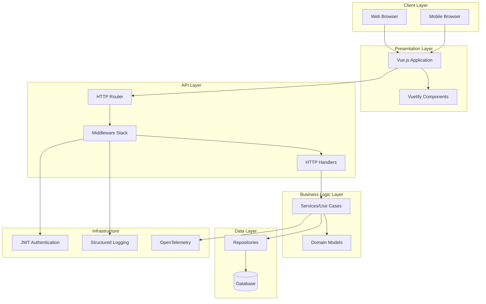
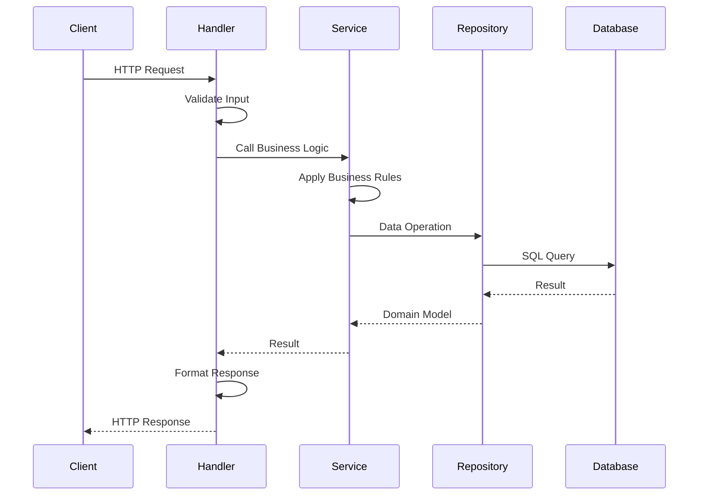
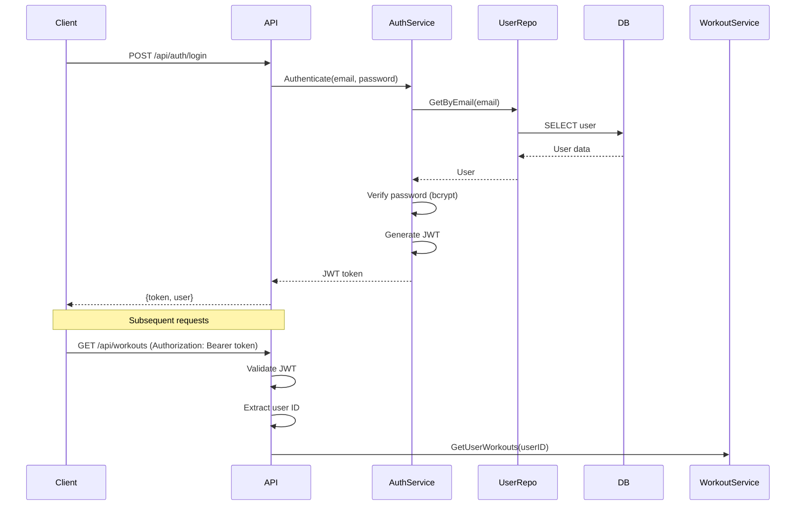
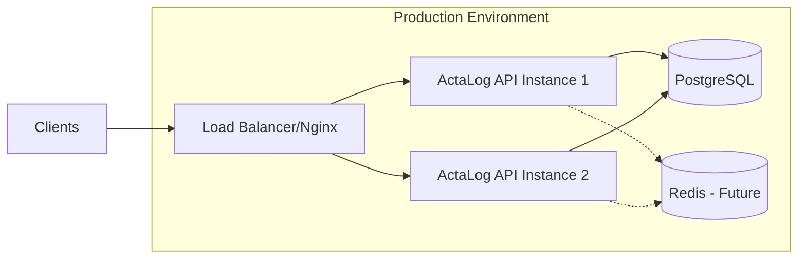

# Architecture Documentation

## Overview

ActaLog is a mobile-first web application built using Clean Architecture principles with a Go backend and Vue.js frontend. The system is designed to be modular, testable, and scalable.

## Architecture Pattern

We follow **Clean Architecture** (also known as Hexagonal Architecture or Ports and Adapters), which provides:

- **Independence from frameworks**: Business logic doesn't depend on external libraries
- **Testability**: Business rules can be tested without UI, database, or external dependencies
- **Independence from UI**: UI can change without affecting business logic
- **Independence from database**: Can swap databases without changing business rules
- **Independence from external services**: Business rules don't know about the outside world

## System Architecture



## Directory Structure

```
actalog/
├── cmd/
│   └── actalog/           # Application entry point
│       └── main.go
├── internal/              # Private application code
│   ├── domain/           # Business entities and interfaces
│   │   ├── user.go
│   │   ├── workout.go
│   │   └── movement.go
│   ├── repository/       # Data access implementations
│   │   ├── user_repo.go
│   │   ├── workout_repo.go
│   │   └── movement_repo.go
│   ├── service/          # Business logic/use cases
│   │   ├── user_service.go
│   │   ├── workout_service.go
│   │   └── movement_service.go
│   └── handler/          # HTTP handlers
│       ├── user_handler.go
│       ├── workout_handler.go
│       └── movement_handler.go
├── pkg/                   # Public, reusable packages
│   ├── auth/             # Authentication utilities
│   ├── middleware/       # HTTP middleware
│   ├── utils/            # Utility functions
│   └── version/          # Version information
├── api/                   # API definitions
│   ├── rest/             # REST API routes
│   └── models/           # API request/response models
├── configs/              # Configuration management
│   └── config.go
├── test/                 # Tests
│   ├── unit/            # Unit tests
│   └── integration/     # Integration tests
├── web/                  # Frontend application
│   ├── public/          # Static assets
│   └── src/             # Vue.js source code
├── docs/                # Documentation
├── design/              # Design assets
└── migrations/          # Database migrations
```

## Layer Responsibilities

### 1. Domain Layer (`internal/domain/`)

**Responsibility**: Contains business entities and repository interfaces

- Pure Go structs representing business concepts
- Repository interfaces (defined here, implemented elsewhere)
- No external dependencies
- The heart of the application

**Example**:
```go
type User struct {
    ID    int64
    Email string
    Name  string
}

type UserRepository interface {
    Create(user *User) error
    GetByID(id int64) (*User, error)
}
```

### 2. Repository Layer (`internal/repository/`)

**Responsibility**: Implements data access interfaces defined in domain

- Implements repository interfaces from domain layer
- Handles database queries and data mapping
- Isolates persistence logic
- Can be easily swapped (e.g., SQLite to PostgreSQL)

### 3. Service Layer (`internal/service/`)

**Responsibility**: Contains business logic and use cases

- Orchestrates business workflows
- Uses repositories for data access
- Validates business rules
- Transaction management
- Independent of delivery mechanism (HTTP, gRPC, etc.)

### 4. Handler Layer (`internal/handler/`)

**Responsibility**: HTTP request/response handling

- Receives HTTP requests
- Validates input
- Calls service layer
- Formats responses
- Error handling and status codes

### 5. API Layer (`api/`)

**Responsibility**: API contracts and routing

- REST endpoint definitions
- Request/response models (DTOs)
- API versioning
- Route configuration

## Data Flow



## Dependency Rule

Dependencies can only point inward:

```
Handlers → Services → Domain ← Repositories
```

- **Domain** has no dependencies
- **Services** depend only on Domain
- **Repositories** depend only on Domain
- **Handlers** depend on Services and Domain

## Key Design Patterns

### 1. Dependency Injection

All dependencies are injected through constructors:

```go
type UserService struct {
    userRepo domain.UserRepository
}

func NewUserService(repo domain.UserRepository) *UserService {
    return &UserService{userRepo: repo}
}
```

### 2. Repository Pattern

Data access is abstracted through interfaces:

```go
// Domain defines the interface
type UserRepository interface {
    GetByID(id int64) (*User, error)
}

// Repository implements it
type PostgresUserRepository struct { ... }
func (r *PostgresUserRepository) GetByID(id int64) (*User, error) { ... }
```

### 3. Interface Segregation

Small, focused interfaces instead of large ones:

```go
type UserReader interface {
    GetByID(id int64) (*User, error)
}

type UserWriter interface {
    Create(user *User) error
}
```

## Technology Stack

### Backend
- **Language**: Go 1.21+
- **Web Framework**: Standard library `net/http` + gorilla/mux or chi
- **Database**: SQLite (dev), PostgreSQL (prod)
- **ORM/Query Builder**: sqlx or raw SQL
- **Authentication**: JWT with golang-jwt
- **Password Hashing**: bcrypt
- **Observability**: OpenTelemetry
- **Testing**: Go standard testing + testify

### Frontend
- **Framework**: Vue.js 3
- **UI Library**: Vuetify 3
- **State Management**: Pinia
- **HTTP Client**: Axios
- **Build Tool**: Vite
- **Testing**: Vitest + Vue Test Utils

### Infrastructure
- **Containerization**: Docker + Docker Compose
- **Database**: MariaDB/PostgreSQL/SQLite
- **Web Server**: Nginx (optional reverse proxy)
- **Migrations**: golang-migrate

## Security Architecture

### Authentication Flow



### Security Measures

1. **Password Security**: Bcrypt with cost factor 12+
2. **SQL Injection Prevention**: Parameterized queries only
3. **XSS Prevention**: Input sanitization and output encoding
4. **CSRF Protection**: CSRF tokens for state-changing operations
5. **Rate Limiting**: Token bucket algorithm
6. **TLS/SSL**: Required in production
7. **CORS**: Configurable allowed origins
8. **Input Validation**: Strict validation at all entry points

## Observability

### Three Pillars

1. **Logs**: Structured JSON logging with correlation IDs
2. **Metrics**: Request latency, throughput, error rates
3. **Traces**: Distributed tracing with OpenTelemetry

### Key Metrics

- Request duration (p50, p95, p99)
- Request rate (requests/second)
- Error rate (errors/second)
- Database query duration
- Active connections
- Memory usage

## Testing Strategy

### Test Pyramid

```
       /\
      /  \  E2E Tests (Few)
     /____\
    /      \ Integration Tests (Some)
   /________\
  /          \ Unit Tests (Many)
 /____________\
```

### Test Types

1. **Unit Tests** (`test/unit/`): Test individual functions/methods
2. **Integration Tests** (`test/integration/`): Test component interactions
3. **E2E Tests**: Test complete user workflows

### Test Practices

- Table-driven tests for multiple scenarios
- Mocking external dependencies
- Test coverage > 80%
- Parallel test execution where safe
- Test isolation (no shared state)

## Deployment Architecture



## Performance Considerations

1. **Database Indexing**: Proper indexes on frequently queried columns
2. **Connection Pooling**: Reuse database connections
3. **Caching Strategy**: Redis for session data and frequent queries (future)
4. **Pagination**: Limit result sets with offset/limit
5. **Lazy Loading**: Load related data on demand
6. **Compression**: gzip compression for API responses

## Future Enhancements

1. **gRPC API**: For mobile apps requiring better performance
2. **GraphQL**: Flexible querying for complex data requirements
3. **Event Sourcing**: Audit trail and temporal queries
4. **Microservices**: Split into smaller services as needed
5. **Real-time Updates**: WebSockets for live workout tracking
6. **Offline Support**: PWA with service workers

## Version History

- **v0.1.0-alpha**: Initial architecture and project setup
