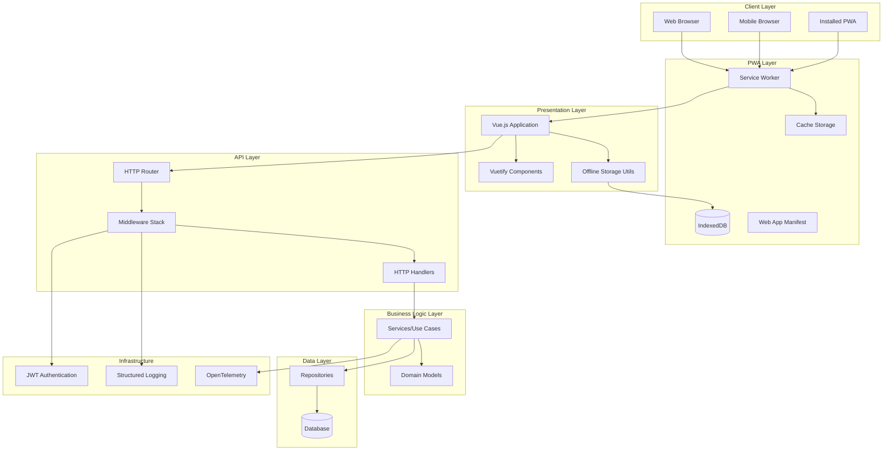
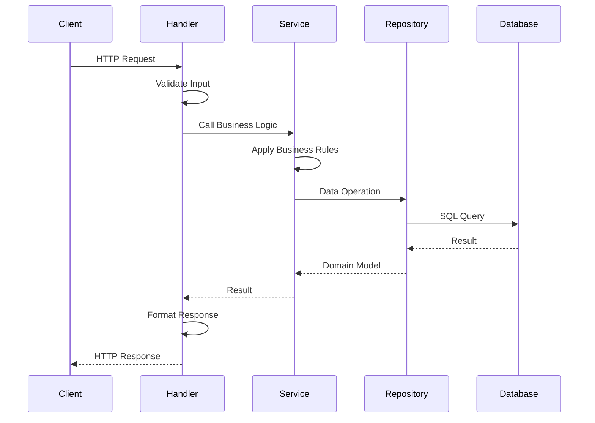
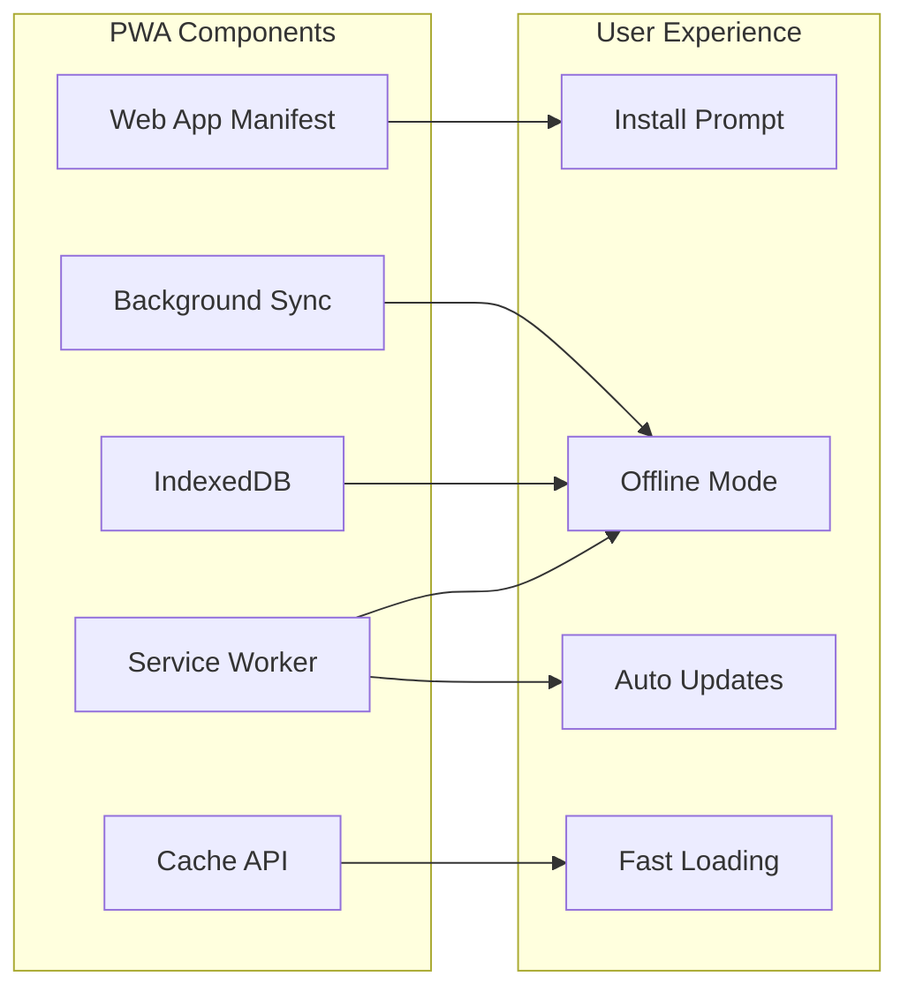
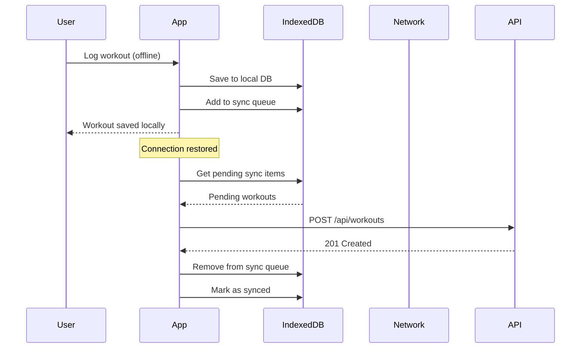
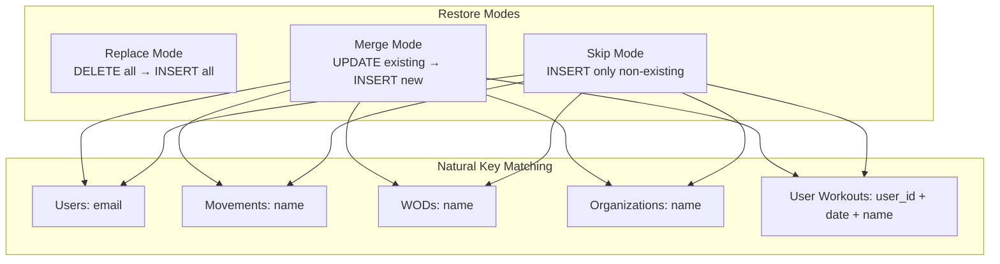
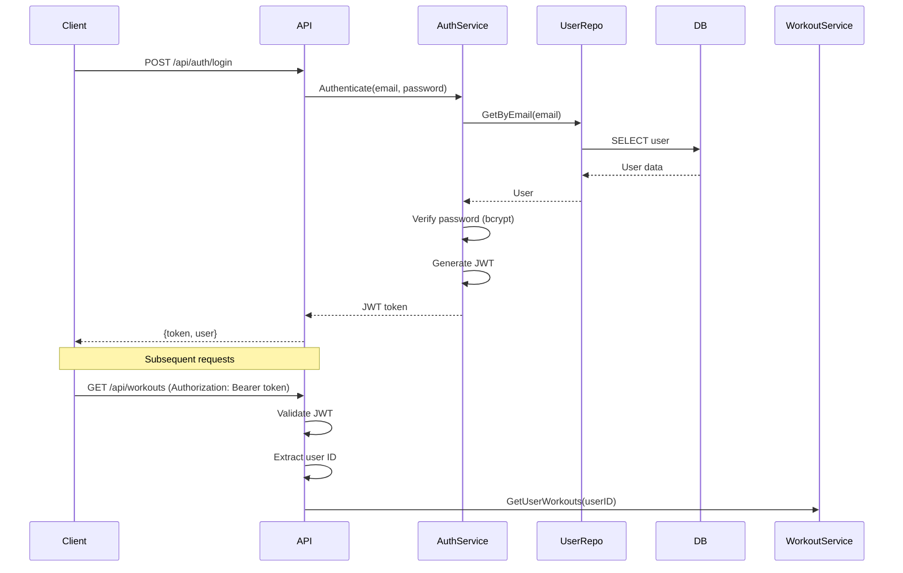
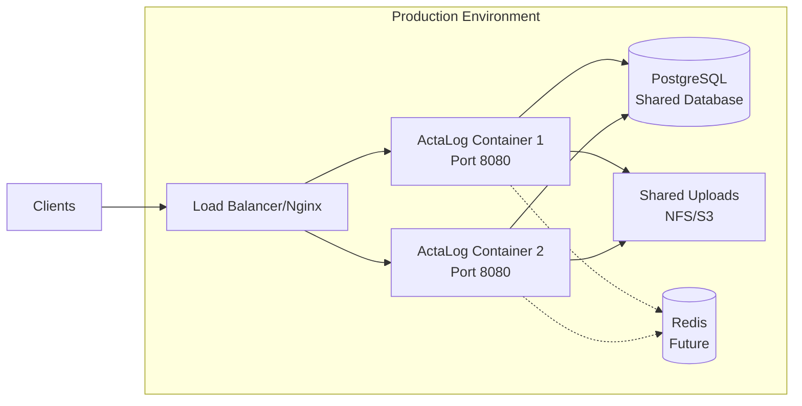

# Architecture Documentation

## Overview

ActaLog is a mobile-first **Progressive Web App (PWA)** built using Clean Architecture principles with a Go backend and Vue.js frontend. The system is designed to be modular, testable, scalable, and works offline-first with automatic synchronization.

## Architecture Pattern

We follow **Clean Architecture** (also known as Hexagonal Architecture or Ports and Adapters), which provides:

- **Independence from frameworks**: Business logic doesn't depend on external libraries
- **Testability**: Business rules can be tested without UI, database, or external dependencies
- **Independence from UI**: UI can change without affecting business logic
- **Independence from database**: Can swap databases without changing business rules
- **Independence from external services**: Business rules don't know about the outside world

## System Architecture


```mermaid
graph TB
    subgraph "Client Layer"
        Web[Web Browser]
        Mobile[Mobile Browser]
        Installed[Installed PWA]
    end

    subgraph "PWA Layer"
        SW[Service Worker]
        IDB[(IndexedDB)]
        Cache[Cache Storage]
        Manifest[Web App Manifest]
    end

    subgraph "Presentation Layer"
        VueApp[Vue.js Application]
        Vuetify[Vuetify Components]
        OfflineUtil[Offline Storage Utils]
    end

    subgraph "API Layer"
        Router[HTTP Router]
        Middleware[Middleware Stack]
        Handlers[HTTP Handlers]
    end

    subgraph "Business Logic Layer"
        Services[Services/Use Cases]
        Domain[Domain Models]
    end

    subgraph "Data Layer"
        Repos[Repositories]
        DB[(Database)]
    end

    subgraph "Infrastructure"
        Auth[JWT Authentication]
        Logger[Structured Logging]
        Telemetry[OpenTelemetry]
    end

    Web --> SW
    Mobile --> SW
    Installed --> SW
    SW --> VueApp
    SW --> Cache
    VueApp --> Vuetify
    VueApp --> OfflineUtil
    OfflineUtil --> IDB
    VueApp --> Router
    Router --> Middleware
    Middleware --> Handlers
    Handlers --> Services
    Services --> Domain
    Services --> Repos
    Repos --> DB
    Middleware --> Auth
    Middleware --> Logger
    Services --> Telemetry
```

## Directory Structure

```
actalog/
├── cmd/
│   └── actalog/           # Application entry point
│       └── main.go
├── internal/              # Private application code
│   ├── domain/           # Business entities and interfaces
│   │   ├── user.go
│   │   ├── workout.go
│   │   └── movement.go
│   ├── repository/       # Data access implementations
│   │   ├── user_repo.go
│   │   ├── workout_repo.go
│   │   └── movement_repo.go
│   ├── service/          # Business logic/use cases
│   │   ├── user_service.go
│   │   ├── workout_service.go
│   │   └── movement_service.go
│   └── handler/          # HTTP handlers
│       ├── user_handler.go
│       ├── workout_handler.go
│       └── movement_handler.go
├── pkg/                   # Public, reusable packages
│   ├── auth/             # Authentication utilities
│   ├── middleware/       # HTTP middleware
│   ├── utils/            # Utility functions
│   └── version/          # Version information
├── api/                   # API definitions
│   ├── rest/             # REST API routes
│   └── models/           # API request/response models
├── configs/              # Configuration management
│   └── config.go
├── test/                 # Tests
│   ├── unit/            # Unit tests
│   └── integration/     # Integration tests
├── web/                  # Frontend application
│   ├── public/          # Static assets
│   └── src/             # Vue.js source code
├── docs/                # Documentation
├── design/              # Design assets
└── migrations/          # Database migrations
```

## Layer Responsibilities

### 1. Domain Layer (`internal/domain/`)

**Responsibility**: Contains business entities and repository interfaces

- Pure Go structs representing business concepts
- Repository interfaces (defined here, implemented elsewhere)
- No external dependencies
- The heart of the application

**Core Entities** (Showing planned v0.3.0 schema - not yet implemented):

```go
// User represents a system user
type User struct {
    ID            int64
    Email         string
    PasswordHash  string
    Name          string
    Birthday      *time.Time
    ProfileImage  string
    Role          string
    CreatedAt     time.Time
    UpdatedAt     time.Time
    UpdatedBy     *int64
    LastLoginAt   *time.Time
}

// WOD represents a predefined CrossFit workout
type WOD struct {
    ID          int64
    Name        string
    Source      string // CrossFit, Other Coach, Self-recorded
    Type        string // Benchmark, Hero, Girl, Notables, Games, Endurance, Self-created
    Regime      string // EMOM, AMRAP, Fastest Time, etc.
    ScoreType   string // Time, Rounds+Reps, Max Weight
    Description string
    URL         string
    Notes       string
    CreatedBy   *int64
    CreatedAt   time.Time
    UpdatedAt   time.Time
    UpdatedBy   *int64
}

// StrengthMovement represents an exercise/movement
type StrengthMovement struct {
    ID           int64
    Name         string
    MovementType string // weightlifting, cardio, gymnastics
    Description  string
    CreatedBy    *int64
    CreatedAt    time.Time
    UpdatedAt    time.Time
    UpdatedBy    *int64
}

// Workout represents a workout template (reusable)
type Workout struct {
    ID        int64
    Name      string
    Notes     string
    CreatedAt time.Time
    UpdatedAt time.Time
    UpdatedBy *int64
}

// UserWorkout links a user to a workout on a specific date
type UserWorkout struct {
    ID          int64
    UserID      int64
    WorkoutID   int64
    WorkoutDate time.Time
    Notes       string
    CreatedAt   time.Time
    UpdatedAt   time.Time
}

// WorkoutWOD links a workout to a WOD with scoring
type WorkoutWOD struct {
    ID         int64
    WorkoutID  int64
    WODID      int64
    ScoreValue string
    OrderIndex int
    CreatedAt  time.Time
    UpdatedAt  time.Time
}

// WorkoutStrength links a workout to a strength movement with details
type WorkoutStrength struct {
    ID         int64
    WorkoutID  int64
    StrengthID int64
    Weight     *float64
    Sets       *int
    Reps       *int
    Notes      string
    OrderIndex int
    CreatedAt  time.Time
    UpdatedAt  time.Time
}

// UserSetting stores user preferences
type UserSetting struct {
    ID                      int64
    UserID                  int64
    NotificationPreferences string
    DataExportFormat        string
    Theme                   string
    CreatedAt               time.Time
    UpdatedAt               time.Time
}

// AuditLog records significant actions
type AuditLog struct {
    ID        int64
    UserID    *int64
    Action    string
    Details   string
    Timestamp time.Time
}

// Repository Interfaces
type UserRepository interface {
    Create(user *User) error
    GetByID(id int64) (*User, error)
    GetByEmail(email string) (*User, error)
    Update(user *User) error
}

type WODRepository interface {
    Create(wod *WOD) error
    GetByID(id int64) (*WOD, error)
    GetByName(name string) (*WOD, error)
    List(filters map[string]interface{}) ([]*WOD, error)
    Update(wod *WOD) error
}

type StrengthMovementRepository interface {
    Create(movement *StrengthMovement) error
    GetByID(id int64) (*StrengthMovement, error)
    ListByType(movementType string) ([]*StrengthMovement, error)
}

type UserWorkoutRepository interface {
    Create(userWorkout *UserWorkout) error
    GetByUserAndDate(userID int64, date time.Time) ([]*UserWorkout, error)
    GetByDateRange(userID int64, start, end time.Time) ([]*UserWorkout, error)
}

// ... and more repository interfaces
```

### 2. Repository Layer (`internal/repository/`)

**Responsibility**: Implements data access interfaces defined in domain

- Implements repository interfaces from domain layer
- Handles database queries and data mapping
- Isolates persistence logic
- Can be easily swapped (e.g., SQLite to PostgreSQL)

### 3. Service Layer (`internal/service/`)

**Responsibility**: Contains business logic and use cases

- Orchestrates business workflows
- Uses repositories for data access
- Validates business rules
- Transaction management
- Independent of delivery mechanism (HTTP, gRPC, etc.)

### 4. Handler Layer (`internal/handler/`)

**Responsibility**: HTTP request/response handling

- Receives HTTP requests
- Validates input
- Calls service layer
- Formats responses
- Error handling and status codes

### 5. API Layer (`api/`)

**Responsibility**: API contracts and routing

- REST endpoint definitions
- Request/response models (DTOs)
- API versioning
- Route configuration

## Data Flow


```mermaid
sequenceDiagram
    participant Client
    participant Handler
    participant Service
    participant Repository
    participant Database

    Client->>Handler: HTTP Request
    Handler->>Handler: Validate Input
    Handler->>Service: Call Business Logic
    Service->>Service: Apply Business Rules
    Service->>Repository: Data Operation
    Repository->>Database: SQL Query
    Database-->>Repository: Result
    Repository-->>Service: Domain Model
    Service-->>Handler: Result
    Handler->>Handler: Format Response
    Handler-->>Client: HTTP Response
```

## Dependency Rule

Dependencies can only point inward:

```
Handlers → Services → Domain ← Repositories
```

- **Domain** has no dependencies
- **Services** depend only on Domain
- **Repositories** depend only on Domain
- **Handlers** depend on Services and Domain

## Key Design Patterns

### 1. Dependency Injection

All dependencies are injected through constructors:

```go
type UserService struct {
    userRepo domain.UserRepository
}

func NewUserService(repo domain.UserRepository) *UserService {
    return &UserService{userRepo: repo}
}
```

### 2. Repository Pattern

Data access is abstracted through interfaces:

```go
// Domain defines the interface
type UserRepository interface {
    GetByID(id int64) (*User, error)
}

// Repository implements it
type PostgresUserRepository struct { ... }
func (r *PostgresUserRepository) GetByID(id int64) (*User, error) { ... }
```

### 3. Interface Segregation

Small, focused interfaces instead of large ones:

```go
type UserReader interface {
    GetByID(id int64) (*User, error)
}

type UserWriter interface {
    Create(user *User) error
}
```

## Technology Stack

### Backend
- **Language**: Go 1.21+
- **Web Framework**: Standard library `net/http` + gorilla/mux or chi
- **Database**: SQLite (dev), PostgreSQL (prod)
- **ORM/Query Builder**: sqlx or raw SQL
- **Authentication**: JWT with golang-jwt
- **Password Hashing**: bcrypt
- **Observability**: OpenTelemetry
- **Testing**: Go standard testing + testify

### Frontend (PWA)
- **Framework**: Vue.js 3
- **UI Library**: Vuetify 3
- **State Management**: Pinia
- **HTTP Client**: Axios
- **Build Tool**: Vite 6
- **PWA Plugin**: vite-plugin-pwa
- **Service Worker**: Workbox 7
- **Offline Storage**: IndexedDB (native browser API)
- **Testing**: Vitest + Vue Test Utils

### Infrastructure
- **Containerization**: Docker + Docker Compose
- **Database**: MariaDB/PostgreSQL/SQLite
- **Web Server**: Nginx (optional reverse proxy)
- **Migrations**: golang-migrate
- **HTTPS**: Required for PWA (Let's Encrypt)

## PWA Architecture

ActaLog is built as a Progressive Web App, providing native app-like experience with offline capabilities.

### PWA Core Components


```mermaid
graph LR
    subgraph "PWA Components"
        Manifest[Web App Manifest]
        SW[Service Worker]
        Cache[Cache API]
        IDB[IndexedDB]
        Sync[Background Sync]
    end

    subgraph "User Experience"
        Install[Install Prompt]
        Offline[Offline Mode]
        Updates[Auto Updates]
        Fast[Fast Loading]
    end

    Manifest --> Install
    SW --> Offline
    SW --> Updates
    Cache --> Fast
    IDB --> Offline
    Sync --> Offline
```

### 1. Web App Manifest

**Location**: Auto-generated by vite-plugin-pwa

**Configuration** (in `vite.config.js`):
```javascript
manifest: {
  name: 'ActaLog - CrossFit Workout Tracker',
  short_name: 'ActaLog',
  description: 'Track your CrossFit workouts...',
  theme_color: '#2c3657',
  background_color: '#ffffff',
  display: 'standalone',
  icons: [...]
}
```

**Capabilities**:
- Installable to home screen on iOS, Android, and desktop
- Custom splash screen with theme colors
- Standalone display mode (no browser UI)
- Portrait orientation for mobile

### 2. Service Worker (Workbox)

**Auto-generated by vite-plugin-pwa with Workbox strategies**

**Caching Strategies**:

1. **CacheFirst** (Static Assets)
   - Fonts (Google Fonts, Material Design Icons)
   - CSS, JS bundles
   - Images and icons
   - Used for rarely-changing resources

2. **NetworkFirst** (API Data)
   - API responses with 5-minute cache fallback
   - 10-second network timeout
   - Falls back to cache if offline

3. **Precaching**
   - All build assets automatically precached
   - Updated on new deployment

### 3. Offline Storage (IndexedDB)

**Implementation**: `src/utils/offlineStorage.js`

**Object Stores**:
- `workouts` - Cached workout data
- `movements` - Cached movement library
- `pendingSync` - Queue for offline operations

**Workflow**:

```mermaid
sequenceDiagram
    participant User
    participant App
    participant IDB as IndexedDB
    participant Network
    participant API

    User->>App: Log workout (offline)
    App->>IDB: Save to local DB
    App->>IDB: Add to sync queue
    App-->>User: Workout saved locally

    Note over App: Connection restored

    App->>IDB: Get pending sync items
    IDB-->>App: Pending workouts
    App->>API: POST /api/workouts
    API-->>App: 201 Created
    App->>IDB: Remove from sync queue
    App->>IDB: Mark as synced
```

**Key Functions**:
- `saveWorkoutOffline()` - Save workout when offline
- `getWorkoutsOffline()` - Retrieve cached workouts
- `syncWithServer()` - Sync pending operations
- `markWorkoutSynced()` - Update sync status

### 4. Offline-First Strategy

**Data Flow**:
1. **Always try network first** for fresh data
2. **Cache successful responses** for offline access
3. **Use cached data** when offline
4. **Queue write operations** for background sync
5. **Sync automatically** when connection restored

**Network Detection**:
```javascript
// Listen for online/offline events
window.addEventListener('online', syncWithServer)
window.addEventListener('offline', showOfflineNotice)

// Check current status
if (navigator.onLine) {
  // Online - normal operation
} else {
  // Offline - use cache
}
```

### 5. Update Strategy

**Auto-update with user notification**:
- Service worker checks for updates on page load
- New version silently downloaded in background
- User prompted to reload when critical updates available
- Seamless updates without app store delays

**Update Flow**:
```javascript
registerSW({
  onNeedRefresh() {
    // Notify user of update
    if (confirm('New version available. Reload?')) {
      updateSW(true)
    }
  }
})
```

### PWA Checklist

✅ Web App Manifest with complete metadata
✅ Service Worker for offline functionality
✅ HTTPS in production (required for PWA)
✅ Responsive design (mobile-first)
✅ Fast loading with cache strategies
✅ Offline page/graceful degradation
✅ Add to home screen capability
✅ App icons (72px - 512px)
✅ Background sync for offline operations
⏳ Push notifications (future enhancement)

### Performance Optimizations

1. **Code Splitting**: Lazy-load routes and components
2. **Asset Optimization**: Compress images, minify CSS/JS
3. **Precaching**: Critical resources cached on install
4. **Runtime Caching**: API responses cached intelligently
5. **IndexedDB**: Efficient local data storage

### Browser Support

- **Chrome/Edge**: Full support (Desktop & Mobile)
- **Safari**: Full support iOS 11.3+ (with limitations on install prompt)
- **Firefox**: Full support (Desktop & Android)
- **Samsung Internet**: Full support
- **Opera**: Full support

**Graceful Degradation**:
- Works as regular web app in older browsers
- Progressive enhancement for modern browsers
- No broken functionality in non-PWA browsers

## Audit Logging Architecture

### Comprehensive Audit Trail System

ActaLog implements a complete audit logging system that tracks all data modifications across the application. This provides accountability, compliance support, and troubleshooting capabilities.

### Audit Logging Design Patterns

**1. Service Layer Integration**
- Audit logging is implemented at the service layer, not in repositories or handlers
- Every service that modifies data accepts an `auditLogRepo` in its constructor
- Services inject user context (userID, userEmail) into audit logs

**2. Conditional Logging**
```go
if s.auditLogRepo != nil {
    details, _ := json.Marshal(map[string]interface{}{
        "entity_id":   entity.ID,
        "entity_name": entity.Name,
        "created_by":  userEmail,
    })
    detailsStr := string(details)
    _ = s.auditLogRepo.Create(&domain.AuditLog{
        UserID:       &userID,
        TargetUserID: &targetUserID,
        EventType:    domain.EventEntityCreated,
        Details:      &detailsStr,
        CreatedAt:    time.Now(),
    })
}
```

**3. Fire-and-Forget Pattern**
- Audit log failures never block primary operations
- Audit logging uses fire-and-forget (errors ignored with `_`)
- Primary business operations succeed even if audit logging fails

**4. Change Tracking for Updates**
```go
// Store old values before update
oldName := entity.Name
oldValue := entity.Value

// Perform update
entity.Name = newName
entity.Value = newValue

// Log with before/after comparison
details, _ := json.Marshal(map[string]interface{}{
    "entity_id": entity.ID,
    "changes": map[string]interface{}{
        "name_old":  oldName,
        "name_new":  entity.Name,
        "value_old": oldValue,
        "value_new": entity.Value,
    },
})
```

**5. User Attribution**
- `UserID`: The user who performed the action
- `TargetUserID`: The user who was affected by the action (for user management operations)
- `userEmail`: Stored in details JSON for human-readable logs

**6. Admin Operation Tracking**
```go
details, _ := json.Marshal(map[string]interface{}{
    "entity_id":    entity.ID,
    "admin_update": true,  // Flag for admin operations
    "updated_by":   adminEmail,
})
```

### Logged Operations by Entity

**Movements**
- `movement_created` - New movement creation (custom and standard)
- `movement_updated` - Movement attribute updates
- `movement_deleted` - Movement deletion

**WODs**
- `wod_created` - New WOD creation
- `wod_updated` - WOD attribute updates
- `wod_deleted` - WOD deletion

**Workout Templates**
- `workout_template_created` - New template creation with movements/WODs
- `workout_template_updated` - Template modifications
- `workout_template_deleted` - Template deletion

**User Workouts**
- `user_workout_logged` - User logs a workout
- `user_workout_updated` - User edits a logged workout
- `user_workout_deleted` - User deletes a workout

**User Management**
- `profile_updated` - User profile changes (name, email, birthday)
- `user_settings_updated` - Settings changes (theme, units, preferences)
- `user_created` - User registration
- `user_disabled` - User account disabled
- `user_enabled` - User account enabled
- `user_role_changed` - Role changes (user ↔ admin)
- `user_deleted` - User account deletion

**Organizations** (v0.14.0)
- `organization_created` - Organization creation
- `organization_updated` - Organization updates
- `organization_deleted` - Organization deletion
- `user_organization_added` - User added to organization
- `user_organization_removed` - User removed from organization

**Subscriptions** (v0.14.0)
- `subscription_created` - Subscription creation
- `subscription_cancelled` - Subscription cancellation
- `subscription_marked_paid` - Payment recorded
- `subscription_marked_unpaid` - Payment reversed

### Audit Log Data Structure

```go
type AuditLog struct {
    ID           int64      `json:"id"`
    UserID       *int64     `json:"user_id"`        // Who performed action
    TargetUserID *int64     `json:"target_user_id"` // Who was affected
    EventType    string     `json:"event_type"`     // Event constant
    Details      *string    `json:"details"`        // JSON-encoded context
    CreatedAt    time.Time  `json:"created_at"`     // Timestamp
}
```

**Details JSON Schema** (varies by event type):
```json
{
    "entity_id": 123,
    "entity_name": "Back Squat",
    "entity_type": "movement",
    "created_by": "user@example.com",
    "admin_update": false,
    "changes": {
        "name_old": "Back Squat",
        "name_new": "Barbell Back Squat",
        "type_old": "weightlifting",
        "type_new": "weightlifting"
    }
}
```

### Admin Audit Log UI

**Admin Data Change Logs View** (`/admin/data-change-logs`)
- Filterable by entity type, operation, user email
- Paginated table showing all audit events
- Detailed dialog showing full before/after JSON
- Changed fields diff table for updates
- Color-coded operations and entity types

**Use Cases:**
- Compliance and accountability tracking
- Troubleshooting data issues
- User action history review
- Security incident investigation
- Admin operation auditing

### Performance Considerations

1. **Asynchronous Logging**: Audit logs written synchronously but don't block operations
2. **No Transactions**: Audit logs in separate operations (may fail independently)
3. **Indexing**: `audit_logs` table indexed on `event_type`, `user_id`, `target_user_id`, `created_at`
4. **Cleanup**: Admin API endpoint for deleting old audit logs (retention policy)

### Security Considerations

- Audit logs are immutable once created (no update/delete from application)
- Only admins can view audit logs via API
- Sensitive data (passwords) never logged
- IP addresses optional (privacy consideration)
- GDPR compliance: Audit logs included in user data exports

### Implementation Checklist

✅ Domain layer: Event type constants defined
✅ Repository layer: AuditLogRepository implemented for all databases
✅ Service layer: All CRUD services inject and use auditLogRepo
✅ Handler layer: All handlers extract userEmail from JWT context
✅ Initialization: All services initialized with auditLogRepo in main.go
✅ Admin UI: Complete audit log viewing and filtering interface
✅ Testing: All services tested with and without audit logging enabled

---

## Backup and Restore Architecture

### Overview

ActaLog provides a comprehensive backup and restore system that supports multiple restore modes for flexible data management. The system uses a JSON-based backup format with schema metadata for cross-database compatibility.

### Backup Format

Backups are stored as ZIP files containing:
- `metadata.json` - Backup metadata (version, timestamp, database info, record counts)
- `schema_metadata.json` - Database schema information for type-aware restoration
- `{table_name}.json` - JSON export of each table's data

### Restore Modes

The restore system supports three modes for handling existing data:


```mermaid
graph TB
    subgraph "Restore Modes"
        Replace[Replace Mode<br>DELETE all → INSERT all]
        Merge[Merge Mode<br>UPDATE existing → INSERT new]
        Skip[Skip Mode<br>INSERT only non-existing]
    end

    subgraph "Natural Key Matching"
        Users[Users: email]
        Movements[Movements: name]
        WODs[WODs: name]
        Orgs[Organizations: name]
        Workouts[User Workouts: user_id + date + name]
    end

    Merge --> Users
    Merge --> Movements
    Merge --> WODs
    Merge --> Orgs
    Merge --> Workouts
    Skip --> Users
    Skip --> Movements
    Skip --> WODs
    Skip --> Orgs
    Skip --> Workouts
```

**1. Replace Mode** (Default)
- Deletes all existing data in each table
- Inserts all records from backup
- Fastest but destructive
- Use for clean restores to fresh database

**2. Merge Mode**
- Matches records by natural key (not ID)
- Updates existing records with backup data
- Inserts new records that don't exist
- Preserves records not in backup
- ID remapping for foreign key integrity

**3. Skip Mode**
- Matches records by natural key
- Skips records that already exist
- Only inserts new records
- Safest for incremental imports
- ID remapping for foreign key integrity

### Natural Key Matching Strategy

Records are matched by business keys rather than database IDs:

| Table | Natural Key | Match Strategy |
|-------|-------------|----------------|
| users | email | Exact match |
| movements | name | Exact match |
| wods | name | Exact match |
| organizations | name | Exact match |
| user_workouts | user_id + workout_date + workout_name | Composite match |
| workout_movements | workout_id + movement_id + order_index | Composite (after remap) |
| workout_wods | workout_id + wod_id + order_index | Composite (after remap) |
| user_settings | user_id | After user remap |
| notifications | - | Additive only (skip) |
| audit_logs | - | Additive only (skip) |

### ID Remapping

When using merge or skip mode, IDs may differ between backup and target database. The system maintains ID mappings:

```go
type idMappings struct {
    users         map[int64]int64  // backup_id -> target_id
    movements     map[int64]int64
    wods          map[int64]int64
    organizations map[int64]int64
    workouts      map[int64]int64
    userWorkouts  map[int64]int64
}
```

**Remapping Flow:**
1. Restore parent tables first (users, movements, wods, organizations)
2. Build ID mapping for each matched/inserted record
3. Restore child tables using remapped foreign keys
4. Update FK references before insert/update

### Restore Result

The API returns detailed statistics:

```json
{
  "mode": "merge",
  "tables_restored": 21,
  "records_created": 16,
  "records_updated": 50,
  "records_skipped": 0,
  "errors": []
}
```

### API Usage

```bash
# Replace mode (default)
curl -X POST /api/admin/backups/{filename}/restore \
  -H "Authorization: Bearer $TOKEN" \
  -d '{"confirm": true}'

# Merge mode
curl -X POST /api/admin/backups/{filename}/restore \
  -H "Authorization: Bearer $TOKEN" \
  -d '{"confirm": true, "mode": "merge"}'

# Skip mode
curl -X POST /api/admin/backups/{filename}/restore \
  -H "Authorization: Bearer $TOKEN" \
  -d '{"confirm": true, "mode": "skip"}'
```

### Import Duplicate Handling

All import services support duplicate detection and handling:

| Import Type | Skip Duplicates | Update Duplicates | Detection Key |
|-------------|-----------------|-------------------|---------------|
| WOD Import | ✅ | ✅ | name |
| Movement Import | ✅ | ✅ | name |
| User Workout Import | ✅ | ✅ | user_id + date + name |
| Wodify Import | ✅ | ✅ | workout date |

**Import Options:**
```bash
# Skip duplicates (keep existing)
curl -X POST /api/import/wods/confirm \
  -F "file=@wods.csv" \
  -F "skip_duplicates=true"

# Update duplicates (overwrite existing)
curl -X POST /api/import/wods/confirm \
  -F "file=@wods.csv" \
  -F "update_duplicates=true"
```

### Security Considerations

- Only admin users can create, restore, or delete backups
- Backup files stored in configurable directory (default: `./backups`)
- Security-sensitive tables (refresh_tokens, password_resets) are skipped during merge/skip
- Audit logs are append-only (never overwritten)
- All restore operations are logged to audit trail

### Implementation Files

- `internal/domain/backup.go` - RestoreMode type, RestoreResult struct, BackupService interface
- `internal/service/backup_service.go` - Full backup/restore implementation with merge/skip logic
- `internal/handler/backup_handler.go` - REST API endpoints
- `internal/service/import_service.go` - Import duplicate handling
- `internal/service/wodify_import_service.go` - Wodify-specific import logic

---

## Security Architecture

### Authentication Flow


```mermaid
sequenceDiagram
    participant Client
    participant API
    participant AuthService
    participant UserRepo
    participant DB

    Client->>API: POST /api/auth/login
    API->>AuthService: Authenticate(email, password)
    AuthService->>UserRepo: GetByEmail(email)
    UserRepo->>DB: SELECT user
    DB-->>UserRepo: User data
    UserRepo-->>AuthService: User
    AuthService->>AuthService: Verify password (bcrypt)
    AuthService->>AuthService: Generate JWT
    AuthService-->>API: JWT token
    API-->>Client: {token, user}

    Note over Client,API: Subsequent requests
    Client->>API: GET /api/workouts (Authorization: Bearer token)
    API->>API: Validate JWT
    API->>API: Extract user ID
    API->>WorkoutService: GetUserWorkouts(userID)
```

### Security Measures

1. **Password Security**: Bcrypt with cost factor 12+
2. **SQL Injection Prevention**: Parameterized queries only
3. **XSS Prevention**: Input sanitization and output encoding
4. **CSRF Protection**: CSRF tokens for state-changing operations
5. **Rate Limiting**: Token bucket algorithm
6. **TLS/SSL**: Required in production
7. **CORS**: Configurable allowed origins
8. **Input Validation**: Strict validation at all entry points

## Observability

### Three Pillars

1. **Logs**: Structured JSON logging with correlation IDs
2. **Metrics**: Request latency, throughput, error rates
3. **Traces**: Distributed tracing with OpenTelemetry

### Key Metrics

- Request duration (p50, p95, p99)
- Request rate (requests/second)
- Error rate (errors/second)
- Database query duration
- Active connections
- Memory usage

## Testing Strategy

### Test Pyramid

```
       /\
      /  \  E2E Tests (Few)
     /____\
    /      \ Integration Tests (Some)
   /________\
  /          \ Unit Tests (Many)
 /____________\
```

### Test Types

1. **Unit Tests** (`test/unit/`): Test individual functions/methods
2. **Integration Tests** (`test/integration/`): Test component interactions
3. **E2E Tests**: Test complete user workflows

### Test Practices

- Table-driven tests for multiple scenarios
- Mocking external dependencies
- Test coverage > 80%
- Parallel test execution where safe
- Test isolation (no shared state)

## Deployment Architecture

### Production Deployment (Docker)

ActaLog uses a **single-port architecture** for production deployments:

```mermaid
graph TB
    subgraph "Client Layer"
        Browser[Web Browser]
        Mobile[Mobile Browser]
        PWA[Installed PWA]
    end

    subgraph "Docker Container (Port 8080)"
        GoApp[Go Application]
        StaticFiles[Static Files<br>/app/web/dist]

        subgraph "Routes"
            APIRoutes[/api/* - API Endpoints]
            Uploads[/uploads/* - User Files]
            Frontend[/* - Frontend SPA]
        end
    end

    subgraph "Data Layer"
        DB[(Database<br>SQLite/PostgreSQL/MariaDB)]
        UploadsVol[Uploads Volume]
        DataVol[Data Volume]
    end

    Browser --> GoApp
    Mobile --> GoApp
    PWA --> GoApp

    GoApp --> APIRoutes
    GoApp --> Uploads
    GoApp --> Frontend

    Frontend --> StaticFiles
    APIRoutes --> DB
    Uploads --> UploadsVol
    DB -.-> DataVol
```

**Key Design Points:**

1. **Single Port (8080)**: All traffic (frontend + backend) served from one port
2. **Static File Serving**: Go serves pre-built frontend static files from `/app/web/dist`
3. **Route Priority**: API routes match first, then uploads, then frontend catch-all
4. **SPA Routing**: Non-existent paths serve `index.html` for Vue Router
5. **No Node.js in Production**: Frontend built during Docker image creation
6. **Volume Management**:
   - `/app/data` - Database files (SQLite) or config
   - `/app/uploads` - User-uploaded files (avatars, etc.)

**Implementation:** See `cmd/actalog/main.go:418-436` for static file serving logic.

### Multi-Instance Production (Scalable)

For high-availability deployments:


```mermaid
graph LR
    subgraph "Production Environment"
        LB[Load Balancer/Nginx]
        App1[ActaLog Container 1<br>Port 8080]
        App2[ActaLog Container 2<br>Port 8080]
        DB[(PostgreSQL<br>Shared Database)]
        Uploads[Shared Uploads<br>NFS/S3]
        Cache[(Redis<br>Future)]
    end

    Client[Clients] --> LB
    LB --> App1
    LB --> App2
    App1 --> DB
    App2 --> DB
    App1 --> Uploads
    App2 --> Uploads
    App1 -.-> Cache
    App2 -.-> Cache
```

**Scaling Considerations:**
- Use PostgreSQL or MariaDB (not SQLite) for shared database
- Mount shared uploads volume or use object storage (S3)
- Load balancer handles TLS termination
- Each container independently serves frontend + API

## Performance Considerations

1. **Database Indexing**: Proper indexes on frequently queried columns
2. **Connection Pooling**: Reuse database connections
3. **Caching Strategy**:
   - Service Worker cache for static assets
   - IndexedDB for offline data
   - Redis for session data (future)
4. **Pagination**: Limit result sets with offset/limit
5. **Lazy Loading**: Load related data on demand
6. **Compression**: gzip compression for API responses
7. **PWA Precaching**: Critical resources cached on app install
8. **Code Splitting**: Lazy-load routes and components

## Future Enhancements

1. **Push Notifications**: Web Push API for workout reminders and achievements
2. **gRPC API**: For enhanced performance on mobile devices
3. **GraphQL**: Flexible querying for complex data requirements
4. **Event Sourcing**: Audit trail and temporal queries
5. **Microservices**: Split into smaller services as needed
6. **Real-time Updates**: WebSockets for live workout tracking
7. **Advanced PWA Features**:
   - Periodic background sync for data refresh
   - Web Share API for workout sharing
   - File System Access API for bulk data operations
   - Badging API for unsynced workout notifications

## Version History

- **v0.3.0**: Planned database schema redesign (documented but not yet implemented)
- **v0.2.0-beta**: Multi-database support, workout logging backend (current version)
- **v0.1.0**: Initial schema and architecture implementation (current schema)

## Notes on Planned v0.3.0 Schema

**Status:** Documented design, not yet implemented in codebase.

The database schema redesign is documented to better represent the logical data model:

**Key Architectural Changes:**
1. **Workouts as Templates**: Workouts are now reusable templates rather than user-specific instances
2. **WOD Entity**: New first-class entity for CrossFit WODs with comprehensive metadata
3. **Junction Tables**: Proper many-to-many relationships via junction tables (user_workouts, workout_wods, workout_strength)
4. **Audit Trail**: Built-in audit logging for accountability and troubleshooting
5. **User Settings**: Separate table for user preferences

**Impact on Application Layers:**
- **Domain Layer**: New entities (WOD, StrengthMovement, UserWorkout, etc.) require new repository interfaces
- **Service Layer**: Business logic must handle template-based workouts and user instances separately
- **API Layer**: Endpoints need refactoring to support new workflow (create template → log user workout)
- **Frontend**: UI must distinguish between workout templates and user workout logs

**Migration Strategy (When Implemented):**
- Database migrations will transform existing data from v0.1.0 schema to v0.3.0
- Existing user workouts will be converted to the new template + user_workout structure
- Standard WODs and movements will be seeded during migration
