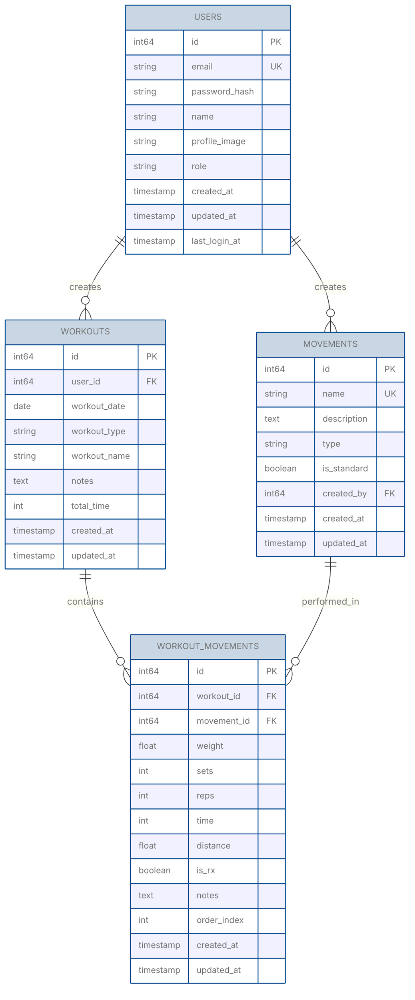

# Database Schema

ActaLog uses a relational database to store user data, workouts, movements, and workout history.

## Supported Databases

- SQLite (default for development)
- PostgreSQL (recommended for production)
- MariaDB/MySQL (supported)

## Schema Version

Current schema version: **0.2.0**

## Entity Relationship Diagram

## Table Definitions

### users

Stores user account information and authentication credentials.

| Column | Type | Constraints | Description |
|--------|------|-------------|-------------|
| id | BIGINT | PRIMARY KEY, AUTO_INCREMENT | Unique user identifier |
| email | VARCHAR(255) | UNIQUE, NOT NULL | User email (login identifier) |
| password_hash | VARCHAR(255) | NOT NULL | Bcrypt hashed password |
| name | VARCHAR(255) | NOT NULL | User display name |
| profile_image | VARCHAR(512) | NULL | URL to profile picture |
| role | VARCHAR(50) | NOT NULL, DEFAULT 'user' | User role (user, admin) |
| created_at | TIMESTAMP | NOT NULL, DEFAULT CURRENT_TIMESTAMP | Account creation time |
| updated_at | TIMESTAMP | NOT NULL, DEFAULT CURRENT_TIMESTAMP | Last update time |
| last_login_at | TIMESTAMP | NULL | Last successful login |

**Indexes:**
- PRIMARY KEY (id)
- UNIQUE INDEX idx_users_email (email)
- INDEX idx_users_role (role)

### workouts

Stores workout sessions logged by users.

| Column | Type | Constraints | Description |
|--------|------|-------------|-------------|
| id | BIGINT | PRIMARY KEY, AUTO_INCREMENT | Unique workout identifier |
| user_id | BIGINT | NOT NULL, FOREIGN KEY | Reference to users.id |
| workout_date | DATE | NOT NULL | Date workout was performed |
| workout_type | VARCHAR(50) | NOT NULL | Type: named_wod, custom |
| workout_name | VARCHAR(255) | NULL | Name of workout (e.g., "Fran", "Murph") |
| notes | TEXT | NULL | General workout notes |
| total_time | INT | NULL | Total time in seconds (for timed workouts) |
| created_at | TIMESTAMP | NOT NULL, DEFAULT CURRENT_TIMESTAMP | Record creation time |
| updated_at | TIMESTAMP | NOT NULL, DEFAULT CURRENT_TIMESTAMP | Last update time |

**Indexes:**
- PRIMARY KEY (id)
- INDEX idx_workouts_user_id (user_id)
- INDEX idx_workouts_workout_date (workout_date)
- INDEX idx_workouts_user_date (user_id, workout_date DESC)

**Foreign Keys:**
- FOREIGN KEY (user_id) REFERENCES users(id) ON DELETE CASCADE

### movements

Stores exercise movements (both standard and user-created).

| Column | Type | Constraints | Description |
|--------|------|-------------|-------------|
| id | BIGINT | PRIMARY KEY, AUTO_INCREMENT | Unique movement identifier |
| name | VARCHAR(255) | UNIQUE, NOT NULL | Movement name (e.g., "Back Squat") |
| description | TEXT | NULL | Movement description/instructions |
| type | VARCHAR(50) | NOT NULL | Type: weightlifting, bodyweight, cardio, gymnastics |
| is_standard | BOOLEAN | NOT NULL, DEFAULT FALSE | True for predefined movements |
| created_by | BIGINT | NULL, FOREIGN KEY | User ID if custom movement |
| created_at | TIMESTAMP | NOT NULL, DEFAULT CURRENT_TIMESTAMP | Record creation time |
| updated_at | TIMESTAMP | NOT NULL, DEFAULT CURRENT_TIMESTAMP | Last update time |

**Indexes:**
- PRIMARY KEY (id)
- UNIQUE INDEX idx_movements_name (name)
- INDEX idx_movements_type (type)
- INDEX idx_movements_standard (is_standard)

**Foreign Keys:**
- FOREIGN KEY (created_by) REFERENCES users(id) ON DELETE SET NULL

### workout_movements

Junction table linking workouts to movements with performance details.

| Column | Type | Constraints | Description |
|--------|------|-------------|-------------|
| id | BIGINT | PRIMARY KEY, AUTO_INCREMENT | Unique record identifier |
| workout_id | BIGINT | NOT NULL, FOREIGN KEY | Reference to workouts.id |
| movement_id | BIGINT | NOT NULL, FOREIGN KEY | Reference to movements.id |
| weight | DECIMAL(10,2) | NULL | Weight used (lbs or kg) |
| sets | INT | NULL | Number of sets |
| reps | INT | NULL | Reps per set or total reps |
| time | INT | NULL | Time in seconds |
| distance | DECIMAL(10,2) | NULL | Distance in meters or miles |
| is_rx | BOOLEAN | NOT NULL, DEFAULT FALSE | Performed at prescribed weight |
| notes | TEXT | NULL | Movement-specific notes |
| order_index | INT | NOT NULL, DEFAULT 0 | Order in workout sequence |
| created_at | TIMESTAMP | NOT NULL, DEFAULT CURRENT_TIMESTAMP | Record creation time |
| updated_at | TIMESTAMP | NOT NULL, DEFAULT CURRENT_TIMESTAMP | Last update time |

**Indexes:**
- PRIMARY KEY (id)
- INDEX idx_wm_workout_id (workout_id)
- INDEX idx_wm_movement_id (movement_id)
- INDEX idx_wm_workout_order (workout_id, order_index)

**Foreign Keys:**
- FOREIGN KEY (workout_id) REFERENCES workouts(id) ON DELETE CASCADE
- FOREIGN KEY (movement_id) REFERENCES movements(id) ON DELETE RESTRICT

## Standard Movements

The application comes pre-loaded with common CrossFit movements:

### Weightlifting
- Back Squat
- Front Squat
- Overhead Squat
- Deadlift
- Sumo Deadlift High Pull
- Clean
- Power Clean
- Hang Clean
- Snatch
- Power Snatch
- Clean and Jerk
- Thruster
- Push Press
- Push Jerk
- Split Jerk

### Gymnastics
- Pull-up
- Chest-to-Bar Pull-up
- Muscle-up
- Handstand Push-up
- Dip
- Toes-to-Bar
- Knees-to-Elbow

### Bodyweight
- Push-up
- Sit-up
- Air Squat
- Burpee
- Box Jump

### Cardio
- Row (meters/calories)
- Run (meters/miles)
- Bike (meters/calories)
- Ski Erg (meters/calories)

## Migration Strategy

Database migrations will be managed using a migration tool (e.g., golang-migrate). Each migration will be versioned and tracked.

## Security Considerations

1. **Password Storage**: All passwords are hashed using bcrypt with appropriate cost factor (minimum 12)
2. **SQL Injection**: All queries use parameterized statements
3. **Cascading Deletes**: Workouts and related data are deleted when a user is deleted
4. **Data Validation**: Input validation at application layer before database insertion
5. **Connection Security**: TLS/SSL required for production database connections

## Backup and Recovery

1. **Automated Backups**: Daily automated backups for production databases
2. **Point-in-Time Recovery**: Transaction logs retained for 7 days
3. **Backup Testing**: Monthly backup restoration tests
4. **Data Export**: Users can export their data in CSV/JSON formats
