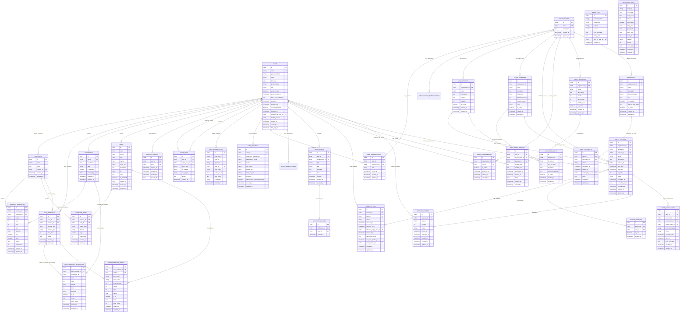

# Database Schema

ActaLog uses a relational database to store user data, workouts, movements, and workout history.

## Supported Databases

- **SQLite** (default for development, single-user deployments)
- **PostgreSQL** (recommended for production, multi-user deployments)
  - Driver: `pgx/v5` (migrated from lib/pq in v0.8.0)
  - Features: Schema isolation, connection pooling, 10-30% performance improvement
- **MariaDB/MySQL** (supported for production, shared hosting)
  - Features: Connection pooling, full compatibility verified

## Schema Version

**Current Version:** 1.3.0 (migration head: 0.35.0)

> v0.35.0 adds per-dialect BEFORE UPDATE / BEFORE DELETE triggers on the `users` table that block writes to protected accounts at the database layer (L3 security). See `docs/security/PROTECTED_USERS.md` for the full protected-user policy and recovery procedures.

## Recent Changes (v0.27.0-beta)

- **Class Scheduling Phase 4**: Documents, packages, credits, waitlist, notifications
  - New `documents` table - Document types required by organizations (waivers, liability forms)
  - New `user_documents` table - Track user document completion status
  - New `class_packages` table - Credit packages (e.g., "10-Class Pack")
  - New `user_class_credits` table - User credit balances with expiration
  - New `waitlist_entries` table - Waitlist queue for full classes
  - New `class_notifications` table - Class reminders and waitlist promotions
  - All tables have proper indexes and foreign key constraints
  - Multi-database support verified (SQLite, PostgreSQL, MariaDB)

## Recent Changes (v0.26.0-beta)

- **Class Scheduling System (Phases 1-3)**: Core scheduling infrastructure
  - New `gym_locations` table - Physical locations within gyms
  - New `class_templates` table - Reusable class definitions
  - New `schedule_slots` table - Recurring time patterns per template
  - New `class_sessions` table - Scheduled class instances
  - New `coach_assignments` table - Per-gym coach role assignments
  - New `session_coaches` table - Coaches assigned to specific sessions
  - New `reservations` table - User bookings with state tracking

## Recent Changes (v0.16.0-beta)

- **Notification Likes Feature**: Social engagement for gym community
  - New `notification_likes` table (4 columns, 4 indexes + unique constraint)
  - Columns: `id`, `notification_id`, `user_id`, `created_at`
  - Foreign keys with CASCADE DELETE to `notifications` and `users`
  - Unique constraint prevents duplicate likes from same user
  - Indexes for fast lookup by notification_id and user_id
  - Migration 0.16.0 creates table structure
  - API endpoints: POST/DELETE/GET for like/unlike/list likes
  - Frontend component: NotificationLikes.vue with thumbs up icon
  - Liking a notification marks it as unread for original recipient
  - Only recipient sees like count and liker names
  - Users can like their own notifications

## Recent Changes (v0.15.0-beta)

- **Admin Announcements**: Gym-wide notification system
  - Admin-only endpoint for creating announcements
  - Sends notifications to all users in the system
  - Flexible notification types (PR achievements, announcements, streaks, milestones)
  - Complete audit trail for announcement operations
  - API endpoint: POST `/api/admin/notifications/announce`

## Recent Changes (v0.14.0-beta)

- **Subscription Billing System**: Dual-level subscription management (user + organization)
  - New `user_subscriptions` table (15 columns, 4 indexes)
  - New `organization_subscriptions` table (15 columns, 4 indexes)
  - Three subscription types: Free, Monthly, Annual
  - Permanent Free option for founders/staff (never expires)
  - Flexible access model: users have write access if EITHER personal OR organization subscription active
  - Manual admin payment control (mark as paid/unpaid)
  - Immediate read-only mode when expired (no grace period)
  - HTTP 402 Payment Required for blocked write operations
  - Read operations (GET) allowed when expired for viewing/exporting
  - Migration 0.14.0 automatically seeds all existing users with permanent free subscriptions
  - Complete audit trail for all subscription operations
  - 10 API endpoints (8 admin, 2 user) for subscription management
- **Database Version Management**: System for testing migrations across versions
  - SQLite snapshots: `db_versions/actalog_X.Y.Z.db`
  - PostgreSQL schemas: `actalog_X_Y_Z` (schema-based versioning)
  - MariaDB databases: `actalog_X_Y_Z` (database-based versioning)
  - Automation scripts: `create-db-snapshot.sh`, `verify-version-databases.sh`
  - Comprehensive documentation: `VERSION_DATABASES.md`, `MIGRATION_TEST_0.14.0.md`
- **Backward Compatibility**: Zero downtime deployment verified on all 3 database engines

## Recent Changes (v0.12.2-beta)

- **No schema changes** in this release
- **PWA Offline Functionality Fix**: Service worker and offline detection improvements
  - Fixed service worker caching pattern for API endpoints
  - Added robust offline detection in axios interceptor
  - Added user-controlled PWA update mechanism
  - Added offline save notification system
- Frontend: New UpdatePrompt component and PWA state management store

## Recent Changes (v0.12.1-beta)

- **No schema changes** in this release
- **MySQL/MariaDB Compatibility Fix**: Database-agnostic timestamp functions
  - Fixed `addWorkoutMovementWithDistance()` to use `NOW()` for MySQL/MariaDB
  - Fixed `refresh_token_repository.go` functions with hardcoded SQLite syntax
  - Added `getTimestampFunc()` helper supporting all database drivers
- Documentation: Enhanced Docker host database troubleshooting guides

## Recent Changes (v0.12.0-beta)

- **No schema changes** in this release
- Frontend/PWA enhancements: Mobile overflow fix across 27 views, iOS safe-area handling
- Docker enhancements: OCI-compliant labels added to build scripts
- Admin UI: User Content view Actions column moved to first position

## Recent Changes (v0.11.0-beta)

- **Data Change Audit Logging**: Complete audit trail for data modifications
  - New `data_change_logs` table tracks INSERT, UPDATE, DELETE operations
  - Captures entity type, entity ID, operation type, before/after values as JSON
  - Records user ID, email, and IP address for each change
  - Integrated with WOD and Movement services for automatic logging
  - Admin-only API endpoints for viewing and filtering logs
  - Admin UI for browsing, filtering, and inspecting changes
  - Cleanup endpoint for log retention management
- **Admin Features**:
  - New Data Change Logs admin view with filtering by entity type, operation, user email
  - Paginated data table with before/after value comparison
  - Details dialog showing diff view for update operations
  - Quick access from admin profile page

## Recent Changes (v0.8.1-beta)

- **No schema changes** in this release (database structure remains identical)
- **Cross-Database Backup/Restore**: Complete database-agnostic system
  - Database-agnostic table existence checks (works with SQLite, PostgreSQL, MariaDB)
  - Table column introspection for schema evolution support
  - Automatic schema difference detection and handling
  - **Cross-database migration support**:
    - ✅ MariaDB → PostgreSQL
    - ✅ SQLite → PostgreSQL
    - ✅ MySQL → MariaDB
    - ✅ Any combination of supported databases
- **Schema Evolution Support**:
  - Restore old backups (v0.6.0+) to newer versions
  - Column filtering: Handles removed columns gracefully
  - New columns use DEFAULT values from schema
  - Automatic data type conversion (especially boolean handling)
- **PostgreSQL Enhancements**:
  - Automatic sequence reset after restore (`setval()` + `pg_get_serial_sequence()`)
  - Prevents "duplicate key violation" errors on subsequent inserts
- **Data Migration Capabilities**:
  - Development (SQLite) → Production (PostgreSQL) via backup/restore
  - Emergency recovery to different database type
  - Multi-tenant migrations using PostgreSQL schema parameter
  - Zero manual SQL intervention required

## Recent Changes (v0.8.0-beta)

- **No schema changes** in this release (database structure remains identical)
- **Database Driver Migration**: PostgreSQL driver migrated from lib/pq to pgx/v5
  - BREAKING for PostgreSQL users (see docs/POSTGRESQL_MIGRATION.md)
  - Full backward compatibility for SQLite and MySQL/MariaDB
  - 10-30% performance improvement for PostgreSQL workloads
- **New Database Features**:
  - Schema isolation support via `DB_SCHEMA` environment variable (PostgreSQL)
  - Connection pooling configuration: `DB_MAX_OPEN_CONNS`, `DB_MAX_IDLE_CONNS`, `DB_CONN_MAX_LIFETIME`
  - Database-agnostic SQL abstraction layer for multi-database compatibility
- **Testing**: All three databases verified working (SQLite, PostgreSQL 16, MariaDB 11)
- **Documentation**: Created comprehensive PostgreSQL migration guide

## Recent Changes (v0.7.6-beta)

- No schema changes in this release
- Backend enhancements: Backup upload for migration, enhanced audit logging, cross-version restore compatibility
- Documentation planning: End-user help docs, admin documentation, test coverage

## Recent Changes (v0.7.5-beta)

- No schema changes in this release
- Backend enhancements: Remember Me functionality, database backup system activation
- Frontend enhancements: Admin user management integration, PR history date fixes

## Recent Changes (v0.7.4-beta)

- No schema changes in this release
- Frontend enhancements: Quick Log buttons on library cards and detail pages

## Recent Changes (v0.7.3-beta)

- No schema changes in this release
- Frontend enhancements: Quick Log integration on Performance screen, improved chart sorting

## Recent Changes (v0.4.6-beta)

- Added session management endpoints and audit logging
- Enhanced admin user management with delete functionality
- Fixed user repository List() method to include all admin fields
- All user security fields now properly exposed to admin interface

## Key Concepts: Organization, Gym, and Location

Understanding the relationship between organizations, gyms, and locations is essential for the scheduling system.

> **Important:** In ActaLog, **"Organization" and "Gym" are the same thing.** The database uses the term `organizations` but this represents your gym, box, or affiliate. The term "Gym Location" refers to physical spaces *within* a gym (like rooms or training areas).

### Terminology Mapping

| Database Table | Business Term | Also Known As | Examples |
|----------------|---------------|---------------|----------|
| `organizations` | **Gym** | Organization, Affiliate, Box, Studio | "CrossFit Downtown", "Iron Tribe Fitness", "F45 Training" |
| `gym_locations` | **Location** | Room, Area, Space, Training Zone | "Main Floor", "Studio A", "Outdoor Rig", "Yoga Room" |

### Quick Reference

- **Organization = Gym** — The business entity (your CrossFit box, fitness studio, etc.)
- **Gym Location = Room/Area** — A physical space within your gym where classes happen

### Conceptual Hierarchy

```
Organization (the gym itself)
└── Gym Locations (physical spaces within the gym)
    ├── Main Floor (capacity: 20)
    ├── Studio A (capacity: 15)
    └── Outdoor Area (capacity: 30)
```

### Why This Design?

1. **Organization = The Gym Business**
   - An organization represents the entire gym/affiliate/box entity
   - It owns all resources: coaches, class templates, packages, documents
   - Athletes join organizations (memberships)
   - Subscriptions are at the organization level

2. **Gym Location = Physical Space Within a Gym**
   - A single gym may have multiple training areas
   - Different classes may occur in different locations simultaneously
   - Each location can have its own capacity limit
   - Examples: "6AM CrossFit" in Main Floor, "6AM Yoga" in Studio A

3. **Multi-Gym Support**
   - Athletes can belong to multiple organizations (gyms)
   - A coach can be assigned to multiple organizations
   - Each organization manages its own schedules independently

### Data Flow Example

```
Organization: "CrossFit Downtown"
    │
    ├── Gym Locations:
    │   ├── "Main Floor" (capacity: 20)
    │   └── "Yoga Studio" (capacity: 12)
    │
    ├── Class Templates:
    │   ├── "CrossFit WOD" (default location: Main Floor)
    │   └── "Mobility Class" (default location: Yoga Studio)
    │
    ├── Schedule Slots:
    │   ├── CrossFit WOD → Mon/Wed/Fri 6:00 AM
    │   └── Mobility Class → Tue/Thu 5:30 PM
    │
    └── Class Sessions (generated from templates + slots):
        ├── CrossFit WOD - Mon Jan 20, 6:00 AM @ Main Floor
        ├── CrossFit WOD - Wed Jan 22, 6:00 AM @ Main Floor
        └── Mobility Class - Tue Jan 21, 5:30 PM @ Yoga Studio
```

### Foreign Key Relationships

| Child Table | → | Parent Table | Meaning |
|-------------|---|--------------|---------|
| `gym_locations` | → | `organizations` | Locations belong to a gym |
| `class_templates` | → | `organizations` | Class types are gym-specific |
| `class_sessions` | → | `organizations` | Sessions are hosted by a gym |
| `class_sessions` | → | `gym_locations` | Sessions occur at a location |
| `coach_assignments` | → | `organizations` | Coaches are assigned per-gym |
| `user_organizations` | → | `organizations` | Athletes belong to gyms |

## Entity Relationship Diagram


```mermaid
erDiagram
    USERS ||--o{ WORKOUTS : creates_templates
    USERS ||--o{ USER_WORKOUTS : logs_instances
    USERS ||--o{ MOVEMENTS : creates
    USERS ||--o{ WODS : creates
    USERS ||--o{ REFRESH_TOKENS : has_sessions
    USERS ||--o{ AUDIT_LOGS : performs_actions
    USERS ||--o{ AUDIT_LOGS : is_target_of
    USERS ||--o{ DATA_CHANGE_LOGS : makes_changes
    USERS ||--o{ USER_SETTINGS : has_preferences
    USERS ||--o{ USER_ORGANIZATIONS : belongs_to
    USERS ||--o{ USER_SUBSCRIPTIONS : has_subscription
    USERS ||--o{ NOTIFICATIONS : receives
    USERS ||--o{ RESERVATIONS : books_classes
    USERS ||--o{ COACH_ASSIGNMENTS : assigned_as_coach
    USERS ||--o{ USER_CLASS_CREDITS : has_credits
    USERS ||--o{ USER_DOCUMENTS : completes_documents
    USERS ||--o{ WAITLIST_ENTRIES : waits_for_classes

    WORKOUTS ||--o{ WORKOUT_MOVEMENTS : contains
    WORKOUTS ||--o{ WORKOUT_WODS : includes
    WORKOUTS ||--o{ USER_WORKOUTS : instantiated_as

    USER_WORKOUTS ||--o{ USER_WORKOUT_MOVEMENTS : tracks_movement_performance
    USER_WORKOUTS ||--o{ USER_WORKOUT_WODS : tracks_wod_performance

    MOVEMENTS ||--o{ WORKOUT_MOVEMENTS : included_in_templates
    MOVEMENTS ||--o{ USER_WORKOUT_MOVEMENTS : performed_in

    WODS ||--o{ WORKOUT_WODS : included_in_templates
    WODS ||--o{ USER_WORKOUT_WODS : performed_in

    ORGANIZATIONS ||--o{ USER_ORGANIZATIONS : has_members
    ORGANIZATIONS ||--o{ ORGANIZATION_SUBSCRIPTIONS : has_subscription
    ORGANIZATIONS ||--o{ GYM_LOCATIONS : has_locations
    ORGANIZATIONS ||--o{ CLASS_TEMPLATES : has_class_types
    ORGANIZATIONS ||--o{ CLASS_SESSIONS : schedules_classes
    ORGANIZATIONS ||--o{ COACH_ASSIGNMENTS : assigns_coaches
    ORGANIZATIONS ||--o{ CLASS_PACKAGES : offers_packages
    ORGANIZATIONS ||--o{ DOCUMENTS : requires_documents

    CLASS_TEMPLATES ||--o{ SCHEDULE_SLOTS : has_recurring_times
    CLASS_TEMPLATES ||--o{ CLASS_SESSIONS : generates_sessions

    CLASS_SESSIONS ||--o{ RESERVATIONS : has_bookings
    CLASS_SESSIONS ||--o{ SESSION_COACHES : has_coaches
    CLASS_SESSIONS ||--o{ WAITLIST_ENTRIES : has_waitlist
    CLASS_SESSIONS ||--o{ CLASS_NOTIFICATIONS : triggers_notifications

    GYM_LOCATIONS ||--o{ CLASS_SESSIONS : hosts_sessions
    GYM_LOCATIONS ||--o{ SCHEDULE_SLOTS : used_in_slots

    CLASS_PACKAGES ||--o{ USER_CLASS_CREDITS : purchased_as

    DOCUMENTS ||--o{ USER_DOCUMENTS : completed_by_users

    NOTIFICATIONS ||--o{ NOTIFICATION_LIKES : receives_likes

    USERS {
        int64 id PK
        string email UK
        string password_hash
        string name
        date birthday
        string profile_image
        string role
        boolean email_verified
        timestamp email_verified_at
        int failed_login_attempts
        timestamp locked_at
        timestamp locked_until
        boolean account_disabled
        timestamp disabled_at
        int64 disabled_by_user_id FK
        string disable_reason
        timestamp created_at
        timestamp updated_at
        timestamp last_login_at
    }

    WORKOUTS {
        int64 id PK
        string name
        text notes
        int64 created_by FK
        timestamp created_at
        timestamp updated_at
    }

    USER_WORKOUTS {
        int64 id PK
        int64 user_id FK
        int64 workout_id FK
        date workout_date
        string workout_type
        int total_time
        text notes
        timestamp created_at
        timestamp updated_at
    }

    MOVEMENTS {
        int64 id PK
        string name UK
        text description
        string type
        boolean is_standard
        int64 created_by FK
        timestamp created_at
        timestamp updated_at
    }

    WODS {
        int64 id PK
        string name UK
        string source
        string type
        string regime
        string score_type
        text description
        string url
        text notes
        boolean is_standard
        int64 created_by FK
        timestamp created_at
        timestamp updated_at
    }

    WORKOUT_MOVEMENTS {
        int64 id PK
        int64 workout_id FK
        int64 movement_id FK
        float weight
        int sets
        int reps
        int time
        float distance
        boolean is_rx
        boolean is_pr
        text notes
        int order_index
        timestamp created_at
        timestamp updated_at
    }

    WORKOUT_WODS {
        int64 id PK
        int64 workout_id FK
        int64 wod_id FK
        string score_value
        string division
        boolean is_pr
        int order_index
        timestamp created_at
        timestamp updated_at
    }

    USER_WORKOUT_MOVEMENTS {
        int64 id PK
        int64 user_workout_id FK
        int64 movement_id FK
        int sets
        int reps
        float weight
        int time
        float distance
        boolean is_pr
        text notes
        int order_index
        timestamp created_at
        timestamp updated_at
    }

    USER_WORKOUT_WODS {
        int64 id PK
        int64 user_workout_id FK
        int64 wod_id FK
        string score_type
        string score_value
        int time_seconds
        int rounds
        int reps
        float weight
        boolean is_pr
        text notes
        int order_index
        timestamp created_at
        timestamp updated_at
    }

    REFRESH_TOKENS {
        int64 id PK
        int64 user_id FK
        string token UK
        timestamp expires_at
        timestamp created_at
        timestamp revoked_at
        text device_info
    }

    AUDIT_LOGS {
        int64 id PK
        int64 user_id FK
        int64 target_user_id FK
        string event_type
        string ip_address
        string user_agent
        text details
        timestamp created_at
    }

    DATA_CHANGE_LOGS {
        int64 id PK
        string entity_type
        int64 entity_id
        string operation
        int64 user_id FK
        string user_email
        text before_value
        text after_value
        string ip_address
        timestamp created_at
    }

    ORGANIZATIONS {
        int64 id PK
        string name UK
        text description
        timestamp created_at
        timestamp updated_at
    }

    USER_ORGANIZATIONS {
        int64 id PK
        int64 user_id FK
        int64 organization_id FK
        string role
        timestamp joined_at
        timestamp created_at
        timestamp updated_at
    }

    USER_SETTINGS {
        int64 id PK
        int64 user_id FK
        text notification_preferences
        string data_export_format
        string theme
        string font_family
        string weight_unit
        string distance_unit
        string timezone
        boolean admin_user_event_notifications
        timestamp created_at
        timestamp updated_at
    }

    NOTIFICATIONS {
        int64 id PK
        int64 user_id FK
        int64 organization_id FK
        string type
        string title
        text message
        text data
        timestamp read_at
        timestamp created_at
        timestamp updated_at
    }

    NOTIFICATION_LIKES {
        int64 id PK
        int64 notification_id FK
        int64 user_id FK
        timestamp created_at
    }

    GYM_LOCATIONS {
        int64 id PK
        int64 organization_id FK
        string name
        text description
        text address
        int capacity
        boolean is_active
        timestamp created_at
        timestamp updated_at
    }

    CLASS_TEMPLATES {
        int64 id PK
        int64 organization_id FK
        string name
        text description
        int64 workout_id FK
        int duration_minutes
        int default_capacity
        string color
        boolean is_active
        timestamp created_at
        timestamp updated_at
    }

    SCHEDULE_SLOTS {
        int64 id PK
        int64 template_id FK
        int64 location_id FK
        int day_of_week
        time start_time
        int override_capacity
        boolean is_active
        timestamp created_at
        timestamp updated_at
    }

    CLASS_SESSIONS {
        int64 id PK
        int64 organization_id FK
        int64 template_id FK
        int64 location_id FK
        string name
        text description
        int64 workout_id FK
        timestamp start_time
        timestamp end_time
        int capacity
        string status
        timestamp cancelled_at
        text cancelled_reason
        timestamp completed_at
        timestamp created_at
        timestamp updated_at
    }

    COACH_ASSIGNMENTS {
        int64 id PK
        int64 organization_id FK
        int64 user_id FK
        boolean is_active
        timestamp assigned_at
        timestamp created_at
        timestamp updated_at
    }

    SESSION_COACHES {
        int64 id PK
        int64 session_id FK
        int64 user_id FK
        boolean is_lead
        timestamp created_at
    }

    RESERVATIONS {
        int64 id PK
        int64 session_id FK
        int64 user_id FK
        string status
        timestamp reserved_at
        timestamp checked_in_at
        int64 checked_in_by_user_id FK
        timestamp cancelled_at
        text cancelled_reason
        timestamp no_show_marked_at
        int64 user_workout_id FK
        timestamp created_at
        timestamp updated_at
    }

    DOCUMENTS {
        int64 id PK
        int64 organization_id FK
        string name
        text description
        string document_type
        text url
        boolean is_required
        int expires_after_days
        boolean is_active
        timestamp created_at
        timestamp updated_at
    }

    USER_DOCUMENTS {
        int64 id PK
        int64 user_id FK
        int64 document_id FK
        string status
        timestamp completed_at
        timestamp expires_at
        int64 verified_by_user_id FK
        text notes
        timestamp created_at
        timestamp updated_at
    }

    CLASS_PACKAGES {
        int64 id PK
        int64 organization_id FK
        string name
        text description
        int credits
        int price_cents
        int validity_days
        boolean is_active
        timestamp created_at
        timestamp updated_at
    }

    USER_CLASS_CREDITS {
        int64 id PK
        int64 user_id FK
        int64 organization_id FK
        int64 package_id FK
        int credits_total
        int credits_used
        timestamp purchased_at
        timestamp expires_at
        text notes
        timestamp created_at
        timestamp updated_at
    }

    WAITLIST_ENTRIES {
        int64 id PK
        int64 session_id FK
        int64 user_id FK
        int position
        string status
        timestamp joined_at
        timestamp promoted_at
        timestamp expired_at
        timestamp created_at
        timestamp updated_at
    }

    CLASS_NOTIFICATIONS {
        int64 id PK
        int64 user_id FK
        int64 session_id FK
        int64 reservation_id FK
        int64 waitlist_entry_id FK
        string notification_type
        string status
        timestamp scheduled_for
        timestamp sent_at
        text error_message
        timestamp created_at
        timestamp updated_at
    }

    EMAIL_LOGS {
        int64 id PK
        string recipient_email
        string email_type
        string subject
        boolean success
        text error_message
        text debug_info
        int64 sent_by_user_id FK
        timestamp created_at
    }

    BENCHMARK_DATA {
        int64 id PK
        string test_key
        text test_value
        float num_value
        int int_value
        boolean bool_value
        text large_text
        text json_blob
        float extra_float
        int extra_int
        string category
        int priority
        int64 created_by FK
        timestamp created_at
        timestamp updated_at
    }
```

## Logical Data Model

The ActaLog data model uses a **template-based workout system**:

**Workout Template** → **User Workout Instance** → **Performance Tracking**

### Key Principles

1. **Workouts** are reusable templates containing movements and/or WODs
2. **User Workouts** are specific instances of workouts logged by users on specific dates
3. **Movements** are exercise definitions (weightlifting, cardio, gymnastics)
4. **WODs** are benchmark workout definitions (Fran, Murph, etc.)
5. **Performance Tracking** captures actual sets, reps, weights, times for each workout instance
6. **Personal Records (PRs)** are automatically flagged for both movements and WODs
7. Users can create custom movements and WODs in addition to standard pre-seeded ones
8. **Audit Logs** track all security-related events and administrative actions

## Data Dictionary

This section provides detailed field-level documentation including usage context, business meaning, example values, and workflow integration for each table.

---

### users

**Purpose:** Central user account table storing authentication credentials, profile information, and security state. Every person using ActaLog has exactly one record in this table.

**Usage Context:** Used for login authentication, profile display, permission checks, and audit trail attribution. The first user to register becomes the system admin.

| Column | Type | Constraints | Usage Context & Business Meaning |
|--------|------|-------------|----------------------------------|
| id | BIGINT | PK, AUTO_INCREMENT | System-generated unique identifier. Referenced by all user-owned data (workouts, reservations, etc.). Never exposed to end users; used internally for joins. |
| email | VARCHAR(255) | UNIQUE, NOT NULL | **Login identifier.** User's email address used for authentication and password reset. Must be verified before account is fully active. Example: `athlete@crossfitgym.com` |
| password_hash | VARCHAR(255) | NOT NULL | **Security credential.** Bcrypt hash (cost 12) of user's password. Never stored or logged in plain text. Updated when user changes password. |
| name | VARCHAR(255) | NOT NULL | **Display name.** Shown on leaderboards, coach rosters, and notifications. Athletes set this during registration. Example: `John Smith` |
| birthday | DATE | NULL | **Profile data.** Optional birth date for age-based competition divisions or birthday notifications. Format: `1990-05-15` |
| profile_image | TEXT | NULL | **Avatar URL.** Full URL to user's profile picture. Used in roster views and social features. Example: `/uploads/avatars/user_123.jpg` |
| role | VARCHAR(50) | NOT NULL, DEFAULT 'user' | **Permission level.** Controls access to admin features. Values: `user` (standard athlete), `admin` (full system access). First registered user auto-promoted to admin. |
| email_verified | BOOLEAN | NOT NULL, DEFAULT FALSE | **Account activation flag.** When FALSE, user cannot access main app features. Set to TRUE after clicking email verification link. |
| email_verified_at | TIMESTAMP | NULL | **Verification timestamp.** Records when user confirmed email ownership. Used for audit and support troubleshooting. |
| failed_login_attempts | INT | NOT NULL, DEFAULT 0 | **Security counter.** Incremented on wrong password. Resets to 0 on successful login. At 5 failures, triggers account lockout. |
| locked_at | TIMESTAMP | NULL | **Lockout start time.** Set when failed_login_attempts reaches threshold. Used to display "account locked" message. |
| locked_until | TIMESTAMP | NULL | **Lockout expiration.** Account automatically unlocks after this time (default: 15 minutes after locked_at). User can login normally once passed. |
| account_disabled | BOOLEAN | NOT NULL, DEFAULT FALSE | **Admin ban flag.** When TRUE, user cannot login regardless of credentials. Only admins can set this. Used for policy violations or account termination. |
| disabled_at | TIMESTAMP | NULL | **Ban timestamp.** When admin disabled the account. Appears in admin audit views. |
| disabled_by_user_id | BIGINT | FK → users(id) | **Admin attribution.** Which admin disabled this account. Important for accountability in multi-admin environments. |
| disable_reason | TEXT | NULL | **Ban explanation.** Admin-provided reason for disabling account. Example: `Repeated class no-shows per gym policy` |
| created_at | TIMESTAMP | NOT NULL | **Registration time.** When user account was created. Used for member tenure reports and anniversary features. |
| updated_at | TIMESTAMP | NOT NULL | **Last modification.** Auto-updated on any profile change. Used for cache invalidation and sync. |
| last_login_at | TIMESTAMP | NULL | **Activity tracking.** Updated on each successful authentication. Admins use this to identify inactive accounts. |

**Indexes:** PK(id), UNIQUE(email), INDEX(role)

**Security Features:**
- **Password hashing:** Bcrypt cost factor 12 (adaptive security)
- **Account lockout:** 5 failed attempts → 15-minute lock (brute force protection)
- **Manual disable:** Admins can ban users with documented reasons
- **Email verification:** Prevents unauthorized account creation
- **Audit trail:** All auth events logged to audit_logs table

**Business Rules:**
- First registered user automatically receives `admin` role
- Locked accounts auto-unlock after `locked_until` timestamp
- Disabled accounts require admin intervention to re-enable
- Admins cannot disable their own account (prevents lockout)

---

### workouts

**Purpose:** Reusable workout templates that define what exercises/WODs to perform. Think of these as "blueprints" that users instantiate when they log actual workout sessions.

**Usage Context:** Coaches create templates for daily programming. Athletes select templates when logging workouts. Standard templates are pre-seeded; users can create custom templates.

| Column | Type | Constraints | Usage Context & Business Meaning |
|--------|------|-------------|----------------------------------|
| id | BIGINT | PK, AUTO_INCREMENT | System-generated identifier. Referenced when users log workouts (user_workouts.workout_id) and by class sessions (class_sessions.workout_id). |
| name | VARCHAR(255) | NOT NULL | **Template title.** Displayed in workout selection lists and history. Should be descriptive. Examples: `Strength - Back Squat 5x5`, `CrossFit Games Open 24.1`, `Recovery Day - Light Cardio` |
| notes | TEXT | NULL | **Programming notes.** Coach instructions, scaling options, or intent explanation. Displayed to athletes before starting workout. Example: `Focus on perfect form. Scale weight if ROM suffers.` |
| created_by | BIGINT | FK → users(id) | **Template author.** NULL for system-seeded templates. Allows filtering "my templates" vs "standard templates" in UI. |
| created_at | TIMESTAMP | NOT NULL | **Creation timestamp.** When template was first created. Used for sorting "newest templates" view. |
| updated_at | TIMESTAMP | NOT NULL | **Modification timestamp.** Updated when template name, notes, or movements are changed. |

**Indexes:** PK(id), INDEX(created_by), INDEX(name)

**Workflow Integration:**
- Templates contain movements (via `workout_movements`) and/or WODs (via `workout_wods`)
- Athletes instantiate templates via `user_workouts` when logging actual sessions
- Class sessions can reference a workout template for the day's programming
- Deleting a template is RESTRICTED if any user_workouts reference it

---

### user_workouts

**Purpose:** Records of actual workout sessions performed by athletes. Each row represents one workout logged on a specific date.

**Usage Context:** Primary performance tracking table. Created when athletes log workouts from templates or when coaches check in athletes to classes. Forms the basis of performance history and PR tracking.

| Column | Type | Constraints | Usage Context & Business Meaning |
|--------|------|-------------|----------------------------------|
| id | BIGINT | PK, AUTO_INCREMENT | System-generated identifier. Referenced by performance data in `user_workout_movements` and `user_workout_wods`. Also linked from `reservations.user_workout_id` for class attendance. |
| user_id | BIGINT | FK → users(id), NOT NULL | **Athlete identifier.** The user who performed this workout. Used for filtering "my workouts" and calculating personal records. CASCADE delete removes workouts when user is deleted. |
| workout_id | BIGINT | FK → workouts(id) | **Template reference.** Links to the workout template used. Can be NULL for ad-hoc workouts not based on templates. RESTRICT prevents template deletion if referenced. |
| workout_name | TEXT | NULL | **Denormalized name.** Stores workout name at time of logging. Preserves history if template is later renamed. |
| workout_date | DATE | NOT NULL | **Performance date.** When the athlete performed the workout. Used for calendar views, weekly summaries, and PR date attribution. Example: `2024-01-15` |
| workout_type | VARCHAR(255) | NULL | **Classification.** Categorizes the workout for filtering and stats. Values: `strength`, `metcon`, `cardio`, `mixed`, `skills`, `recovery`. Example: `strength` |
| total_time | INT | NULL | **Duration in seconds.** Total workout time including rest. Used for time-based stats. Example: `3600` (1 hour). Displayed as `60:00` in UI. |
| notes | TEXT | NULL | **Athlete journal.** Personal notes about how the workout felt, modifications made, or factors affecting performance. Example: `Felt strong today. Increased squat weight 10lbs.` |
| created_at | TIMESTAMP | NOT NULL | **Log timestamp.** When athlete logged the workout (may differ from workout_date for backdated entries). |
| updated_at | TIMESTAMP | NOT NULL | **Edit timestamp.** Updated when athlete modifies workout details or adds performance data. |

**Indexes:** PK(id), INDEX(user_id), INDEX(workout_date), COMPOSITE(user_id, workout_date DESC)

**Workflow Integration:**
- Created manually by athletes logging workouts OR automatically when coaches check in class attendees
- Performance details stored in `user_workout_movements` (strength work) and `user_workout_wods` (benchmark WODs)
- Athletes can log multiple workouts per day (morning strength + evening metcon)
- Linked to class attendance via `reservations.user_workout_id`

---

### movements

**Purpose:** Exercise/movement library containing all trackable exercises. Includes 31 pre-seeded CrossFit movements plus user-created custom movements.

**Usage Context:** Athletes select movements when building workouts. Used for PR tracking (per-movement personal records), performance history charts, and workout template construction.

| Column | Type | Constraints | Usage Context & Business Meaning |
|--------|------|-------------|----------------------------------|
| id | BIGINT | PK, AUTO_INCREMENT | System-generated identifier. Referenced by workout_movements and user_workout_movements for tracking which exercises were performed. |
| name | VARCHAR(255) | UNIQUE, NOT NULL | **Exercise name.** Displayed in movement selection, PR lists, and performance charts. Must be unique system-wide. Examples: `Back Squat`, `Pull-up`, `500m Row`, `Deadlift` |
| description | TEXT | NULL | **Movement guidance.** Instructions, form cues, or scaling options. Displayed when athlete views movement details. Example: `Barbell on upper back, squat below parallel, drive through heels.` |
| type | VARCHAR(50) | NOT NULL | **Category for filtering.** Helps athletes find movements in library. Values: `weightlifting` (barbell/dumbbell), `cardio` (row/run/bike), `gymnastics` (muscle-ups/HSPUs), `bodyweight` (push-ups/squats). |
| is_standard | BOOLEAN | NOT NULL, DEFAULT FALSE | **System vs custom flag.** TRUE for 31 pre-seeded movements, FALSE for user-created. Standard movements cannot be deleted; custom movements only visible to creator. |
| created_by | BIGINT | FK → users(id) | **Custom movement author.** NULL for standard movements. Allows filtering "my movements" in library view. |
| created_at | TIMESTAMP | NOT NULL | **Creation timestamp.** When movement was added to library. |
| updated_at | TIMESTAMP | NOT NULL | **Modification timestamp.** Updated when description or type is changed. |

**Indexes:** PK(id), UNIQUE(name), INDEX(type), INDEX(is_standard)

**Workflow Integration:**
- Pre-seeded on first database initialization (31 CrossFit movements)
- Users add custom movements via Movements Library → Create Movement
- Deleting a movement is RESTRICTED if any workouts reference it (preserves history)
- Performance tracked in `user_workout_movements` with 1RM calculation

---

### workout_movements

**Purpose:** Junction table defining which movements are included in a workout template, with prescribed weights/reps/sets.

**Usage Context:** Defines the "prescription" for a workout template. When athletes log workouts, these prescriptions are copied to user_workout_movements where they record actual performance.

| Column | Type | Constraints | Usage Context & Business Meaning |
|--------|------|-------------|----------------------------------|
| id | BIGINT | PK, AUTO_INCREMENT | System-generated identifier for this template-movement link. |
| workout_id | BIGINT | FK → workouts(id), NOT NULL | **Parent template.** Which workout template this movement belongs to. CASCADE delete removes movements when template is deleted. |
| movement_id | BIGINT | FK → movements(id), NOT NULL | **Exercise reference.** Which movement is prescribed. RESTRICT prevents movement deletion if used in templates. |
| weight | DECIMAL(10,2) | NULL | **Prescribed weight.** Target weight in user's preferred unit (lbs/kg). Used as starting point when logging. Example: `185.00` for 185 lbs. |
| sets | INT | NULL | **Prescribed sets.** Number of sets to perform. Example: `5` for 5x5 protocol. |
| reps | INT | NULL | **Prescribed reps.** Reps per set or total reps. Example: `5` for 5x5, or `21-15-9` stored as notes. |
| time | INT | NULL | **Time component (seconds).** For timed efforts like max calories in 60 seconds. Example: `60` for 1-minute max effort. |
| distance | DECIMAL(10,2) | NULL | **Distance component.** For rowing/running prescriptions. Example: `500.00` for 500m row. Unit depends on user settings. |
| is_rx | BOOLEAN | NOT NULL, DEFAULT FALSE | **Prescription flag.** TRUE means this is the "Rx" (prescribed) standard. Athlete can choose to scale. |
| is_pr | BOOLEAN | NOT NULL, DEFAULT FALSE | **PR flag for template.** Rarely used at template level; primarily used in user_workout_movements. |
| instructions | TEXT | DEFAULT '' | **Movement-specific notes.** Coaching cues for this specific movement within the workout. Example: `Pause at bottom for 2 seconds.` |
| notes | TEXT | NULL | **Additional details.** Any other information about this movement in the workout. |
| order_index | INT | NOT NULL, DEFAULT 0 | **Sequence position.** Determines display order. 0 = first movement, 1 = second, etc. Allows reordering movements. |
| created_at | TIMESTAMP | NOT NULL | **Creation timestamp.** |
| updated_at | TIMESTAMP | NOT NULL | **Modification timestamp.** |

**Indexes:** PK(id), INDEX(workout_id), INDEX(movement_id), COMPOSITE(workout_id, order_index)

**Workflow Integration:**
- Created when coach/athlete adds movements to a workout template
- Copied to `user_workout_movements` when athlete logs the workout
- `order_index` determines the sequence shown in workout view

---

### refresh_tokens

**Purpose:** Manages persistent login sessions for "Remember Me" functionality. Allows users to stay logged in across browser sessions without re-entering credentials.

**Usage Context:** Created when user checks "Remember Me" during login. Enables automatic JWT renewal. Multiple tokens allow login from multiple devices simultaneously.

| Column | Type | Constraints | Usage Context & Business Meaning |
|--------|------|-------------|----------------------------------|
| id | BIGINT | PK, AUTO_INCREMENT | System-generated identifier for this token record. |
| user_id | BIGINT | FK → users(id), NOT NULL | **Token owner.** Which user this session belongs to. CASCADE delete removes tokens when user is deleted. |
| token | VARCHAR(255) | UNIQUE, NOT NULL | **Secure session key.** 32-byte cryptographically random string sent in HTTP-only cookie. Used to issue new JWT access tokens. Never logged or displayed. |
| expires_at | TIMESTAMP | NOT NULL | **Session expiration.** Token becomes invalid after this time (default: 30 days from creation). User must re-login after expiration. |
| created_at | TIMESTAMP | NOT NULL | **Session start.** When user checked "Remember Me" and logged in. Used for session management UI showing active logins. |
| revoked_at | TIMESTAMP | NULL | **Logout timestamp.** Set when user explicitly logs out or admin revokes session. Non-null means token is invalid even if not expired. |
| device_info | TEXT | NULL | **Client identification.** Browser user-agent string captured at login. Displayed in "Active Sessions" view. Example: `Mozilla/5.0 (iPhone; CPU iPhone OS 17_0)...` |

**Indexes:** PK(id), UNIQUE(token), INDEX(user_id), INDEX(expires_at)

**Security Implementation:**
- Tokens are 32-byte cryptographically secure random strings (256-bit entropy)
- Tokens expire after 30 days (configurable)
- Users can have multiple active tokens (phone + laptop + work computer)
- Tokens are revoked on explicit logout
- Admins can revoke all sessions for a user via user management

### password_resets

Stores password reset tokens (separate repository implementation).

| Column | Type | Constraints | Description |
|--------|------|-------------|-------------|
| id | BIGINT | PRIMARY KEY, AUTO_INCREMENT | Unique reset identifier |
| user_id | BIGINT | NOT NULL, FOREIGN KEY | Reference to users.id |
| token | VARCHAR(255) | UNIQUE, NOT NULL | Password reset token |
| expires_at | TIMESTAMP | NOT NULL | Token expiration (1 hour) |
| used_at | TIMESTAMP | NULL | When token was used |
| created_at | TIMESTAMP | NOT NULL | Token creation time |

**Indexes:**
- PRIMARY KEY (id)
- UNIQUE INDEX idx_password_resets_token (token)
- INDEX idx_password_resets_user_id (user_id)

**Foreign Keys:**
- FOREIGN KEY (user_id) REFERENCES users(id) ON DELETE CASCADE

**Security:**
- Tokens are single-use only
- Tokens expire after 1 hour
- Email delivery via SMTP (configurable)

### email_verification_tokens

Stores email verification tokens (separate repository implementation).

| Column | Type | Constraints | Description |
|--------|------|-------------|-------------|
| id | BIGINT | PRIMARY KEY, AUTO_INCREMENT | Unique verification identifier |
| user_id | BIGINT | NOT NULL, FOREIGN KEY | Reference to users.id |
| token | VARCHAR(255) | UNIQUE, NOT NULL | Email verification token |
| expires_at | TIMESTAMP | NOT NULL | Token expiration (24 hours) |
| used_at | TIMESTAMP | NULL | When token was used |
| created_at | TIMESTAMP | NOT NULL | Token creation time |

**Indexes:**
- PRIMARY KEY (id)
- UNIQUE INDEX idx_email_verification_tokens_token (token)
- INDEX idx_email_verification_tokens_user_id (user_id)

**Foreign Keys:**
- FOREIGN KEY (user_id) REFERENCES users(id) ON DELETE CASCADE

**Behavior:**
- Sent automatically on user registration
- Sent on email address change
- Tokens expire after 24 hours
- Single-use tokens

### data_change_logs

Stores audit trail of data modifications for WODs, Movements, and other entities (added v0.11.0).

| Column | Type | Constraints | Description |
|--------|------|-------------|-------------|
| id | BIGINT | PRIMARY KEY, AUTO_INCREMENT | Unique log entry identifier |
| entity_type | VARCHAR(100) | NOT NULL | Type of entity modified (wod, movement, etc.) |
| entity_id | BIGINT | NOT NULL | ID of the modified entity |
| operation | VARCHAR(50) | NOT NULL | Operation type: INSERT, UPDATE, DELETE |
| user_id | BIGINT | NULL, FOREIGN KEY | Reference to users.id who made the change |
| user_email | VARCHAR(255) | NULL | Email of user who made the change (denormalized) |
| before_value | TEXT | NULL | JSON snapshot of entity before change |
| after_value | TEXT | NULL | JSON snapshot of entity after change |
| ip_address | VARCHAR(45) | NULL | IP address of the request |
| created_at | TIMESTAMP | NOT NULL, DEFAULT CURRENT_TIMESTAMP | When the change occurred |

**Indexes:**
- PRIMARY KEY (id)
- INDEX idx_data_change_logs_entity (entity_type, entity_id)
- INDEX idx_data_change_logs_user_id (user_id)
- INDEX idx_data_change_logs_created_at (created_at)
- INDEX idx_data_change_logs_operation (operation)

**Foreign Keys:**
- FOREIGN KEY (user_id) REFERENCES users(id) ON DELETE SET NULL

**Design Notes:**
- `before_value` is NULL for INSERT operations
- `after_value` is NULL for DELETE operations
- Both `before_value` and `after_value` contain JSON for UPDATE operations
- `user_email` is denormalized for query convenience and historical accuracy
- Admin-only access for viewing logs
- Supports retention-based cleanup via API

**Use Cases:**
- Audit trail for compliance and security
- Track who modified what and when
- Ability to see before/after values for updates
- Filter by entity type, operation, user, or date range

### user_subscriptions

Stores individual user-level subscription billing information (added v0.14.0).

| Column | Type | Constraints | Description |
|--------|------|-------------|-------------|
| id | BIGINT | PRIMARY KEY, AUTO_INCREMENT | Unique subscription identifier |
| user_id | BIGINT | NOT NULL, FOREIGN KEY | Reference to users.id |
| subscription_type | VARCHAR(20) | NOT NULL, CHECK | Subscription type: 'free', 'monthly', 'annual' |
| status | VARCHAR(20) | NOT NULL, CHECK | Status: 'active', 'expired', 'cancelled' |
| is_permanent_free | BOOLEAN | NOT NULL, DEFAULT FALSE | Permanent free access (never expires) |
| start_date | TIMESTAMP | NOT NULL | When subscription started |
| end_date | TIMESTAMP | NULL | When subscription expires (NULL for permanent free) |
| last_payment_date | TIMESTAMP | NULL | Last successful payment date |
| next_billing_date | TIMESTAMP | NULL | Next billing date (NULL for free/permanent) |
| cancelled_at | TIMESTAMP | NULL | When subscription was cancelled |
| cancelled_reason | TEXT | NULL | Reason for cancellation |
| notes | TEXT | NULL | Admin notes about subscription |
| created_at | TIMESTAMP | NOT NULL, DEFAULT CURRENT_TIMESTAMP | Record creation time |
| updated_at | TIMESTAMP | NOT NULL, DEFAULT CURRENT_TIMESTAMP | Last update time |
| created_by_user_id | BIGINT | NULL, FOREIGN KEY | Admin who created/modified |

**Indexes:**
- PRIMARY KEY (id)
- INDEX idx_user_subscriptions_user_id (user_id)
- INDEX idx_user_subscriptions_status (status)
- INDEX idx_user_subscriptions_next_billing (next_billing_date)

**Foreign Keys:**
- FOREIGN KEY (user_id) REFERENCES users(id) ON DELETE CASCADE
- FOREIGN KEY (created_by_user_id) REFERENCES users(id) ON DELETE SET NULL

**Constraints:**
- CHECK (subscription_type IN ('free', 'monthly', 'annual'))
- CHECK (status IN ('active', 'expired', 'cancelled'))

**Business Rules:**
- Users have write access if EITHER personal OR any organization subscription is active
- Permanent free subscriptions never expire (is_permanent_free = TRUE, end_date = NULL)
- Monthly subscriptions: end_date = last_payment_date + 30 days
- Annual subscriptions: end_date = last_payment_date + 365 days
- Admins manually mark subscriptions as paid (updates last_payment_date, extends end_date)
- When subscription expires: immediate read-only mode (no grace period)
- Read-only mode allows: GET requests (view, export, dashboard)
- Read-only mode blocks: POST/PUT/PATCH/DELETE (returns HTTP 402 Payment Required)
- All subscription operations are logged to audit_logs
- Migration 0.14.0 seeds all existing users with permanent free subscriptions

### organization_subscriptions

Stores organization-level subscription billing information (added v0.14.0). Allows gyms/teams to pay for all members.

| Column | Type | Constraints | Description |
|--------|------|-------------|-------------|
| id | BIGINT | PRIMARY KEY, AUTO_INCREMENT | Unique subscription identifier |
| organization_id | BIGINT | NOT NULL, FOREIGN KEY | Reference to organizations.id |
| subscription_type | VARCHAR(20) | NOT NULL, CHECK | Subscription type: 'free', 'monthly', 'annual' |
| status | VARCHAR(20) | NOT NULL, CHECK | Status: 'active', 'expired', 'cancelled' |
| is_permanent_free | BOOLEAN | NOT NULL, DEFAULT FALSE | Permanent free access (never expires) |
| start_date | TIMESTAMP | NOT NULL | When subscription started |
| end_date | TIMESTAMP | NULL | When subscription expires (NULL for permanent free) |
| last_payment_date | TIMESTAMP | NULL | Last successful payment date |
| next_billing_date | TIMESTAMP | NULL | Next billing date (NULL for free/permanent) |
| cancelled_at | TIMESTAMP | NULL | When subscription was cancelled |
| cancelled_reason | TEXT | NULL | Reason for cancellation |
| notes | TEXT | NULL | Admin notes about subscription |
| created_at | TIMESTAMP | NOT NULL, DEFAULT CURRENT_TIMESTAMP | Record creation time |
| updated_at | TIMESTAMP | NOT NULL, DEFAULT CURRENT_TIMESTAMP | Last update time |
| created_by_user_id | BIGINT | NULL, FOREIGN KEY | Admin who created/modified |

**Indexes:**
- PRIMARY KEY (id)
- INDEX idx_org_subscriptions_org_id (organization_id)
- INDEX idx_org_subscriptions_status (status)
- INDEX idx_org_subscriptions_next_billing (next_billing_date)

**Foreign Keys:**
- FOREIGN KEY (organization_id) REFERENCES organizations(id) ON DELETE CASCADE
- FOREIGN KEY (created_by_user_id) REFERENCES users(id) ON DELETE SET NULL

**Constraints:**
- CHECK (subscription_type IN ('free', 'monthly', 'annual'))
- CHECK (status IN ('active', 'expired', 'cancelled'))

**Business Rules:**
- All members of an organization benefit from organization subscription
- If any organization a user belongs to has active subscription, user has write access
- Dual-level access check: CheckUserAccess() returns TRUE if EITHER personal OR organization subscription active
- Performance optimization: User subscription checked first (single query), organization subscriptions second

**Subscription Access Logic:**
```
User has write access if:
  1. User has active personal subscription (is_permanent_free OR end_date > NOW())
  OR
  2. User belongs to ≥1 organization with active subscription
```

**API Endpoints (v0.14.0):**
- User: `GET /api/subscriptions/status` - View subscription status
- Admin: `POST /api/admin/subscriptions/user` - Create user subscription
- Admin: `POST /api/admin/subscriptions/user/{id}/mark-paid` - Mark as paid
- Admin: `POST /api/admin/subscriptions/user/{id}/cancel` - Cancel subscription
- Admin: `GET /api/admin/subscriptions/user/{user_id}` - View subscription history
- Organization endpoints follow same pattern

---

### documents

**Purpose:** Defines document types that gyms require members to complete (waivers, liability forms, health questionnaires). Each gym can have different required documents.

**Usage Context:** Admins create document requirements for their organization. Athletes see pending documents in their dashboard. Completion is tracked in user_documents. Can block class registration if required documents incomplete.

| Column | Type | Constraints | Usage Context & Business Meaning |
|--------|------|-------------|----------------------------------|
| id | BIGINT | PK, AUTO_INCREMENT | System-generated identifier. Referenced by user_documents for completion tracking. |
| organization_id | BIGINT | FK → organizations(id), NOT NULL | **Owning gym.** Documents are gym-specific. Different gyms may have different waiver requirements. CASCADE delete removes documents if gym is deleted. |
| name | VARCHAR(255) | NOT NULL | **Document title.** Displayed to athletes in "Required Documents" list. Examples: `Liability Waiver 2024`, `Health Questionnaire`, `Photo/Video Release` |
| description | TEXT | NULL | **Instructions for athlete.** What the document covers, how to complete it. Example: `Please read carefully and sign acknowledging the inherent risks of CrossFit training.` |
| document_type | VARCHAR(50) | NOT NULL, DEFAULT 'waiver' | **Category.** For filtering and reporting. Values: `waiver` (liability), `liability`, `health` (medical questionnaire), `other`. |
| url | TEXT | NULL | **External link.** URL to PDF or online form (DocuSign, JotForm, etc.). If NULL, document is verified manually by admin. Example: `https://docusign.com/waiver/123` |
| is_required | BOOLEAN | NOT NULL, DEFAULT TRUE | **Enforcement flag.** When TRUE, athletes may be blocked from booking classes until document is completed. FALSE = optional. |
| expires_after_days | INT | NULL | **Renewal period.** Days after completion before document must be re-signed. NULL = never expires. Example: `365` for annual waiver renewal. |
| is_active | BOOLEAN | NOT NULL, DEFAULT TRUE | **Availability flag.** FALSE hides document from new signups but preserves existing completion records. Use for retired document versions. |
| created_at | TIMESTAMP | NOT NULL | **Creation timestamp.** |
| updated_at | TIMESTAMP | NOT NULL | **Modification timestamp.** |

**Indexes:** INDEX(organization_id), INDEX(is_active), INDEX(document_type)

**Workflow Integration:**
- Admins create documents via Admin → Documents → Create
- Athletes see required documents on Dashboard or during class registration
- Completion tracked in `user_documents` table
- Optional: Block class booking if required documents not complete

---

### user_documents

**Purpose:** Tracks which documents each athlete has completed, when they expire, and who verified completion.

**Usage Context:** Created when admin marks a document as completed for a user. Used to enforce document requirements before class booking. Expiration dates trigger re-signing reminders.

| Column | Type | Constraints | Usage Context & Business Meaning |
|--------|------|-------------|----------------------------------|
| id | BIGINT | PK, AUTO_INCREMENT | System-generated identifier. |
| user_id | BIGINT | FK → users(id), NOT NULL | **Athlete.** Which user this completion record belongs to. CASCADE delete removes records when user deleted. |
| document_id | BIGINT | FK → documents(id), NOT NULL | **Document type.** Which document was completed. CASCADE delete removes records if document type deleted. |
| status | VARCHAR(50) | NOT NULL, DEFAULT 'pending' | **Completion state.** Values: `pending` (awaiting completion), `completed` (signed/submitted), `expired` (past expires_at, needs renewal). |
| completed_at | TIMESTAMP | NULL | **Signature timestamp.** When athlete completed the document. Used for audit trail and expiration calculation. |
| expires_at | TIMESTAMP | NULL | **Expiration date.** Calculated as completed_at + document.expires_after_days. After this date, status changes to `expired`. |
| verified_by_user_id | BIGINT | FK → users(id) | **Admin verification.** Which admin/coach verified document completion. Important for accountability. |
| notes | TEXT | NULL | **Admin notes.** Any comments about verification. Example: `Verified original signature on file dated 1/15/2024` |
| created_at | TIMESTAMP | NOT NULL | **Record creation.** When tracking record was created (may differ from completed_at). |
| updated_at | TIMESTAMP | NOT NULL | **Last modification.** |

**Indexes:** INDEX(user_id), INDEX(document_id), INDEX(status), INDEX(expires_at)

**Unique Constraint:** (user_id, document_id) - One completion record per user per document type

**Workflow Integration:**
- Created automatically when athlete's document status needs tracking
- Updated by admin via Admin → Users → [User] → Documents → Mark Complete
- Background job can change status to `expired` when expires_at passes
- Class booking can check for `completed` status on required documents

---

### class_packages

**Purpose:** Defines credit packages (class packs) that athletes can purchase. Each package grants a number of credits usable for class reservations.

**Usage Context:** Admins create packages for their gym (10-class, 20-class, unlimited). Athletes purchase packages, credits are added to user_class_credits. One credit typically = one class reservation.

| Column | Type | Constraints | Usage Context & Business Meaning |
|--------|------|-------------|----------------------------------|
| id | BIGINT | PK, AUTO_INCREMENT | System-generated identifier. Referenced by user_class_credits.package_id. |
| organization_id | BIGINT | FK → organizations(id), NOT NULL | **Owning gym.** Packages are gym-specific. Credits from Gym A package can only be used at Gym A. |
| name | VARCHAR(255) | NOT NULL | **Package title.** Displayed in purchase UI and credit history. Examples: `10-Class Pack`, `Monthly Unlimited`, `Drop-In Single Class` |
| description | TEXT | NULL | **Marketing copy.** Benefits, restrictions, what's included. Example: `Best value! 10 classes valid for 3 months. Use for any scheduled class.` |
| credits | INT | NOT NULL | **Credits granted.** Number of class credits when purchased. Example: `10` for 10-class pack, `999` for unlimited. |
| price_cents | INT | NOT NULL, DEFAULT 0 | **Price in cents.** Stored as integer to avoid floating-point issues. Example: `15000` = $150.00. Used for display/reporting; actual payment handled externally. |
| validity_days | INT | NULL | **Expiration period.** Days from purchase until credits expire. NULL = never expires. Example: `90` for 3-month validity. |
| is_active | BOOLEAN | NOT NULL, DEFAULT TRUE | **Availability flag.** FALSE removes package from purchase options but preserves existing purchases. |
| created_at | TIMESTAMP | NOT NULL | **Creation timestamp.** |
| updated_at | TIMESTAMP | NOT NULL | **Modification timestamp.** |

**Indexes:** INDEX(organization_id), INDEX(is_active)

**Workflow Integration:**
- Admins create packages via Admin → Packages → Create
- Athletes view available packages in Schedule → Buy Credits
- Admin manually records purchase → creates user_class_credits record
- Price is for display; actual payment processing is external (Stripe, cash, etc.)

---

### user_class_credits

**Purpose:** Tracks athlete credit balances. Each row represents a batch of credits from a package purchase or admin grant.

**Usage Context:** Created when admin adds credits to an athlete's account (from package purchase or comp credits). Decremented when athlete books classes. Multiple credit batches per user possible (each with different expiration).

| Column | Type | Constraints | Usage Context & Business Meaning |
|--------|------|-------------|----------------------------------|
| id | BIGINT | PK, AUTO_INCREMENT | System-generated identifier. |
| user_id | BIGINT | FK → users(id), NOT NULL | **Credit owner.** Which athlete owns these credits. CASCADE delete removes credits when user deleted. |
| organization_id | BIGINT | FK → organizations(id), NOT NULL | **Valid at gym.** Credits can only be used for classes at this organization. |
| package_id | BIGINT | FK → class_packages(id) | **Source package.** Which package these credits came from. NULL if manually granted by admin. |
| credits_total | INT | NOT NULL | **Original amount.** Credits granted when purchased/added. Never changes after creation. Example: `10` |
| credits_used | INT | NOT NULL, DEFAULT 0 | **Consumed amount.** Incremented each time a credit is spent on a reservation. Example: `3` if 3 classes booked. |
| purchased_at | TIMESTAMP | NOT NULL | **Acquisition date.** When credits were added to account. Used for FIFO credit consumption (oldest credits used first). |
| expires_at | TIMESTAMP | NULL | **Expiration date.** Credits invalid after this date. Calculated as purchased_at + package.validity_days. NULL = never expires. |
| notes | TEXT | NULL | **Admin notes.** Reason for credit grant. Example: `Comp credits for class cancellation`, `Won in member challenge` |
| created_at | TIMESTAMP | NOT NULL | **Record creation.** |
| updated_at | TIMESTAMP | NOT NULL | **Last modification.** Updated when credits_used changes. |

**Indexes:** INDEX(user_id), INDEX(organization_id), INDEX(expires_at)

**Calculated Field:** `credits_remaining = credits_total - credits_used`

**Workflow Integration:**
- Admin adds credits: Admin → Users → [User] → Add Credits → Select package or enter manual amount
- Athlete books class → oldest non-expired credits decremented first (FIFO)
- Athlete cancels reservation → credit returned (credits_used decremented)
- Expired credits (expires_at < NOW) are skipped during booking

---

### waitlist_entries

**Purpose:** Queue for athletes waiting for spots in full classes. When someone cancels, the first waitlisted person is automatically promoted to a reservation.

**Usage Context:** Created when athlete clicks "Join Waitlist" on a full class. System monitors cancellations and promotes waitlist entries in order. Athlete notified when promoted.

| Column | Type | Constraints | Usage Context & Business Meaning |
|--------|------|-------------|----------------------------------|
| id | BIGINT | PK, AUTO_INCREMENT | System-generated identifier. |
| session_id | BIGINT | FK → class_sessions(id), NOT NULL | **Target class.** Which class session the athlete is waiting for. CASCADE delete removes entries when session deleted/cancelled. |
| user_id | BIGINT | FK → users(id), NOT NULL | **Waiting athlete.** Who is on the waitlist. CASCADE delete removes entries when user deleted. |
| position | INT | NOT NULL | **Queue position.** Lower number = higher priority. 1 = first in line. Recalculated when people leave waitlist. |
| status | VARCHAR(50) | NOT NULL, DEFAULT 'waiting' | **Entry state.** Values: `waiting` (in queue), `promoted` (converted to reservation), `expired` (class started without promotion), `cancelled` (athlete left waitlist). |
| joined_at | TIMESTAMP | NOT NULL | **Queue entry time.** When athlete joined waitlist. Used for position assignment (earlier = lower position number). |
| promoted_at | TIMESTAMP | NULL | **Reservation conversion time.** When status changed from `waiting` to `promoted`. NULL if never promoted. |
| expired_at | TIMESTAMP | NULL | **Expiration time.** When status changed to `expired` (class started). NULL if not expired. |
| created_at | TIMESTAMP | NOT NULL | **Record creation.** |
| updated_at | TIMESTAMP | NOT NULL | **Last modification.** |

**Indexes:** INDEX(session_id), INDEX(user_id), INDEX(status), INDEX(position)

**Unique Constraint:** (session_id, user_id) - Athlete can only be on waitlist once per class

**Workflow Integration:**
- Athlete joins waitlist: Schedule → [Full Class] → Join Waitlist
- Someone cancels reservation → system checks waitlist → promotes position 1
- Promoted athlete receives notification and reservation is created automatically
- Athlete can leave waitlist voluntarily → positions recalculated for remaining entries

---

### class_notifications

**Purpose:** Scheduled notifications for class reminders, waitlist promotions, and class changes. Processed by background job that sends emails/push notifications.

**Usage Context:** Created automatically by system events (reservation made, waitlist promoted, class cancelled). Background scheduler processes pending notifications at scheduled_for time.

| Column | Type | Constraints | Usage Context & Business Meaning |
|--------|------|-------------|----------------------------------|
| id | BIGINT | PK, AUTO_INCREMENT | System-generated identifier. |
| user_id | BIGINT | FK → users(id), NOT NULL | **Notification recipient.** Who should receive this notification. CASCADE delete removes notifications when user deleted. |
| session_id | BIGINT | FK → class_sessions(id) | **Related class.** Which class session this notification is about. Used for email content. |
| reservation_id | BIGINT | FK → reservations(id) | **Related reservation.** For reminder and check-in notifications. |
| waitlist_entry_id | BIGINT | FK → waitlist_entries(id) | **Related waitlist entry.** For promotion notifications. |
| notification_type | VARCHAR(50) | NOT NULL | **Notification category.** Values: `reminder` (upcoming class), `waitlist_promoted` (spot available), `class_cancelled` (class won't happen), `class_updated` (time/details changed). |
| status | VARCHAR(50) | NOT NULL, DEFAULT 'pending' | **Delivery state.** Values: `pending` (scheduled, not sent), `sent` (delivered successfully), `failed` (delivery error). |
| scheduled_for | TIMESTAMP | NOT NULL | **Delivery time.** When notification should be sent. For reminders, typically 1-24 hours before class. |
| sent_at | TIMESTAMP | NULL | **Actual delivery time.** When notification was successfully sent. NULL if pending or failed. |
| error_message | TEXT | NULL | **Failure reason.** If status = `failed`, contains error details. Example: `Email bounced: invalid address` |
| created_at | TIMESTAMP | NOT NULL | **Record creation.** |
| updated_at | TIMESTAMP | NOT NULL | **Last modification.** |

**Indexes:** INDEX(user_id), INDEX(session_id), INDEX(status), INDEX(scheduled_for)

**Workflow Integration:**
- Created automatically when: reservation made (schedule reminder), waitlist promoted, class cancelled/updated
- Background job queries for `status = 'pending' AND scheduled_for <= NOW()`
- Job attempts delivery → updates status to `sent` or `failed`
- Admin can view notification history in Admin → Email Logs

---

### audit_logs

**Purpose:** Security audit trail recording all authentication events, administrative actions, and sensitive operations. Essential for compliance, security investigations, and troubleshooting.

**Usage Context:** Written automatically by backend on login/logout, admin actions, profile changes, etc. Read by admins via Admin → Audit Logs. Supports filtering by user, event type, and date range.

| Column | Type | Constraints | Usage Context & Business Meaning |
|--------|------|-------------|----------------------------------|
| id | BIGINT | PK, AUTO_INCREMENT | System-generated identifier. |
| user_id | BIGINT | FK → users(id) | **Acting user.** Who performed the action. NULL for anonymous events (failed login with unknown email). SET NULL preserves log if user deleted. |
| target_user_id | BIGINT | FK → users(id) | **Affected user.** For admin actions on other users (disable account, change role). NULL if action doesn't affect another user. |
| event_type | VARCHAR(100) | NOT NULL | **Event category.** Examples: `login_success`, `login_failed`, `logout`, `password_change`, `password_reset_request`, `email_verified`, `account_disabled`, `role_changed`, `subscription_created`. |
| ip_address | VARCHAR(50) | NULL | **Client IP.** For security analysis and geographic tracking. Supports IPv4 and IPv6. Example: `192.168.1.100`, `2001:db8::1` |
| user_agent | TEXT | NULL | **Client identification.** Browser/app user agent string. Helps identify device type and detect suspicious access. |
| details | TEXT | NULL | **Event context.** JSON with additional event-specific information. Example for login: `{"method": "password", "remember_me": true}`. Example for role change: `{"old_role": "user", "new_role": "admin"}` |
| created_at | TIMESTAMP | NOT NULL | **Event timestamp.** When the event occurred. Used for timeline analysis and filtering. |

**Indexes:** INDEX(user_id), INDEX(target_user_id), INDEX(event_type), INDEX(created_at DESC), COMPOSITE(user_id, event_type, created_at)

**Event Types:**
- Authentication: `login_success`, `login_failed`, `logout`, `token_refresh`
- Security: `password_change`, `password_reset_request`, `password_reset_complete`, `account_locked`, `account_unlocked`
- Admin: `account_disabled`, `account_enabled`, `role_changed`, `subscription_created`, `subscription_cancelled`
- Profile: `email_change_requested`, `email_verified`, `profile_updated`

---

### benchmark_data

**Purpose:** Test data table for API performance benchmarking and load testing. Contains various data types to simulate realistic payloads.

**Usage Context:** Used by developers for API performance testing. Not used in production workflows. Data created via benchmark API endpoints during load testing.

| Column | Type | Constraints | Usage Context & Business Meaning |
|--------|------|-------------|----------------------------------|
| id | BIGINT | PK, AUTO_INCREMENT | System-generated identifier. |
| test_key | VARCHAR(255) | NOT NULL | **Test identifier.** Key for grouping benchmark runs. Example: `load_test_2024_01_15` |
| test_value | TEXT | NULL | **String payload.** For testing text field performance. |
| num_value | DOUBLE | DEFAULT 0 | **Numeric payload.** For testing floating-point operations. |
| int_value | INTEGER | DEFAULT 0 | **Integer payload.** For testing integer operations and sorting. |
| bool_value | BOOLEAN | DEFAULT FALSE | **Boolean payload.** For testing boolean filtering. |
| large_text | TEXT | DEFAULT '' | **Large text payload.** For stress testing with large strings. |
| json_blob | TEXT | DEFAULT '' | **JSON payload.** For testing JSON serialization/deserialization. |
| extra_float | DOUBLE | DEFAULT 0 | **Additional numeric field.** For testing multi-column operations. |
| extra_int | INTEGER | DEFAULT 0 | **Additional integer field.** For testing multi-column sorting. |
| category | VARCHAR(100) | DEFAULT '' | **Grouping field.** For testing filtered queries. |
| priority | INTEGER | DEFAULT 0 | **Priority field.** For testing ordered retrieval. |
| created_by | BIGINT | FK → users(id), NOT NULL | **Test author.** Who ran the benchmark. |
| created_at | TIMESTAMP | NOT NULL | **Test timestamp.** |
| updated_at | TIMESTAMP | NOT NULL | **Modification timestamp.** |

**Indexes:** INDEX(test_key), INDEX(created_by), INDEX(category), INDEX(priority)

---

### class_sessions

**Purpose:** Actual scheduled class instances that athletes can reserve. Each session is a specific class at a specific time (e.g., "CrossFit WOD on Monday Jan 15 at 6:00 AM").

**Usage Context:** Athletes browse sessions in Schedule view, make reservations. Coaches view their assigned sessions, check in athletes. Sessions can be created from templates (recurring) or as one-off events.

| Column | Type | Constraints | Usage Context & Business Meaning |
|--------|------|-------------|----------------------------------|
| id | BIGINT | PK, AUTO_INCREMENT | System-generated identifier. Referenced by reservations, waitlist_entries, session_coaches. |
| organization_id | BIGINT | FK → organizations(id), NOT NULL | **Hosting gym.** Which organization offers this class. Used for filtering "classes at my gym". |
| template_id | BIGINT | FK → class_templates(id) | **Source template.** If session was created from a recurring template. NULL for one-off sessions. |
| location_id | BIGINT | FK → gym_locations(id) | **Physical space.** Where within the gym this class takes place. Example: Main Floor, Studio B. |
| name | VARCHAR(255) | NOT NULL | **Class title.** Displayed in schedule. Usually inherited from template. Examples: `CrossFit WOD`, `Olympic Lifting`, `Yoga` |
| description | TEXT | NULL | **Class details.** What to expect, what to bring. Can be overridden from template for special sessions. |
| workout_id | BIGINT | FK → workouts(id) | **Day's programming.** Links to workout template for this session. Allows athletes to see what movements they'll do. |
| start_time | TIMESTAMP | NOT NULL | **Class start.** When class begins. Primary filter for schedule display. Stored in UTC, displayed in user's timezone. |
| end_time | TIMESTAMP | NOT NULL | **Class end.** When class ends. Duration = end_time - start_time. Used for calendar display. |
| capacity | INTEGER | NOT NULL, DEFAULT 20 | **Max spots.** Maximum number of athletes allowed. When reservations reach capacity, new athletes go to waitlist. |
| status | VARCHAR(20) | NOT NULL, DEFAULT 'scheduled' | **Session state.** Values: `scheduled` (upcoming), `in_progress` (started), `completed` (finished), `cancelled` (won't happen). |
| cancelled_at | TIMESTAMP | NULL | **Cancellation time.** When admin/coach cancelled the session. Triggers notifications to reserved athletes. |
| cancelled_reason | TEXT | NULL | **Cancellation explanation.** Why class was cancelled. Included in notification to athletes. Example: `Coach unavailable due to illness` |
| completed_at | TIMESTAMP | NULL | **Completion time.** When coach marked session complete. Triggers attendance finalization. |
| created_at | TIMESTAMP | NOT NULL | **Record creation.** |
| updated_at | TIMESTAMP | NOT NULL | **Last modification.** |

**Indexes:** INDEX(organization_id), INDEX(template_id), INDEX(start_time), INDEX(status), COMPOSITE(organization_id, start_time, status)

**Status State Machine:**
```
scheduled → in_progress → completed
    ↓
cancelled
```

**Workflow Integration:**
- Created by materializer from templates OR manually by admin
- Athletes browse via Schedule → [Gym] → [Date Range]
- Athletes reserve spots → creates reservation record
- Coach starts class → status = `in_progress`
- Coach completes class → status = `completed`, user_workouts created for attended athletes

---

### class_templates

**Purpose:** Reusable class type definitions for recurring schedule patterns. Templates define the "what" (class name, duration, capacity) while schedule_slots define the "when" (day/time).

**Usage Context:** Admins create templates for their gym's class offerings. Templates combined with schedule_slots drive automatic session generation. Example: "CrossFit WOD" template + "MWF 6am, 9am, 5pm" slots.

| Column | Type | Constraints | Usage Context & Business Meaning |
|--------|------|-------------|----------------------------------|
| id | BIGINT | PK, AUTO_INCREMENT | System-generated identifier. Referenced by schedule_slots and class_sessions. |
| organization_id | BIGINT | FK → organizations(id), NOT NULL | **Owning gym.** Templates are gym-specific. |
| name | VARCHAR(255) | NOT NULL | **Class type name.** What kind of class this is. Examples: `CrossFit WOD`, `Olympic Lifting`, `Fundamentals`, `Open Gym`, `Yoga` |
| description | TEXT | NULL | **Class description.** What the class involves, skill level, what to bring. Shown when athlete views class details. |
| workout_id | BIGINT | FK → workouts(id) | **Default workout.** Workout template to use for sessions (can be overridden per session). |
| duration_minutes | INTEGER | NOT NULL, DEFAULT 60 | **Class length.** How long sessions run. Used to calculate end_time from start_time. Common values: 45, 60, 90. |
| default_capacity | INTEGER | NOT NULL, DEFAULT 20 | **Default max athletes.** Copied to sessions when created. Can be overridden by schedule_slot or individual session. |
| color | VARCHAR(20) | DEFAULT '#00bcd4' | **Calendar color.** For visual distinction in schedule UI. Hex color code. |
| is_active | BOOLEAN | NOT NULL, DEFAULT TRUE | **Availability flag.** FALSE hides template from new session creation but preserves existing sessions. |
| created_at | TIMESTAMP | NOT NULL | **Creation timestamp.** |
| updated_at | TIMESTAMP | NOT NULL | **Modification timestamp.** |

**Indexes:** INDEX(organization_id), INDEX(is_active)

**Workflow Integration:**
- Admin creates: Admin → Class Templates → Create
- Admin adds schedule slots: Admin → Class Templates → [Template] → Schedule Slots
- Materializer runs: Creates class_sessions from template + slots for upcoming dates
- Sessions inherit template properties but can be individually customized

---

### coach_assignments

**Purpose:** Assigns users as coaches for a specific gym. Coaches have elevated permissions to manage sessions, view rosters, and check in athletes.

**Usage Context:** Admin assigns coaches per organization. Coach role is per-gym (user can be coach at Gym A but regular member at Gym B). Coaches see their dashboard with upcoming sessions.

| Column | Type | Constraints | Usage Context & Business Meaning |
|--------|------|-------------|----------------------------------|
| id | BIGINT | PK, AUTO_INCREMENT | System-generated identifier. |
| organization_id | BIGINT | FK → organizations(id), NOT NULL | **Gym scope.** Which gym this coach assignment applies to. User can be coach at multiple gyms. |
| user_id | BIGINT | FK → users(id), NOT NULL | **Coach.** Which user is being assigned as coach. |
| is_active | BOOLEAN | NOT NULL, DEFAULT TRUE | **Active status.** FALSE removes coach privileges without deleting history. Use for temporary or ended coach roles. |
| assigned_at | TIMESTAMP | NOT NULL | **Assignment date.** When user became a coach at this gym. |
| created_at | TIMESTAMP | NOT NULL | **Record creation.** |
| updated_at | TIMESTAMP | NOT NULL | **Last modification.** |

**Indexes:** INDEX(organization_id), INDEX(user_id), INDEX(is_active)

**Unique Constraint:** (organization_id, user_id) - User can only have one assignment per gym

**Permissions Granted:**
- View class rosters and attendee details
- Check in athletes to classes
- View athlete workout history (within their gym)
- Create/edit class sessions (if gym allows)

---

### email_logs

**Purpose:** Audit trail for all outgoing emails from the system. Records delivery status for troubleshooting and compliance.

**Usage Context:** Written automatically when system sends any email (verification, password reset, notifications). Admins view via Admin → Email Logs to debug delivery issues.

| Column | Type | Constraints | Usage Context & Business Meaning |
|--------|------|-------------|----------------------------------|
| id | BIGINT | PK, AUTO_INCREMENT | System-generated identifier. |
| recipient_email | VARCHAR(255) | NOT NULL | **Recipient.** Email address the message was sent to. For searching "what emails did user@example.com receive?" |
| email_type | VARCHAR(50) | NOT NULL | **Email category.** Values: `verification` (confirm email), `password_reset`, `notification` (announcements), `class_reminder`, `waitlist_promotion`, `class_cancelled`. |
| subject | VARCHAR(500) | NOT NULL | **Email subject line.** The subject that was sent. Useful for identifying specific emails. |
| success | BOOLEAN | NOT NULL, DEFAULT FALSE | **Delivery status.** TRUE if SMTP accepted the message. FALSE if sending failed. |
| error_message | TEXT | NULL | **Failure details.** If success=FALSE, contains error from SMTP server. Example: `550 User not found` |
| debug_info | TEXT | NULL | **Technical details.** SMTP response, connection info. Used for troubleshooting delivery issues. |
| sent_by_user_id | BIGINT | FK → users(id) | **Triggering user.** For admin-initiated emails (announcements), which admin sent it. NULL for system-triggered emails. |
| created_at | TIMESTAMP | NOT NULL | **Send timestamp.** When email was sent (or attempted). |

**Indexes:** INDEX(email_type), INDEX(recipient_email), INDEX(created_at DESC), INDEX(success)

---

### gym_locations

**Purpose:** Physical spaces within a gym where classes take place. Allows scheduling different class types in different areas.

**Usage Context:** Admins define locations for their gym. Sessions and schedule_slots reference locations. Athletes see location in class details. Example: Main Floor (20 capacity), Yoga Studio (15 capacity).

| Column | Type | Constraints | Usage Context & Business Meaning |
|--------|------|-------------|----------------------------------|
| id | BIGINT | PK, AUTO_INCREMENT | System-generated identifier. Referenced by class_sessions and schedule_slots. |
| organization_id | BIGINT | FK → organizations(id), NOT NULL | **Owning gym.** Locations are gym-specific. |
| name | VARCHAR(255) | NOT NULL | **Location name.** Displayed in schedule and class details. Examples: `Main Floor`, `Studio A`, `Outdoor Area`, `Yoga Room` |
| description | TEXT | NULL | **Location details.** What equipment is there, special instructions. Example: `Air conditioned, has rowers and assault bikes.` |
| address | TEXT | NULL | **Physical address.** For gyms with multiple buildings or outdoor locations. |
| capacity | INTEGER | DEFAULT 0 | **Location capacity.** Maximum people that fit. 0 = unlimited. Can override class template capacity if location is smaller. |
| is_active | BOOLEAN | NOT NULL, DEFAULT TRUE | **Availability flag.** FALSE hides location from new session creation (e.g., under renovation). |
| created_at | TIMESTAMP | NOT NULL | **Creation timestamp.** |
| updated_at | TIMESTAMP | NOT NULL | **Modification timestamp.** |

**Indexes:** INDEX(organization_id), INDEX(is_active)

---

### notification_likes

**Purpose:** Tracks social engagement (likes) on notifications/announcements. Allows athletes to acknowledge or appreciate gym announcements.

**Usage Context:** Athletes tap "like" on announcements in their notification feed. Like count displayed on announcement. Used for engagement metrics.

| Column | Type | Constraints | Usage Context & Business Meaning |
|--------|------|-------------|----------------------------------|
| id | BIGINT | PK, AUTO_INCREMENT | System-generated identifier. |
| notification_id | BIGINT | FK → notifications(id), NOT NULL | **Liked item.** Which notification received the like. CASCADE delete removes likes when notification deleted. |
| user_id | BIGINT | FK → users(id), NOT NULL | **Liking user.** Who gave the like. CASCADE delete removes likes when user deleted. |
| created_at | TIMESTAMP | NOT NULL | **Like timestamp.** When user liked the notification. |

**Indexes:** INDEX(notification_id), INDEX(user_id)

**Unique Constraint:** (notification_id, user_id) - One like per user per notification

---

### notifications

**Purpose:** In-app notifications for athletes including gym announcements, PR achievements, workout streaks, and system messages.

**Usage Context:** Created by system events (PR achieved, streak milestone) or admin announcements. Athletes view in Notifications view with read/unread status. Supports organization-scoped announcements.

| Column | Type | Constraints | Usage Context & Business Meaning |
|--------|------|-------------|----------------------------------|
| id | BIGINT | PK, AUTO_INCREMENT | System-generated identifier. |
| user_id | BIGINT | FK → users(id), NOT NULL | **Recipient.** Which athlete receives this notification. CASCADE delete removes notifications when user deleted. |
| organization_id | BIGINT | FK → organizations(id) | **Gym context.** For org-specific announcements. NULL for personal notifications (PR achievements). |
| type | VARCHAR(50) | NOT NULL | **Notification category.** Values: `announcement` (gym news), `pr_achievement` (new PR), `streak` (consistency milestone), `milestone` (achievement unlocked), `system` (app updates). |
| title | VARCHAR(255) | NOT NULL | **Notification headline.** Bold text in notification list. Example: `New Personal Record!`, `Important Gym Announcement` |
| message | TEXT | NOT NULL | **Notification body.** Full message content. Example: `You hit a new PR on Back Squat: 275 lbs!` |
| data | JSON/TEXT | NULL | **Structured payload.** JSON with additional context. For PR: `{"movement_id": 5, "weight": 275, "previous_pr": 265}`. For navigation or deep linking. |
| read_at | TIMESTAMP | NULL | **Read status.** NULL = unread, timestamp = when user viewed/acknowledged. Used for unread badge count. |
| created_at | TIMESTAMP | NOT NULL | **Creation timestamp.** When notification was generated. |
| updated_at | TIMESTAMP | NOT NULL | **Modification timestamp.** |

**Indexes:** INDEX(user_id), COMPOSITE(user_id, read_at), INDEX(created_at DESC), INDEX(type)

---

### organizations

**Purpose:** Gym/affiliate/box entities that athletes can belong to. Organizations can have their own class schedules, coaches, packages, and documents.

**Usage Context:** Admins create organizations representing gyms. Athletes join organizations to access schedules and classes. Multi-gym support allows one athlete to belong to multiple gyms.

| Column | Type | Constraints | Usage Context & Business Meaning |
|--------|------|-------------|----------------------------------|
| id | BIGINT | PK, AUTO_INCREMENT | System-generated identifier. Referenced by many tables (classes, coaches, packages, etc.). |
| name | VARCHAR(255) | UNIQUE, NOT NULL | **Gym name.** Displayed in gym selector, schedules, and membership lists. Examples: `CrossFit Downtown`, `Iron Tribe Fitness`, `F45 Training Studio` |
| description | TEXT | NULL | **Gym description.** About the gym, location, contact info. Displayed on gym profile/selection page. |
| created_at | TIMESTAMP | NOT NULL | **Creation timestamp.** |
| updated_at | TIMESTAMP | NOT NULL | **Modification timestamp.** |

**Indexes:** UNIQUE(name)

**Workflow Integration:**
- Admin creates gym: Admin → Organizations → Create
- Athletes join via invitation or admin assignment
- Membership tracked in `user_organizations` junction table
- Organization subscription enables write access for all members

---

### reservations

**Purpose:** Athlete bookings for class sessions. Tracks the full lifecycle from reservation through check-in to attendance or no-show.

**Usage Context:** Created when athlete reserves a spot. Coach updates status on check-in. System marks no-shows after class ends. Links to user_workout when athlete completes class.

| Column | Type | Constraints | Usage Context & Business Meaning |
|--------|------|-------------|----------------------------------|
| id | BIGINT | PK, AUTO_INCREMENT | System-generated identifier. |
| session_id | BIGINT | FK → class_sessions(id), NOT NULL | **Reserved class.** Which session the athlete booked. CASCADE delete removes reservations when session cancelled. |
| user_id | BIGINT | FK → users(id), NOT NULL | **Reserving athlete.** Who made the reservation. CASCADE delete removes reservations when user deleted. |
| status | VARCHAR(20) | NOT NULL, DEFAULT 'reserved' | **Reservation state.** Values: `reserved` (booked, not yet attended), `checked_in` (arrived at class), `cancelled` (athlete cancelled), `no_show` (didn't show up), `attended` (completed class). |
| reserved_at | TIMESTAMP | NOT NULL | **Booking time.** When athlete made the reservation. Used for check-in deadline calculations. |
| checked_in_at | TIMESTAMP | NULL | **Arrival time.** When coach marked athlete as arrived. NULL until checked in. |
| checked_in_by_user_id | BIGINT | FK → users(id) | **Check-in coach.** Which coach confirmed athlete's attendance. Accountability trail. |
| cancelled_at | TIMESTAMP | NULL | **Cancellation time.** When athlete or admin cancelled. Used for late-cancel policy enforcement. |
| cancelled_reason | TEXT | NULL | **Cancellation reason.** Why reservation was cancelled. Example: `Late cancel - illness`, `Class cancelled by gym` |
| no_show_marked_at | TIMESTAMP | NULL | **No-show timestamp.** When system or coach marked athlete as didn't show up. Triggers no-show policy. |
| user_workout_id | BIGINT | FK → user_workouts(id) | **Workout link.** Links to workout log created when athlete checks in. Connects class attendance to performance tracking. |
| created_at | TIMESTAMP | NOT NULL | **Record creation.** |
| updated_at | TIMESTAMP | NOT NULL | **Last modification.** |

**Indexes:** INDEX(session_id), INDEX(user_id), INDEX(status)

**Unique Constraint:** (session_id, user_id) - One reservation per athlete per class

**Status State Machine:**
```
reserved → checked_in → attended
    ↓         ↓
cancelled   no_show
```

**Workflow Integration:**
- Athlete reserves: Schedule → [Class] → Reserve → status = `reserved`
- Coach checks in: Roster → [Athlete] → Check In → status = `checked_in`, creates user_workout
- Class completes: status = `attended`, user_workout finalized
- Athlete cancels before class: status = `cancelled`, credit returned
- Athlete doesn't show: status = `no_show`, credit may be forfeited per gym policy

---

### schedule_slots

**Purpose:** Recurring time patterns for class templates. Defines the weekly schedule of when classes occur. Combined with templates to generate actual sessions.

**Usage Context:** Admins define slots like "Monday 6:00 AM, Wednesday 6:00 AM, Friday 6:00 AM" for a template. Materializer uses slots to create class_sessions for upcoming weeks.

| Column | Type | Constraints | Usage Context & Business Meaning |
|--------|------|-------------|----------------------------------|
| id | BIGINT | PK, AUTO_INCREMENT | System-generated identifier. |
| template_id | BIGINT | FK → class_templates(id), NOT NULL | **Parent template.** Which class type this slot schedules. CASCADE delete removes slots when template deleted. |
| location_id | BIGINT | FK → gym_locations(id) | **Location override.** If different from template default. Example: 6am class in Studio A, 5pm class in Main Floor. |
| day_of_week | INTEGER | NOT NULL | **Weekly day.** 0=Sunday, 1=Monday, ..., 6=Saturday. Used by materializer to place sessions on correct days. |
| start_time | TIME | NOT NULL | **Daily start time.** What time the class starts. Example: `06:00:00` for 6:00 AM. End time calculated from template.duration_minutes. |
| override_capacity | INTEGER | NULL | **Capacity override.** If this slot should have different capacity than template default. Example: 6am class limited to 12 due to staffing. |
| is_active | BOOLEAN | NOT NULL, DEFAULT TRUE | **Active flag.** FALSE skips this slot during materialization. Use for temporary schedule changes (holiday closures). |
| created_at | TIMESTAMP | NOT NULL | **Creation timestamp.** |
| updated_at | TIMESTAMP | NOT NULL | **Modification timestamp.** |

**Indexes:** INDEX(template_id), INDEX(day_of_week), INDEX(is_active)

**Day of Week Values:**
| Value | Day |
|-------|-----|
| 0 | Sunday |
| 1 | Monday |
| 2 | Tuesday |
| 3 | Wednesday |
| 4 | Thursday |
| 5 | Friday |
| 6 | Saturday |

**Workflow Integration:**
- Admin creates: Class Templates → [Template] → Add Schedule Slot
- Materializer: For each active slot, creates class_sessions for next N weeks
- Schedule changes: Deactivate slots for holidays, reactivate after

---

### session_coaches

**Purpose:** Tracks which coaches are assigned to specific class sessions. Allows multiple coaches per class with lead designation.

**Usage Context:** Coach sees their assigned sessions in Coach Dashboard. Lead coach has primary responsibility. Multiple coaches for larger classes or mentoring.

| Column | Type | Constraints | Usage Context & Business Meaning |
|--------|------|-------------|----------------------------------|
| id | BIGINT | PK, AUTO_INCREMENT | System-generated identifier. |
| session_id | BIGINT | FK → class_sessions(id), NOT NULL | **Assigned class.** Which session the coach is working. CASCADE delete removes assignments when session deleted. |
| user_id | BIGINT | FK → users(id), NOT NULL | **Assigned coach.** Which user is coaching this session. Must have coach_assignments for the gym. |
| is_lead | BOOLEAN | NOT NULL, DEFAULT FALSE | **Lead coach flag.** TRUE for primary coach responsible for the class. Each session should have one lead coach. |
| created_at | TIMESTAMP | NOT NULL | **Assignment timestamp.** When coach was assigned to this session. |

**Indexes:** INDEX(session_id), INDEX(user_id)

**Unique Constraint:** (session_id, user_id) - Coach can only be assigned once per session

**Workflow Integration:**
- Auto-assigned when sessions created from templates (if template has default coach)
- Manually assigned by admin for substitutions or one-off sessions
- Lead coach shown prominently in class details
- Coaches see assigned sessions in their dashboard

---

### user_organizations

**Purpose:** Junction table connecting users to organizations (gym memberships). Enables multi-gym support where athletes can belong to multiple gyms.

**Usage Context:** Created when athlete joins a gym. Used for gym selector, subscription checks, and access control. Role field enables per-gym permissions.

| Column | Type | Constraints | Usage Context & Business Meaning |
|--------|------|-------------|----------------------------------|
| id | BIGINT | PK, AUTO_INCREMENT | System-generated identifier. |
| user_id | BIGINT | FK → users(id), NOT NULL | **Member.** Which user belongs to the organization. CASCADE delete removes memberships when user deleted. |
| organization_id | BIGINT | FK → organizations(id), NOT NULL | **Gym.** Which organization the user belongs to. RESTRICT prevents org deletion with members. |
| role | VARCHAR(50) | DEFAULT 'member' | **Membership role.** Values: `member` (standard athlete), `coach` (elevated permissions - deprecated, use coach_assignments), `admin` (org admin). |
| joined_at | TIMESTAMP | NOT NULL | **Membership start.** When user became a member. Used for tenure reports. |
| created_at | TIMESTAMP | NOT NULL | **Record creation.** |
| updated_at | TIMESTAMP | NOT NULL | **Last modification.** |

**Indexes:** INDEX(user_id), INDEX(organization_id), COMPOSITE(user_id, organization_id)

**Unique Constraint:** (user_id, organization_id) - User can only join each org once

**Workflow Integration:**
- Admin adds member: Admin → Organizations → [Org] → Members → Add
- Athlete sees gyms in gym selector dropdown
- Athlete's schedules filtered by their organizations
- Organization subscription benefits all members
- Removing membership doesn't delete user, just removes from gym

---

### user_settings

**Purpose:** User preferences for display, units, timezone, and notifications. Separate from users table to allow easy defaults and clean separation.

**Usage Context:** Created automatically for new users with defaults. Updated via Settings view. Applied throughout app for weight display, time formatting, etc.

| Column | Type | Constraints | Usage Context & Business Meaning |
|--------|------|-------------|----------------------------------|
| id | BIGINT | PK, AUTO_INCREMENT | System-generated identifier. |
| user_id | BIGINT | FK → users(id), UNIQUE, NOT NULL | **Settings owner.** One settings record per user. CASCADE delete removes settings when user deleted. |
| notification_preferences | TEXT | NULL | **Notification config.** JSON object controlling which notifications to receive. Example: `{"email_pr": true, "email_announcements": true, "push_class_reminder": true}` |
| data_export_format | VARCHAR(50) | DEFAULT 'json' | **Export preference.** Format for workout data export. Values: `json`, `csv`. |
| theme | VARCHAR(50) | DEFAULT 'light' | **UI theme.** App appearance. Values: `light`, `dark`, `system` (follow device). |
| font_family | VARCHAR(50) | DEFAULT 'system' | **Font preference.** Display font. Values: `system`, `roboto`, `inter`. |
| weight_unit | VARCHAR(20) | DEFAULT 'lbs' | **Weight display.** How weights are shown/entered. Values: `lbs` (pounds), `kg` (kilograms). Converts automatically. |
| distance_unit | VARCHAR(20) | DEFAULT 'meters' | **Distance display.** How distances are shown. Values: `meters`, `miles`, `km`. Used for running/rowing. |
| timezone | VARCHAR(50) | DEFAULT 'America/New_York' | **User timezone.** IANA timezone for schedule display. Class times converted from UTC. Example: `America/Los_Angeles` |
| admin_user_event_notifications | BOOLEAN | NOT NULL, DEFAULT TRUE | **Admin email flag.** For admins only: receive emails when new users register, password resets, etc. |
| created_at | TIMESTAMP | NOT NULL | **Record creation.** |
| updated_at | TIMESTAMP | NOT NULL | **Last modification.** Updated when user changes any setting. |

**Indexes:** UNIQUE(user_id)

**Workflow Integration:**
- Created automatically with defaults when user registers
- User modifies via Settings → Preferences
- Weight unit applied to all weight displays and inputs (auto-conversion)
- Timezone applied to all schedule/class time displays
- Notifications preferences checked before sending any notification

## Standard Movements

The application pre-seeds 31 standard CrossFit movements on initialization:

### Weightlifting (11 movements)
- Back Squat
- Front Squat
- Overhead Squat
- Deadlift
- Sumo Deadlift
- Clean
- Power Clean
- Snatch
- Power Snatch
- Clean and Jerk
- Thruster

### Gymnastics (8 movements)
- Pull-up
- Chest-to-Bar Pull-up
- Bar Muscle-up
- Ring Muscle-up
- Handstand Push-up
- Strict Handstand Push-up
- Toes-to-Bar
- Knees-to-Elbow

### Bodyweight (6 movements)
- Push-up
- Sit-up
- Air Squat
- Burpee
- Box Jump
- Wall Ball

### Cardio (6 movements)
- Rowing
- Running
- Assault Bike
- Ski Erg
- Jump Rope
- Swimming

**Note:** Users can also create custom movements via the movements API.

## Migration History

Database migrations are managed through `internal/repository/migrations.go` and tracked in the `schema_migrations` table.

### v0.1.0 - Initial Schema
**Description:** Base schema with users, workouts, movements, workout_movements tables

**Tables Created:**
- users (basic auth fields)
- workouts (user-specific instances)
- movements (exercise definitions)
- workout_movements (junction table)

### v0.2.0 - Password Reset
**Description:** Add password reset token fields to users table

**Changes:**
- Added `reset_token` (VARCHAR/TEXT)
- Added `reset_token_expires_at` (TIMESTAMP)

**Features Enabled:** Password reset via email

### v0.3.0 - Personal Records
**Description:** Add PR tracking to workout_movements

**Changes:**
- Added `is_pr` (BOOLEAN) to workout_movements table

**Features Enabled:**
- Automatic PR detection on workout creation
- Manual PR flag toggling
- PR history views

### v0.3.1 - Email Verification
**Description:** Add email verification fields to users table

**Changes:**
- Added `email_verified` (BOOLEAN, DEFAULT FALSE)
- Added `email_verified_at` (TIMESTAMP)
- Added `verification_token` (VARCHAR/TEXT)
- Added `verification_token_expires_at` (TIMESTAMP)

**Features Enabled:**
- Email verification on registration
- Re-verification on email change
- Verification status tracking

### v0.3.2 - Remember Me
**Description:** Add refresh_tokens table for persistent sessions

**Changes:**
- Created `refresh_tokens` table with:
  - id, user_id, token, expires_at, created_at, revoked_at, device_info

**Features Enabled:**
- Remember Me checkbox on login
- 30-day persistent sessions
- Multi-device session management
- Token revocation on logout

### v0.3.3 - User Profiles
**Description:** Add birthday field to users table for profile editing

**Changes:**
- Added `birthday` (DATE) to users table

**Features Enabled:**
- User profile editing (name, email, birthday)
- Profile information display

### v0.11.0 - Data Change Audit Logging
**Description:** Add data_change_logs table for tracking entity modifications

**Changes:**
- Created `data_change_logs` table with:
  - id, entity_type, entity_id, operation, user_id, user_email
  - before_value, after_value (JSON), ip_address, created_at

**Features Enabled:**
- Complete audit trail for WOD and Movement modifications
- Before/after value comparison for updates
- Admin-only access to change history
- Filtering by entity type, operation, user, date range
- Log retention management via cleanup API

## API Endpoints

### Authentication
- `POST /api/auth/register` - User registration
- `POST /api/auth/login` - User login (with optional Remember Me)
- `POST /api/auth/logout` - User logout (revokes refresh token)
- `POST /api/auth/refresh` - Refresh JWT using refresh token
- `POST /api/auth/forgot-password` - Request password reset
- `POST /api/auth/reset-password` - Reset password with token
- `GET /api/auth/verify-email?token=...` - Verify email address
- `POST /api/auth/resend-verification` - Resend verification email

### Users
- `GET /api/users/profile` - Get current user profile
- `PUT /api/users/profile` - Update user profile (name, email, birthday)

### Movements
- `GET /api/movements` - List all movements
- `GET /api/movements/search?q=...` - Search movements by name
- `POST /api/movements` - Create custom movement (authenticated)

### Workouts
- `POST /api/workouts` - Create new workout
- `GET /api/workouts` - List user's workouts
- `GET /api/workouts/{id}` - Get single workout
- `PUT /api/workouts/{id}` - Update workout
- `DELETE /api/workouts/{id}` - Delete workout
- `GET /api/workouts/prs` - Get personal records (aggregated by movement)
- `GET /api/workouts/pr-movements?limit=5` - Get recent PR-flagged movements
- `POST /api/workouts/movements/{id}/toggle-pr` - Toggle PR flag

### Performance Tracking
- `GET /api/performance/search?q=...` - Unified search for movements and WODs
- `GET /api/performance/movements/{id}` - Get movement performance history with calculated 1RM
  - Returns: `performances` array with `calculated_1rm` and `formula` for each record
  - Returns: `best_1rm` - Overall best estimated 1RM across all performances
  - Returns: `best_formula` - Formula used for best 1RM (Actual 1RM, Epley, or Wathan)
- `GET /api/performance/wods/{id}` - Get WOD performance history

### Data Change Logs (Admin Only)
- `GET /api/data-change-logs` - List data change logs with pagination and filters
  - Query params: entity_type, entity_id, operation, user_id, user_email, start_date, end_date, limit, offset
- `GET /api/data-change-logs/{id}` - Get single data change log entry
- `GET /api/data-change-logs/entity/{entity_type}/{entity_id}` - Get change history for specific entity
- `POST /api/admin/data-change-logs/cleanup` - Delete old logs (retention_days parameter)

## Security Considerations

1. **Password Storage:** Bcrypt hashing with cost factor ≥12
2. **SQL Injection:** All queries use parameterized statements (sqlx)
3. **Authentication:** JWT tokens with configurable expiration
4. **Refresh Tokens:** Secure random generation, single-use on revocation
5. **Email Tokens:** 32-byte cryptographically secure tokens
6. **Authorization:** Users can only access their own workouts and data
7. **CORS:** Configurable allowed origins via environment variable
8. **Cascading Deletes:** User data properly deleted on account deletion

## Performance Optimization

1. **Indexes:** Proper indexes on foreign keys and query patterns
2. **Composite Indexes:** Multi-column indexes for user_id + workout_date queries
3. **Eager Loading:** Movement details loaded with workouts to avoid N+1 queries
4. **Connection Pooling:** Database connection pool managed by database/sql
5. **Prepared Statements:** Reusable prepared statements for common queries

## Backup and Recovery

1. **SQLite Development:** Database file (`actalog.db`) can be backed up directly
2. **PostgreSQL Production:** Use pg_dump for regular backups
3. **Migration Tracking:** schema_migrations table preserves migration history
4. **Data Export:** Users can export their workout data (planned feature)

## Future Enhancements

Potential future schema additions (not yet implemented):

- **workout_templates** table for pre-defined benchmark WODs (Fran, Murph, etc.)
- **user_settings** table for preferences (theme, units, notifications)
- **social features** (followers, activity feed, leaderboards)
- **workout_comments** for notes and reflections over time
- **scheduled_backups** table for remote backup scheduling

## Triggers

### Protected-user triggers (migration 0.35.0)

`protected_users_no_update` and `protected_users_no_delete` are BEFORE-UPDATE/DELETE triggers on the `users` table that raise an error when the target row's email is in the protected list. Per-dialect implementations:

- **SQLite:** `RAISE(ABORT, ...)`
- **PostgreSQL:** PL/pgSQL function with `RAISE EXCEPTION`
- **MySQL/MariaDB:** `SIGNAL SQLSTATE '45000'`

Error message text is contract-locked: `protected user: writes blocked at db layer`. The L4 service-layer wrapper pattern-matches this string. See `docs/security/PROTECTED_USERS.md` and `internal/repository/protected_triggers_sql.go` for the canonical SQL.

## Version History

- **v0.35.0**: Protected-user BEFORE UPDATE / BEFORE DELETE triggers on `users` table (L3 security, all three dialects)
- **v0.27.0-beta** (Current Schema): Class scheduling Phase 4 - documents, packages, credits, waitlist, notifications
- **v0.26.0-beta**: Class scheduling Phases 1-3 - locations, templates, sessions, coaches, reservations
- **v0.16.0-beta**: Notification likes feature
- **v0.14.0-beta**: Subscription billing system (user + organization subscriptions)
- **v0.11.0-beta**: Data change audit logging with before/after value tracking
- **Application v0.10.0-beta**: Docker deployment system and Wodify performance import
- **Application v0.8.x-beta**: Cross-database backup/restore, PostgreSQL pgx driver migration
- **v0.3.3-beta**: User profile editing with birthday field
- **Application v0.7.2-beta**: No schema changes (1RM calculation and display enhancements)
- **Application v0.7.1-beta**: No schema changes (Wodify import date fixes)
- **Application v0.4.1-beta**: No schema changes (bug fixes and deployment improvements)
- **Application v0.4.0-beta**: No schema changes (backend refactoring for template architecture)
- **v0.3.2-beta**: Remember Me functionality with refresh tokens
- **v0.3.1-beta**: Email verification system
- **v0.3.0-beta**: Personal Records (PR) tracking
- **v0.2.0-beta**: Password reset functionality
- **v0.1.0**: Initial schema design

**Note:** Schema version may differ from application version when releases contain only bug fixes or code refactoring without database changes.
