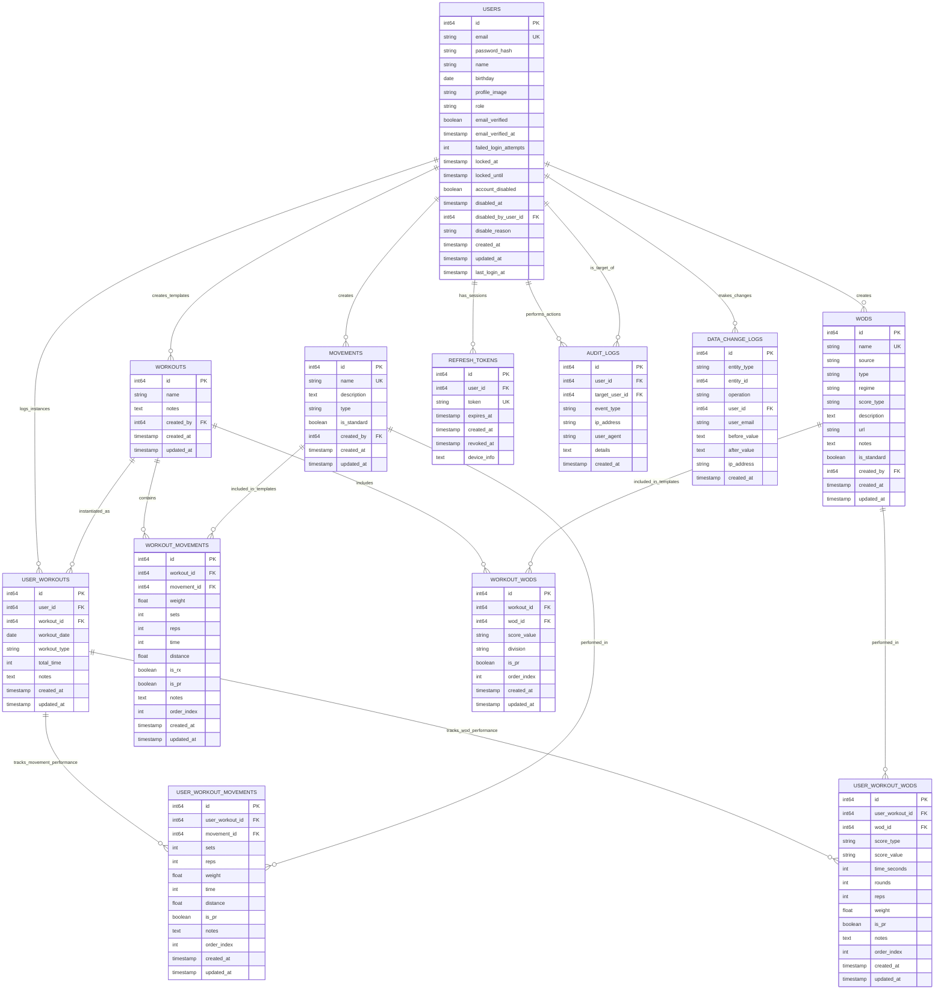

# Database Schema

ActaLog uses a relational database to store user data, workouts, movements, and workout history.

## Supported Databases

- **SQLite** (default for development, single-user deployments)
- **PostgreSQL** (recommended for production, multi-user deployments)
  - Driver: `pgx/v5` (migrated from lib/pq in v0.8.0)
  - Features: Schema isolation, connection pooling, 10-30% performance improvement
- **MariaDB/MySQL** (supported for production, shared hosting)
  - Features: Connection pooling, full compatibility verified

## Schema Version

**Current Version:** 0.27.0-beta (Class Scheduling Phase 4)

## Recent Changes (v0.27.0-beta)

- **Class Scheduling Phase 4**: Documents, packages, credits, waitlist, notifications
  - New `documents` table - Document types required by organizations (waivers, liability forms)
  - New `user_documents` table - Track user document completion status
  - New `class_packages` table - Credit packages (e.g., "10-Class Pack")
  - New `user_class_credits` table - User credit balances with expiration
  - New `waitlist_entries` table - Waitlist queue for full classes
  - New `class_notifications` table - Class reminders and waitlist promotions
  - All tables have proper indexes and foreign key constraints
  - Multi-database support verified (SQLite, PostgreSQL, MariaDB)

## Recent Changes (v0.26.0-beta)

- **Class Scheduling System (Phases 1-3)**: Core scheduling infrastructure
  - New `gym_locations` table - Physical locations within gyms
  - New `class_templates` table - Reusable class definitions
  - New `schedule_slots` table - Recurring time patterns per template
  - New `class_sessions` table - Scheduled class instances
  - New `coach_assignments` table - Per-gym coach role assignments
  - New `session_coaches` table - Coaches assigned to specific sessions
  - New `reservations` table - User bookings with state tracking

## Recent Changes (v0.16.0-beta)

- **Notification Likes Feature**: Social engagement for gym community
  - New `notification_likes` table (4 columns, 4 indexes + unique constraint)
  - Columns: `id`, `notification_id`, `user_id`, `created_at`
  - Foreign keys with CASCADE DELETE to `notifications` and `users`
  - Unique constraint prevents duplicate likes from same user
  - Indexes for fast lookup by notification_id and user_id
  - Migration 0.16.0 creates table structure
  - API endpoints: POST/DELETE/GET for like/unlike/list likes
  - Frontend component: NotificationLikes.vue with thumbs up icon
  - Liking a notification marks it as unread for original recipient
  - Only recipient sees like count and liker names
  - Users can like their own notifications

## Recent Changes (v0.15.0-beta)

- **Admin Announcements**: Gym-wide notification system
  - Admin-only endpoint for creating announcements
  - Sends notifications to all users in the system
  - Flexible notification types (PR achievements, announcements, streaks, milestones)
  - Complete audit trail for announcement operations
  - API endpoint: POST `/api/admin/notifications/announce`

## Recent Changes (v0.14.0-beta)

- **Subscription Billing System**: Dual-level subscription management (user + organization)
  - New `user_subscriptions` table (15 columns, 4 indexes)
  - New `organization_subscriptions` table (15 columns, 4 indexes)
  - Three subscription types: Free, Monthly, Annual
  - Permanent Free option for founders/staff (never expires)
  - Flexible access model: users have write access if EITHER personal OR organization subscription active
  - Manual admin payment control (mark as paid/unpaid)
  - Immediate read-only mode when expired (no grace period)
  - HTTP 402 Payment Required for blocked write operations
  - Read operations (GET) allowed when expired for viewing/exporting
  - Migration 0.14.0 automatically seeds all existing users with permanent free subscriptions
  - Complete audit trail for all subscription operations
  - 10 API endpoints (8 admin, 2 user) for subscription management
- **Database Version Management**: System for testing migrations across versions
  - SQLite snapshots: `db_versions/actalog_X.Y.Z.db`
  - PostgreSQL schemas: `actalog_X_Y_Z` (schema-based versioning)
  - MariaDB databases: `actalog_X_Y_Z` (database-based versioning)
  - Automation scripts: `create-db-snapshot.sh`, `verify-version-databases.sh`
  - Comprehensive documentation: `VERSION_DATABASES.md`, `MIGRATION_TEST_0.14.0.md`
- **Backward Compatibility**: Zero downtime deployment verified on all 3 database engines

## Recent Changes (v0.12.2-beta)

- **No schema changes** in this release
- **PWA Offline Functionality Fix**: Service worker and offline detection improvements
  - Fixed service worker caching pattern for API endpoints
  - Added robust offline detection in axios interceptor
  - Added user-controlled PWA update mechanism
  - Added offline save notification system
- Frontend: New UpdatePrompt component and PWA state management store

## Recent Changes (v0.12.1-beta)

- **No schema changes** in this release
- **MySQL/MariaDB Compatibility Fix**: Database-agnostic timestamp functions
  - Fixed `addWorkoutMovementWithDistance()` to use `NOW()` for MySQL/MariaDB
  - Fixed `refresh_token_repository.go` functions with hardcoded SQLite syntax
  - Added `getTimestampFunc()` helper supporting all database drivers
- Documentation: Enhanced Docker host database troubleshooting guides

## Recent Changes (v0.12.0-beta)

- **No schema changes** in this release
- Frontend/PWA enhancements: Mobile overflow fix across 27 views, iOS safe-area handling
- Docker enhancements: OCI-compliant labels added to build scripts
- Admin UI: User Content view Actions column moved to first position

## Recent Changes (v0.11.0-beta)

- **Data Change Audit Logging**: Complete audit trail for data modifications
  - New `data_change_logs` table tracks INSERT, UPDATE, DELETE operations
  - Captures entity type, entity ID, operation type, before/after values as JSON
  - Records user ID, email, and IP address for each change
  - Integrated with WOD and Movement services for automatic logging
  - Admin-only API endpoints for viewing and filtering logs
  - Admin UI for browsing, filtering, and inspecting changes
  - Cleanup endpoint for log retention management
- **Admin Features**:
  - New Data Change Logs admin view with filtering by entity type, operation, user email
  - Paginated data table with before/after value comparison
  - Details dialog showing diff view for update operations
  - Quick access from admin profile page

## Recent Changes (v0.8.1-beta)

- **No schema changes** in this release (database structure remains identical)
- **Cross-Database Backup/Restore**: Complete database-agnostic system
  - Database-agnostic table existence checks (works with SQLite, PostgreSQL, MariaDB)
  - Table column introspection for schema evolution support
  - Automatic schema difference detection and handling
  - **Cross-database migration support**:
    - ✅ MariaDB → PostgreSQL
    - ✅ SQLite → PostgreSQL
    - ✅ MySQL → MariaDB
    - ✅ Any combination of supported databases
- **Schema Evolution Support**:
  - Restore old backups (v0.6.0+) to newer versions
  - Column filtering: Handles removed columns gracefully
  - New columns use DEFAULT values from schema
  - Automatic data type conversion (especially boolean handling)
- **PostgreSQL Enhancements**:
  - Automatic sequence reset after restore (`setval()` + `pg_get_serial_sequence()`)
  - Prevents "duplicate key violation" errors on subsequent inserts
- **Data Migration Capabilities**:
  - Development (SQLite) → Production (PostgreSQL) via backup/restore
  - Emergency recovery to different database type
  - Multi-tenant migrations using PostgreSQL schema parameter
  - Zero manual SQL intervention required

## Recent Changes (v0.8.0-beta)

- **No schema changes** in this release (database structure remains identical)
- **Database Driver Migration**: PostgreSQL driver migrated from lib/pq to pgx/v5
  - BREAKING for PostgreSQL users (see docs/POSTGRESQL_MIGRATION.md)
  - Full backward compatibility for SQLite and MySQL/MariaDB
  - 10-30% performance improvement for PostgreSQL workloads
- **New Database Features**:
  - Schema isolation support via `DB_SCHEMA` environment variable (PostgreSQL)
  - Connection pooling configuration: `DB_MAX_OPEN_CONNS`, `DB_MAX_IDLE_CONNS`, `DB_CONN_MAX_LIFETIME`
  - Database-agnostic SQL abstraction layer for multi-database compatibility
- **Testing**: All three databases verified working (SQLite, PostgreSQL 16, MariaDB 11)
- **Documentation**: Created comprehensive PostgreSQL migration guide

## Recent Changes (v0.7.6-beta)

- No schema changes in this release
- Backend enhancements: Backup upload for migration, enhanced audit logging, cross-version restore compatibility
- Documentation planning: End-user help docs, admin documentation, test coverage

## Recent Changes (v0.7.5-beta)

- No schema changes in this release
- Backend enhancements: Remember Me functionality, database backup system activation
- Frontend enhancements: Admin user management integration, PR history date fixes

## Recent Changes (v0.7.4-beta)

- No schema changes in this release
- Frontend enhancements: Quick Log buttons on library cards and detail pages

## Recent Changes (v0.7.3-beta)

- No schema changes in this release
- Frontend enhancements: Quick Log integration on Performance screen, improved chart sorting

## Recent Changes (v0.4.6-beta)

- Added session management endpoints and audit logging
- Enhanced admin user management with delete functionality
- Fixed user repository List() method to include all admin fields
- All user security fields now properly exposed to admin interface

## Entity Relationship Diagram


```mermaid
erDiagram
    USERS ||--o{ WORKOUTS : creates_templates
    USERS ||--o{ USER_WORKOUTS : logs_instances
    USERS ||--o{ MOVEMENTS : creates
    USERS ||--o{ WODS : creates
    USERS ||--o{ REFRESH_TOKENS : has_sessions
    USERS ||--o{ AUDIT_LOGS : performs_actions
    USERS ||--o{ AUDIT_LOGS : is_target_of
    USERS ||--o{ DATA_CHANGE_LOGS : makes_changes

    WORKOUTS ||--o{ WORKOUT_MOVEMENTS : contains
    WORKOUTS ||--o{ WORKOUT_WODS : includes
    WORKOUTS ||--o{ USER_WORKOUTS : instantiated_as

    USER_WORKOUTS ||--o{ USER_WORKOUT_MOVEMENTS : tracks_movement_performance
    USER_WORKOUTS ||--o{ USER_WORKOUT_WODS : tracks_wod_performance

    MOVEMENTS ||--o{ WORKOUT_MOVEMENTS : included_in_templates
    MOVEMENTS ||--o{ USER_WORKOUT_MOVEMENTS : performed_in

    WODS ||--o{ WORKOUT_WODS : included_in_templates
    WODS ||--o{ USER_WORKOUT_WODS : performed_in

    USERS {
        int64 id PK
        string email UK
        string password_hash
        string name
        date birthday
        string profile_image
        string role
        boolean email_verified
        timestamp email_verified_at
        int failed_login_attempts
        timestamp locked_at
        timestamp locked_until
        boolean account_disabled
        timestamp disabled_at
        int64 disabled_by_user_id FK
        string disable_reason
        timestamp created_at
        timestamp updated_at
        timestamp last_login_at
    }

    WORKOUTS {
        int64 id PK
        string name
        text notes
        int64 created_by FK
        timestamp created_at
        timestamp updated_at
    }

    USER_WORKOUTS {
        int64 id PK
        int64 user_id FK
        int64 workout_id FK
        date workout_date
        string workout_type
        int total_time
        text notes
        timestamp created_at
        timestamp updated_at
    }

    MOVEMENTS {
        int64 id PK
        string name UK
        text description
        string type
        boolean is_standard
        int64 created_by FK
        timestamp created_at
        timestamp updated_at
    }

    WODS {
        int64 id PK
        string name UK
        string source
        string type
        string regime
        string score_type
        text description
        string url
        text notes
        boolean is_standard
        int64 created_by FK
        timestamp created_at
        timestamp updated_at
    }

    WORKOUT_MOVEMENTS {
        int64 id PK
        int64 workout_id FK
        int64 movement_id FK
        float weight
        int sets
        int reps
        int time
        float distance
        boolean is_rx
        boolean is_pr
        text notes
        int order_index
        timestamp created_at
        timestamp updated_at
    }

    WORKOUT_WODS {
        int64 id PK
        int64 workout_id FK
        int64 wod_id FK
        string score_value
        string division
        boolean is_pr
        int order_index
        timestamp created_at
        timestamp updated_at
    }

    USER_WORKOUT_MOVEMENTS {
        int64 id PK
        int64 user_workout_id FK
        int64 movement_id FK
        int sets
        int reps
        float weight
        int time
        float distance
        boolean is_pr
        text notes
        int order_index
        timestamp created_at
        timestamp updated_at
    }

    USER_WORKOUT_WODS {
        int64 id PK
        int64 user_workout_id FK
        int64 wod_id FK
        string score_type
        string score_value
        int time_seconds
        int rounds
        int reps
        float weight
        boolean is_pr
        text notes
        int order_index
        timestamp created_at
        timestamp updated_at
    }

    REFRESH_TOKENS {
        int64 id PK
        int64 user_id FK
        string token UK
        timestamp expires_at
        timestamp created_at
        timestamp revoked_at
        text device_info
    }

    AUDIT_LOGS {
        int64 id PK
        int64 user_id FK
        int64 target_user_id FK
        string event_type
        string ip_address
        string user_agent
        text details
        timestamp created_at
    }

    DATA_CHANGE_LOGS {
        int64 id PK
        string entity_type
        int64 entity_id
        string operation
        int64 user_id FK
        string user_email
        text before_value
        text after_value
        string ip_address
        timestamp created_at
    }
```

## Logical Data Model

The ActaLog data model uses a **template-based workout system**:

**Workout Template** → **User Workout Instance** → **Performance Tracking**

### Key Principles

1. **Workouts** are reusable templates containing movements and/or WODs
2. **User Workouts** are specific instances of workouts logged by users on specific dates
3. **Movements** are exercise definitions (weightlifting, cardio, gymnastics)
4. **WODs** are benchmark workout definitions (Fran, Murph, etc.)
5. **Performance Tracking** captures actual sets, reps, weights, times for each workout instance
6. **Personal Records (PRs)** are automatically flagged for both movements and WODs
7. Users can create custom movements and WODs in addition to standard pre-seeded ones
8. **Audit Logs** track all security-related events and administrative actions

## Table Definitions

### users

Stores user account information, authentication credentials, profile data, and security features.

| Column | Type | Constraints | Description |
|--------|------|-------------|-------------|
| id | BIGINT | PRIMARY KEY, AUTO_INCREMENT | Unique user identifier |
| email | VARCHAR(255) | UNIQUE, NOT NULL | User email (login identifier) |
| password_hash | VARCHAR(255) | NOT NULL | Bcrypt hashed password (cost ≥12) |
| name | VARCHAR(255) | NOT NULL | User display name |
| birthday | DATE | NULL | User's birth date (added v0.3.3) |
| profile_image | TEXT | NULL | URL to profile picture |
| role | VARCHAR(50) | NOT NULL, DEFAULT 'user' | User role: 'user' or 'admin' |
| email_verified | BOOLEAN | NOT NULL, DEFAULT FALSE | Email verification status (added v0.3.1) |
| email_verified_at | TIMESTAMP | NULL | When email was verified (added v0.3.1) |
| failed_login_attempts | INT | NOT NULL, DEFAULT 0 | Count of consecutive failed logins (added v0.4.6) |
| locked_at | TIMESTAMP | NULL | When account was locked due to failed attempts (added v0.4.6) |
| locked_until | TIMESTAMP | NULL | When account lock expires (added v0.4.6) |
| account_disabled | BOOLEAN | NOT NULL, DEFAULT FALSE | Manual disable by admin (added v0.4.6) |
| disabled_at | TIMESTAMP | NULL | When account was manually disabled (added v0.4.6) |
| disabled_by_user_id | BIGINT | NULL, FOREIGN KEY | Admin who disabled the account (added v0.4.6) |
| disable_reason | TEXT | NULL | Reason for account disable (added v0.4.7) |
| created_at | TIMESTAMP | NOT NULL, DEFAULT CURRENT_TIMESTAMP | Account creation time |
| updated_at | TIMESTAMP | NOT NULL, DEFAULT CURRENT_TIMESTAMP | Last update time |
| last_login_at | TIMESTAMP | NULL | Last successful login |

**Indexes:**
- PRIMARY KEY (id)
- UNIQUE INDEX idx_users_email (email)
- INDEX idx_users_role (role)

**Foreign Keys:**
- FOREIGN KEY (disabled_by_user_id) REFERENCES users(id) ON DELETE SET NULL

**Security Features:**
- **Password hashing:** Bcrypt with cost factor 12
- **Account lockout:** 5 failed login attempts → 15 minute lock (configurable)
- **Manual disable:** Admins can disable accounts with reason tracking
- **Email verification:** Prevents login until email is verified
- **Audit trail:** All security events logged to audit_logs table

**Business Rules:**
- First registered user automatically receives 'admin' role
- JWT tokens used for authentication (stored client-side only, server tracks refresh tokens)
- Locked accounts automatically unlock after locked_until timestamp
- Disabled accounts cannot login until re-enabled by admin
- Admin cannot disable their own account

### workouts

Stores reusable workout templates (not instances). Templates can be standard (pre-seeded) or custom (user-created).

| Column | Type | Constraints | Description |
|--------|------|-------------|-------------|
| id | BIGINT | PRIMARY KEY, AUTO_INCREMENT | Unique workout template identifier |
| name | VARCHAR(255) | NOT NULL | Template name (e.g., "Strength Training - Back Squat Focus") |
| notes | TEXT | NULL | Template description/instructions |
| created_by | BIGINT | NULL, FOREIGN KEY | User who created template (NULL for standard) |
| created_at | TIMESTAMP | NOT NULL, DEFAULT CURRENT_TIMESTAMP | Record creation time |
| updated_at | TIMESTAMP | NOT NULL, DEFAULT CURRENT_TIMESTAMP | Last update time |

**Indexes:**
- PRIMARY KEY (id)
- INDEX idx_workouts_created_by (created_by)
- INDEX idx_workouts_name (name)

**Foreign Keys:**
- FOREIGN KEY (created_by) REFERENCES users(id) ON DELETE SET NULL

**Design Note:**
- Workouts are templates, not instances
- Templates can include movements (via workout_movements) and/or WODs (via workout_wods)
- Users instantiate templates via user_workouts when logging actual workout sessions

### user_workouts

Stores user-specific workout instances logged on specific dates (instantiations of workout templates).

| Column | Type | Constraints | Description |
|--------|------|-------------|-------------|
| id | BIGINT | PRIMARY KEY, AUTO_INCREMENT | Unique workout instance identifier |
| user_id | BIGINT | NOT NULL, FOREIGN KEY | Reference to users.id |
| workout_id | BIGINT | NOT NULL, FOREIGN KEY | Reference to workouts.id (template) |
| workout_date | DATE | NOT NULL | Date workout was performed |
| workout_type | VARCHAR(255) | NULL | Type: strength, metcon, cardio, mixed |
| total_time | INT | NULL | Total workout duration (seconds) |
| notes | TEXT | NULL | User's notes for this workout instance |
| created_at | TIMESTAMP | NOT NULL, DEFAULT CURRENT_TIMESTAMP | Record creation time |
| updated_at | TIMESTAMP | NOT NULL, DEFAULT CURRENT_TIMESTAMP | Last update time |

**Indexes:**
- PRIMARY KEY (id)
- INDEX idx_user_workouts_user_id (user_id)
- INDEX idx_user_workouts_workout_date (workout_date)
- INDEX idx_user_workouts_user_date (user_id, workout_date DESC)

**Foreign Keys:**
- FOREIGN KEY (user_id) REFERENCES users(id) ON DELETE CASCADE
- FOREIGN KEY (workout_id) REFERENCES workouts(id) ON DELETE RESTRICT

**Design Note:**
- Each user_workout is a specific instance of a workout template
- Performance data (sets, reps, weights) stored in user_workout_movements and user_workout_wods
- Users can log multiple workouts per day

### movements

Stores movement/exercise definitions (both standard and user-created).

| Column | Type | Constraints | Description |
|--------|------|-------------|-------------|
| id | BIGINT | PRIMARY KEY, AUTO_INCREMENT | Unique movement identifier |
| name | VARCHAR(255) | UNIQUE, NOT NULL | Movement name (e.g., "Back Squat") |
| description | TEXT | NULL | Movement description/instructions |
| type | VARCHAR(50) | NOT NULL | Type: weightlifting, cardio, gymnastics, bodyweight |
| is_standard | BOOLEAN | NOT NULL, DEFAULT FALSE | TRUE for pre-seeded movements, FALSE for user-created |
| created_by | BIGINT | NULL, FOREIGN KEY | User ID if custom movement (NULL for standard) |
| created_at | TIMESTAMP | NOT NULL, DEFAULT CURRENT_TIMESTAMP | Record creation time |
| updated_at | TIMESTAMP | NOT NULL, DEFAULT CURRENT_TIMESTAMP | Last update time |

**Indexes:**
- PRIMARY KEY (id)
- UNIQUE INDEX idx_movements_name (name)
- INDEX idx_movements_type (type)
- INDEX idx_movements_standard (is_standard)

**Foreign Keys:**
- FOREIGN KEY (created_by) REFERENCES users(id) ON DELETE SET NULL

**Standard Movements:**
The application pre-seeds 31 standard CrossFit movements on first run (see Standard Movements section below).

### workout_movements

Junction table linking workouts to movements with performance details.

| Column | Type | Constraints | Description |
|--------|------|-------------|-------------|
| id | BIGINT | PRIMARY KEY, AUTO_INCREMENT | Unique record identifier |
| workout_id | BIGINT | NOT NULL, FOREIGN KEY | Reference to workouts.id |
| movement_id | BIGINT | NOT NULL, FOREIGN KEY | Reference to movements.id |
| weight | DECIMAL(10,2) | NULL | Weight used (lbs or kg) |
| sets | INT | NULL | Number of sets |
| reps | INT | NULL | Reps per set or total reps |
| time | INT | NULL | Time for movement (seconds) |
| distance | DECIMAL(10,2) | NULL | Distance (meters, miles, etc.) |
| is_rx | BOOLEAN | NOT NULL, DEFAULT FALSE | TRUE if performed as prescribed |
| is_pr | BOOLEAN | NOT NULL, DEFAULT FALSE | Personal record flag (added v0.3.0) |
| notes | TEXT | NULL | Movement-specific notes |
| order_index | INT | NOT NULL, DEFAULT 0 | Order in workout sequence |
| created_at | TIMESTAMP | NOT NULL, DEFAULT CURRENT_TIMESTAMP | Record creation time |
| updated_at | TIMESTAMP | NOT NULL, DEFAULT CURRENT_TIMESTAMP | Last update time |

**Indexes:**
- PRIMARY KEY (id)
- INDEX idx_wm_workout_id (workout_id)
- INDEX idx_wm_movement_id (movement_id)
- INDEX idx_wm_workout_order (workout_id, order_index)

**Foreign Keys:**
- FOREIGN KEY (workout_id) REFERENCES workouts(id) ON DELETE CASCADE
- FOREIGN KEY (movement_id) REFERENCES movements(id) ON DELETE RESTRICT

**PR Auto-Detection:**
When a workout is created, the system automatically compares weight for each movement against the user's historical max and sets `is_pr=TRUE` if it's a new personal record. Users can also manually toggle the PR flag.

### refresh_tokens

Stores refresh tokens for "Remember Me" functionality (added v0.3.2).

| Column | Type | Constraints | Description |
|--------|------|-------------|-------------|
| id | BIGINT | PRIMARY KEY, AUTO_INCREMENT | Unique token identifier |
| user_id | BIGINT | NOT NULL, FOREIGN KEY | Reference to users.id |
| token | VARCHAR(255) | UNIQUE, NOT NULL | Cryptographically secure token |
| expires_at | TIMESTAMP | NOT NULL | Token expiration time |
| created_at | TIMESTAMP | NOT NULL | Token creation time |
| revoked_at | TIMESTAMP | NULL | When token was revoked (logout) |
| device_info | TEXT | NULL | Device/browser information |

**Indexes:**
- PRIMARY KEY (id)
- UNIQUE INDEX idx_refresh_tokens_token (token)
- INDEX idx_refresh_tokens_user_id (user_id)
- INDEX idx_refresh_tokens_expires (expires_at)

**Foreign Keys:**
- FOREIGN KEY (user_id) REFERENCES users(id) ON DELETE CASCADE

**Security Notes:**
- Tokens are 32-byte cryptographically secure random strings
- Tokens expire after 30 days
- Users can have multiple active tokens (different devices)
- Tokens are revoked on logout

### password_resets

Stores password reset tokens (separate repository implementation).

| Column | Type | Constraints | Description |
|--------|------|-------------|-------------|
| id | BIGINT | PRIMARY KEY, AUTO_INCREMENT | Unique reset identifier |
| user_id | BIGINT | NOT NULL, FOREIGN KEY | Reference to users.id |
| token | VARCHAR(255) | UNIQUE, NOT NULL | Password reset token |
| expires_at | TIMESTAMP | NOT NULL | Token expiration (1 hour) |
| used_at | TIMESTAMP | NULL | When token was used |
| created_at | TIMESTAMP | NOT NULL | Token creation time |

**Indexes:**
- PRIMARY KEY (id)
- UNIQUE INDEX idx_password_resets_token (token)
- INDEX idx_password_resets_user_id (user_id)

**Foreign Keys:**
- FOREIGN KEY (user_id) REFERENCES users(id) ON DELETE CASCADE

**Security:**
- Tokens are single-use only
- Tokens expire after 1 hour
- Email delivery via SMTP (configurable)

### email_verification_tokens

Stores email verification tokens (separate repository implementation).

| Column | Type | Constraints | Description |
|--------|------|-------------|-------------|
| id | BIGINT | PRIMARY KEY, AUTO_INCREMENT | Unique verification identifier |
| user_id | BIGINT | NOT NULL, FOREIGN KEY | Reference to users.id |
| token | VARCHAR(255) | UNIQUE, NOT NULL | Email verification token |
| expires_at | TIMESTAMP | NOT NULL | Token expiration (24 hours) |
| used_at | TIMESTAMP | NULL | When token was used |
| created_at | TIMESTAMP | NOT NULL | Token creation time |

**Indexes:**
- PRIMARY KEY (id)
- UNIQUE INDEX idx_email_verification_tokens_token (token)
- INDEX idx_email_verification_tokens_user_id (user_id)

**Foreign Keys:**
- FOREIGN KEY (user_id) REFERENCES users(id) ON DELETE CASCADE

**Behavior:**
- Sent automatically on user registration
- Sent on email address change
- Tokens expire after 24 hours
- Single-use tokens

### data_change_logs

Stores audit trail of data modifications for WODs, Movements, and other entities (added v0.11.0).

| Column | Type | Constraints | Description |
|--------|------|-------------|-------------|
| id | BIGINT | PRIMARY KEY, AUTO_INCREMENT | Unique log entry identifier |
| entity_type | VARCHAR(100) | NOT NULL | Type of entity modified (wod, movement, etc.) |
| entity_id | BIGINT | NOT NULL | ID of the modified entity |
| operation | VARCHAR(50) | NOT NULL | Operation type: INSERT, UPDATE, DELETE |
| user_id | BIGINT | NULL, FOREIGN KEY | Reference to users.id who made the change |
| user_email | VARCHAR(255) | NULL | Email of user who made the change (denormalized) |
| before_value | TEXT | NULL | JSON snapshot of entity before change |
| after_value | TEXT | NULL | JSON snapshot of entity after change |
| ip_address | VARCHAR(45) | NULL | IP address of the request |
| created_at | TIMESTAMP | NOT NULL, DEFAULT CURRENT_TIMESTAMP | When the change occurred |

**Indexes:**
- PRIMARY KEY (id)
- INDEX idx_data_change_logs_entity (entity_type, entity_id)
- INDEX idx_data_change_logs_user_id (user_id)
- INDEX idx_data_change_logs_created_at (created_at)
- INDEX idx_data_change_logs_operation (operation)

**Foreign Keys:**
- FOREIGN KEY (user_id) REFERENCES users(id) ON DELETE SET NULL

**Design Notes:**
- `before_value` is NULL for INSERT operations
- `after_value` is NULL for DELETE operations
- Both `before_value` and `after_value` contain JSON for UPDATE operations
- `user_email` is denormalized for query convenience and historical accuracy
- Admin-only access for viewing logs
- Supports retention-based cleanup via API

**Use Cases:**
- Audit trail for compliance and security
- Track who modified what and when
- Ability to see before/after values for updates
- Filter by entity type, operation, user, or date range

### user_subscriptions

Stores individual user-level subscription billing information (added v0.14.0).

| Column | Type | Constraints | Description |
|--------|------|-------------|-------------|
| id | BIGINT | PRIMARY KEY, AUTO_INCREMENT | Unique subscription identifier |
| user_id | BIGINT | NOT NULL, FOREIGN KEY | Reference to users.id |
| subscription_type | VARCHAR(20) | NOT NULL, CHECK | Subscription type: 'free', 'monthly', 'annual' |
| status | VARCHAR(20) | NOT NULL, CHECK | Status: 'active', 'expired', 'cancelled' |
| is_permanent_free | BOOLEAN | NOT NULL, DEFAULT FALSE | Permanent free access (never expires) |
| start_date | TIMESTAMP | NOT NULL | When subscription started |
| end_date | TIMESTAMP | NULL | When subscription expires (NULL for permanent free) |
| last_payment_date | TIMESTAMP | NULL | Last successful payment date |
| next_billing_date | TIMESTAMP | NULL | Next billing date (NULL for free/permanent) |
| cancelled_at | TIMESTAMP | NULL | When subscription was cancelled |
| cancelled_reason | TEXT | NULL | Reason for cancellation |
| notes | TEXT | NULL | Admin notes about subscription |
| created_at | TIMESTAMP | NOT NULL, DEFAULT CURRENT_TIMESTAMP | Record creation time |
| updated_at | TIMESTAMP | NOT NULL, DEFAULT CURRENT_TIMESTAMP | Last update time |
| created_by_user_id | BIGINT | NULL, FOREIGN KEY | Admin who created/modified |

**Indexes:**
- PRIMARY KEY (id)
- INDEX idx_user_subscriptions_user_id (user_id)
- INDEX idx_user_subscriptions_status (status)
- INDEX idx_user_subscriptions_next_billing (next_billing_date)

**Foreign Keys:**
- FOREIGN KEY (user_id) REFERENCES users(id) ON DELETE CASCADE
- FOREIGN KEY (created_by_user_id) REFERENCES users(id) ON DELETE SET NULL

**Constraints:**
- CHECK (subscription_type IN ('free', 'monthly', 'annual'))
- CHECK (status IN ('active', 'expired', 'cancelled'))

**Business Rules:**
- Users have write access if EITHER personal OR any organization subscription is active
- Permanent free subscriptions never expire (is_permanent_free = TRUE, end_date = NULL)
- Monthly subscriptions: end_date = last_payment_date + 30 days
- Annual subscriptions: end_date = last_payment_date + 365 days
- Admins manually mark subscriptions as paid (updates last_payment_date, extends end_date)
- When subscription expires: immediate read-only mode (no grace period)
- Read-only mode allows: GET requests (view, export, dashboard)
- Read-only mode blocks: POST/PUT/PATCH/DELETE (returns HTTP 402 Payment Required)
- All subscription operations are logged to audit_logs
- Migration 0.14.0 seeds all existing users with permanent free subscriptions

### organization_subscriptions

Stores organization-level subscription billing information (added v0.14.0). Allows gyms/teams to pay for all members.

| Column | Type | Constraints | Description |
|--------|------|-------------|-------------|
| id | BIGINT | PRIMARY KEY, AUTO_INCREMENT | Unique subscription identifier |
| organization_id | BIGINT | NOT NULL, FOREIGN KEY | Reference to organizations.id |
| subscription_type | VARCHAR(20) | NOT NULL, CHECK | Subscription type: 'free', 'monthly', 'annual' |
| status | VARCHAR(20) | NOT NULL, CHECK | Status: 'active', 'expired', 'cancelled' |
| is_permanent_free | BOOLEAN | NOT NULL, DEFAULT FALSE | Permanent free access (never expires) |
| start_date | TIMESTAMP | NOT NULL | When subscription started |
| end_date | TIMESTAMP | NULL | When subscription expires (NULL for permanent free) |
| last_payment_date | TIMESTAMP | NULL | Last successful payment date |
| next_billing_date | TIMESTAMP | NULL | Next billing date (NULL for free/permanent) |
| cancelled_at | TIMESTAMP | NULL | When subscription was cancelled |
| cancelled_reason | TEXT | NULL | Reason for cancellation |
| notes | TEXT | NULL | Admin notes about subscription |
| created_at | TIMESTAMP | NOT NULL, DEFAULT CURRENT_TIMESTAMP | Record creation time |
| updated_at | TIMESTAMP | NOT NULL, DEFAULT CURRENT_TIMESTAMP | Last update time |
| created_by_user_id | BIGINT | NULL, FOREIGN KEY | Admin who created/modified |

**Indexes:**
- PRIMARY KEY (id)
- INDEX idx_org_subscriptions_org_id (organization_id)
- INDEX idx_org_subscriptions_status (status)
- INDEX idx_org_subscriptions_next_billing (next_billing_date)

**Foreign Keys:**
- FOREIGN KEY (organization_id) REFERENCES organizations(id) ON DELETE CASCADE
- FOREIGN KEY (created_by_user_id) REFERENCES users(id) ON DELETE SET NULL

**Constraints:**
- CHECK (subscription_type IN ('free', 'monthly', 'annual'))
- CHECK (status IN ('active', 'expired', 'cancelled'))

**Business Rules:**
- All members of an organization benefit from organization subscription
- If any organization a user belongs to has active subscription, user has write access
- Dual-level access check: CheckUserAccess() returns TRUE if EITHER personal OR organization subscription active
- Performance optimization: User subscription checked first (single query), organization subscriptions second

**Subscription Access Logic:**
```
User has write access if:
  1. User has active personal subscription (is_permanent_free OR end_date > NOW())
  OR
  2. User belongs to ≥1 organization with active subscription
```

**API Endpoints (v0.14.0):**
- User: `GET /api/subscriptions/status` - View subscription status
- Admin: `POST /api/admin/subscriptions/user` - Create user subscription
- Admin: `POST /api/admin/subscriptions/user/{id}/mark-paid` - Mark as paid
- Admin: `POST /api/admin/subscriptions/user/{id}/cancel` - Cancel subscription
- Admin: `GET /api/admin/subscriptions/user/{user_id}` - View subscription history
- Organization endpoints follow same pattern

### documents

Stores document types that organizations require users to complete (waivers, liability forms, health forms). Added in v0.27.0.

| Column | Type | Constraints | Description |
|--------|------|-------------|-------------|
| id | BIGINT | PRIMARY KEY, AUTO_INCREMENT | Unique document identifier |
| organization_id | BIGINT | NOT NULL, FOREIGN KEY | Reference to organizations.id |
| name | VARCHAR(255) | NOT NULL | Document name (e.g., "Liability Waiver") |
| description | TEXT | NULL | Description of the document |
| document_type | VARCHAR(50) | NOT NULL, DEFAULT 'waiver' | Type: waiver, liability, health, other |
| url | TEXT | NULL | URL to external document (if applicable) |
| is_required | BOOLEAN | NOT NULL, DEFAULT TRUE | Whether document is required |
| expires_after_days | INT | NULL | Days until document expires (NULL = never) |
| is_active | BOOLEAN | NOT NULL, DEFAULT TRUE | Whether document is currently active |
| created_at | TIMESTAMP | NOT NULL | Record creation time |
| updated_at | TIMESTAMP | NOT NULL | Last update time |

**Indexes:** idx_documents_org_id, idx_documents_active, idx_documents_type

**Foreign Keys:** organization_id → organizations(id) ON DELETE CASCADE

### user_documents

Tracks which documents each user has completed. Added in v0.27.0.

| Column | Type | Constraints | Description |
|--------|------|-------------|-------------|
| id | BIGINT | PRIMARY KEY, AUTO_INCREMENT | Unique record identifier |
| user_id | BIGINT | NOT NULL, FOREIGN KEY | Reference to users.id |
| document_id | BIGINT | NOT NULL, FOREIGN KEY | Reference to documents.id |
| status | VARCHAR(50) | NOT NULL, DEFAULT 'pending' | Status: pending, completed, expired |
| completed_at | TIMESTAMP | NULL | When document was completed |
| expires_at | TIMESTAMP | NULL | When completion expires |
| verified_by_user_id | BIGINT | NULL, FOREIGN KEY | Admin who verified completion |
| notes | TEXT | NULL | Admin notes |
| created_at | TIMESTAMP | NOT NULL | Record creation time |
| updated_at | TIMESTAMP | NOT NULL | Last update time |

**Indexes:** idx_user_documents_user_id, idx_user_documents_document_id, idx_user_documents_status, idx_user_documents_expires

**Foreign Keys:** user_id → users(id) CASCADE, document_id → documents(id) CASCADE, verified_by_user_id → users(id) SET NULL

**Unique Constraint:** (user_id, document_id)

### class_packages

Stores credit package definitions that can be purchased. Added in v0.27.0.

| Column | Type | Constraints | Description |
|--------|------|-------------|-------------|
| id | BIGINT | PRIMARY KEY, AUTO_INCREMENT | Unique package identifier |
| organization_id | BIGINT | NOT NULL, FOREIGN KEY | Reference to organizations.id |
| name | VARCHAR(255) | NOT NULL | Package name (e.g., "10-Class Pack") |
| description | TEXT | NULL | Package description |
| credits | INT | NOT NULL | Number of credits in package |
| price_cents | INT | NOT NULL, DEFAULT 0 | Price in cents |
| validity_days | INT | NULL | Days until credits expire (NULL = never) |
| is_active | BOOLEAN | NOT NULL, DEFAULT TRUE | Whether package is available |
| created_at | TIMESTAMP | NOT NULL | Record creation time |
| updated_at | TIMESTAMP | NOT NULL | Last update time |

**Indexes:** idx_class_packages_org_id, idx_class_packages_active

**Foreign Keys:** organization_id → organizations(id) ON DELETE CASCADE

### user_class_credits

Tracks user credit balances from purchased packages. Added in v0.27.0.

| Column | Type | Constraints | Description |
|--------|------|-------------|-------------|
| id | BIGINT | PRIMARY KEY, AUTO_INCREMENT | Unique credit record identifier |
| user_id | BIGINT | NOT NULL, FOREIGN KEY | Reference to users.id |
| organization_id | BIGINT | NOT NULL, FOREIGN KEY | Reference to organizations.id |
| package_id | BIGINT | NULL, FOREIGN KEY | Reference to class_packages.id (if from package) |
| credits_total | INT | NOT NULL | Total credits purchased |
| credits_used | INT | NOT NULL, DEFAULT 0 | Credits consumed |
| purchased_at | TIMESTAMP | NOT NULL | When credits were purchased |
| expires_at | TIMESTAMP | NULL | When credits expire |
| notes | TEXT | NULL | Admin notes |
| created_at | TIMESTAMP | NOT NULL | Record creation time |
| updated_at | TIMESTAMP | NOT NULL | Last update time |

**Indexes:** idx_user_class_credits_user_id, idx_user_class_credits_org_id, idx_user_class_credits_expires

**Foreign Keys:** user_id → users(id) CASCADE, organization_id → organizations(id) CASCADE, package_id → class_packages(id) SET NULL

**Calculated Field:** `credits_remaining = credits_total - credits_used`

### waitlist_entries

Queue for users waiting for spots in full classes. Added in v0.27.0.

| Column | Type | Constraints | Description |
|--------|------|-------------|-------------|
| id | BIGINT | PRIMARY KEY, AUTO_INCREMENT | Unique waitlist entry identifier |
| session_id | BIGINT | NOT NULL, FOREIGN KEY | Reference to class_sessions.id |
| user_id | BIGINT | NOT NULL, FOREIGN KEY | Reference to users.id |
| position | INT | NOT NULL | Position in waitlist queue |
| status | VARCHAR(50) | NOT NULL, DEFAULT 'waiting' | Status: waiting, promoted, expired, cancelled |
| joined_at | TIMESTAMP | NOT NULL | When user joined waitlist |
| promoted_at | TIMESTAMP | NULL | When promoted to reservation |
| expired_at | TIMESTAMP | NULL | When entry expired |
| created_at | TIMESTAMP | NOT NULL | Record creation time |
| updated_at | TIMESTAMP | NOT NULL | Last update time |

**Indexes:** idx_waitlist_entries_session_id, idx_waitlist_entries_user_id, idx_waitlist_entries_status, idx_waitlist_entries_position

**Foreign Keys:** session_id → class_sessions(id) CASCADE, user_id → users(id) CASCADE

**Unique Constraint:** (session_id, user_id)

### class_notifications

Notifications for class reminders, waitlist promotions, and cancellations. Added in v0.27.0.

| Column | Type | Constraints | Description |
|--------|------|-------------|-------------|
| id | BIGINT | PRIMARY KEY, AUTO_INCREMENT | Unique notification identifier |
| user_id | BIGINT | NOT NULL, FOREIGN KEY | Reference to users.id |
| session_id | BIGINT | NULL, FOREIGN KEY | Reference to class_sessions.id |
| reservation_id | BIGINT | NULL, FOREIGN KEY | Reference to reservations.id |
| waitlist_entry_id | BIGINT | NULL, FOREIGN KEY | Reference to waitlist_entries.id |
| notification_type | VARCHAR(50) | NOT NULL | Type: reminder, waitlist_promoted, class_cancelled, class_updated |
| status | VARCHAR(50) | NOT NULL, DEFAULT 'pending' | Status: pending, sent, failed |
| scheduled_for | TIMESTAMP | NOT NULL | When notification should be sent |
| sent_at | TIMESTAMP | NULL | When notification was sent |
| error_message | TEXT | NULL | Error message if failed |
| created_at | TIMESTAMP | NOT NULL | Record creation time |
| updated_at | TIMESTAMP | NOT NULL | Last update time |

**Indexes:** idx_class_notifications_user_id, idx_class_notifications_session_id, idx_class_notifications_status, idx_class_notifications_scheduled

**Foreign Keys:** user_id → users(id) CASCADE, session_id → class_sessions(id) CASCADE, reservation_id → reservations(id) CASCADE, waitlist_entry_id → waitlist_entries(id) CASCADE

## Standard Movements

The application pre-seeds 31 standard CrossFit movements on initialization:

### Weightlifting (11 movements)
- Back Squat
- Front Squat
- Overhead Squat
- Deadlift
- Sumo Deadlift
- Clean
- Power Clean
- Snatch
- Power Snatch
- Clean and Jerk
- Thruster

### Gymnastics (8 movements)
- Pull-up
- Chest-to-Bar Pull-up
- Bar Muscle-up
- Ring Muscle-up
- Handstand Push-up
- Strict Handstand Push-up
- Toes-to-Bar
- Knees-to-Elbow

### Bodyweight (6 movements)
- Push-up
- Sit-up
- Air Squat
- Burpee
- Box Jump
- Wall Ball

### Cardio (6 movements)
- Rowing
- Running
- Assault Bike
- Ski Erg
- Jump Rope
- Swimming

**Note:** Users can also create custom movements via the movements API.

## Migration History

Database migrations are managed through `internal/repository/migrations.go` and tracked in the `schema_migrations` table.

### v0.1.0 - Initial Schema
**Description:** Base schema with users, workouts, movements, workout_movements tables

**Tables Created:**
- users (basic auth fields)
- workouts (user-specific instances)
- movements (exercise definitions)
- workout_movements (junction table)

### v0.2.0 - Password Reset
**Description:** Add password reset token fields to users table

**Changes:**
- Added `reset_token` (VARCHAR/TEXT)
- Added `reset_token_expires_at` (TIMESTAMP)

**Features Enabled:** Password reset via email

### v0.3.0 - Personal Records
**Description:** Add PR tracking to workout_movements

**Changes:**
- Added `is_pr` (BOOLEAN) to workout_movements table

**Features Enabled:**
- Automatic PR detection on workout creation
- Manual PR flag toggling
- PR history views

### v0.3.1 - Email Verification
**Description:** Add email verification fields to users table

**Changes:**
- Added `email_verified` (BOOLEAN, DEFAULT FALSE)
- Added `email_verified_at` (TIMESTAMP)
- Added `verification_token` (VARCHAR/TEXT)
- Added `verification_token_expires_at` (TIMESTAMP)

**Features Enabled:**
- Email verification on registration
- Re-verification on email change
- Verification status tracking

### v0.3.2 - Remember Me
**Description:** Add refresh_tokens table for persistent sessions

**Changes:**
- Created `refresh_tokens` table with:
  - id, user_id, token, expires_at, created_at, revoked_at, device_info

**Features Enabled:**
- Remember Me checkbox on login
- 30-day persistent sessions
- Multi-device session management
- Token revocation on logout

### v0.3.3 - User Profiles
**Description:** Add birthday field to users table for profile editing

**Changes:**
- Added `birthday` (DATE) to users table

**Features Enabled:**
- User profile editing (name, email, birthday)
- Profile information display

### v0.11.0 - Data Change Audit Logging
**Description:** Add data_change_logs table for tracking entity modifications

**Changes:**
- Created `data_change_logs` table with:
  - id, entity_type, entity_id, operation, user_id, user_email
  - before_value, after_value (JSON), ip_address, created_at

**Features Enabled:**
- Complete audit trail for WOD and Movement modifications
- Before/after value comparison for updates
- Admin-only access to change history
- Filtering by entity type, operation, user, date range
- Log retention management via cleanup API

## API Endpoints

### Authentication
- `POST /api/auth/register` - User registration
- `POST /api/auth/login` - User login (with optional Remember Me)
- `POST /api/auth/logout` - User logout (revokes refresh token)
- `POST /api/auth/refresh` - Refresh JWT using refresh token
- `POST /api/auth/forgot-password` - Request password reset
- `POST /api/auth/reset-password` - Reset password with token
- `GET /api/auth/verify-email?token=...` - Verify email address
- `POST /api/auth/resend-verification` - Resend verification email

### Users
- `GET /api/users/profile` - Get current user profile
- `PUT /api/users/profile` - Update user profile (name, email, birthday)

### Movements
- `GET /api/movements` - List all movements
- `GET /api/movements/search?q=...` - Search movements by name
- `POST /api/movements` - Create custom movement (authenticated)

### Workouts
- `POST /api/workouts` - Create new workout
- `GET /api/workouts` - List user's workouts
- `GET /api/workouts/{id}` - Get single workout
- `PUT /api/workouts/{id}` - Update workout
- `DELETE /api/workouts/{id}` - Delete workout
- `GET /api/workouts/prs` - Get personal records (aggregated by movement)
- `GET /api/workouts/pr-movements?limit=5` - Get recent PR-flagged movements
- `POST /api/workouts/movements/{id}/toggle-pr` - Toggle PR flag

### Performance Tracking
- `GET /api/performance/search?q=...` - Unified search for movements and WODs
- `GET /api/performance/movements/{id}` - Get movement performance history with calculated 1RM
  - Returns: `performances` array with `calculated_1rm` and `formula` for each record
  - Returns: `best_1rm` - Overall best estimated 1RM across all performances
  - Returns: `best_formula` - Formula used for best 1RM (Actual 1RM, Epley, or Wathan)
- `GET /api/performance/wods/{id}` - Get WOD performance history

### Data Change Logs (Admin Only)
- `GET /api/data-change-logs` - List data change logs with pagination and filters
  - Query params: entity_type, entity_id, operation, user_id, user_email, start_date, end_date, limit, offset
- `GET /api/data-change-logs/{id}` - Get single data change log entry
- `GET /api/data-change-logs/entity/{entity_type}/{entity_id}` - Get change history for specific entity
- `POST /api/admin/data-change-logs/cleanup` - Delete old logs (retention_days parameter)

## Security Considerations

1. **Password Storage:** Bcrypt hashing with cost factor ≥12
2. **SQL Injection:** All queries use parameterized statements (sqlx)
3. **Authentication:** JWT tokens with configurable expiration
4. **Refresh Tokens:** Secure random generation, single-use on revocation
5. **Email Tokens:** 32-byte cryptographically secure tokens
6. **Authorization:** Users can only access their own workouts and data
7. **CORS:** Configurable allowed origins via environment variable
8. **Cascading Deletes:** User data properly deleted on account deletion

## Performance Optimization

1. **Indexes:** Proper indexes on foreign keys and query patterns
2. **Composite Indexes:** Multi-column indexes for user_id + workout_date queries
3. **Eager Loading:** Movement details loaded with workouts to avoid N+1 queries
4. **Connection Pooling:** Database connection pool managed by database/sql
5. **Prepared Statements:** Reusable prepared statements for common queries

## Backup and Recovery

1. **SQLite Development:** Database file (`actalog.db`) can be backed up directly
2. **PostgreSQL Production:** Use pg_dump for regular backups
3. **Migration Tracking:** schema_migrations table preserves migration history
4. **Data Export:** Users can export their workout data (planned feature)

## Future Enhancements

Potential future schema additions (not yet implemented):

- **workout_templates** table for pre-defined benchmark WODs (Fran, Murph, etc.)
- **user_settings** table for preferences (theme, units, notifications)
- **social features** (followers, activity feed, leaderboards)
- **workout_comments** for notes and reflections over time
- **scheduled_backups** table for remote backup scheduling

## Version History

- **v0.27.0-beta** (Current Schema): Class scheduling Phase 4 - documents, packages, credits, waitlist, notifications
- **v0.26.0-beta**: Class scheduling Phases 1-3 - locations, templates, sessions, coaches, reservations
- **v0.16.0-beta**: Notification likes feature
- **v0.14.0-beta**: Subscription billing system (user + organization subscriptions)
- **v0.11.0-beta**: Data change audit logging with before/after value tracking
- **Application v0.10.0-beta**: Docker deployment system and Wodify performance import
- **Application v0.8.x-beta**: Cross-database backup/restore, PostgreSQL pgx driver migration
- **v0.3.3-beta**: User profile editing with birthday field
- **Application v0.7.2-beta**: No schema changes (1RM calculation and display enhancements)
- **Application v0.7.1-beta**: No schema changes (Wodify import date fixes)
- **Application v0.4.1-beta**: No schema changes (bug fixes and deployment improvements)
- **Application v0.4.0-beta**: No schema changes (backend refactoring for template architecture)
- **v0.3.2-beta**: Remember Me functionality with refresh tokens
- **v0.3.1-beta**: Email verification system
- **v0.3.0-beta**: Personal Records (PR) tracking
- **v0.2.0-beta**: Password reset functionality
- **v0.1.0**: Initial schema design

**Note:** Schema version may differ from application version when releases contain only bug fixes or code refactoring without database changes.
