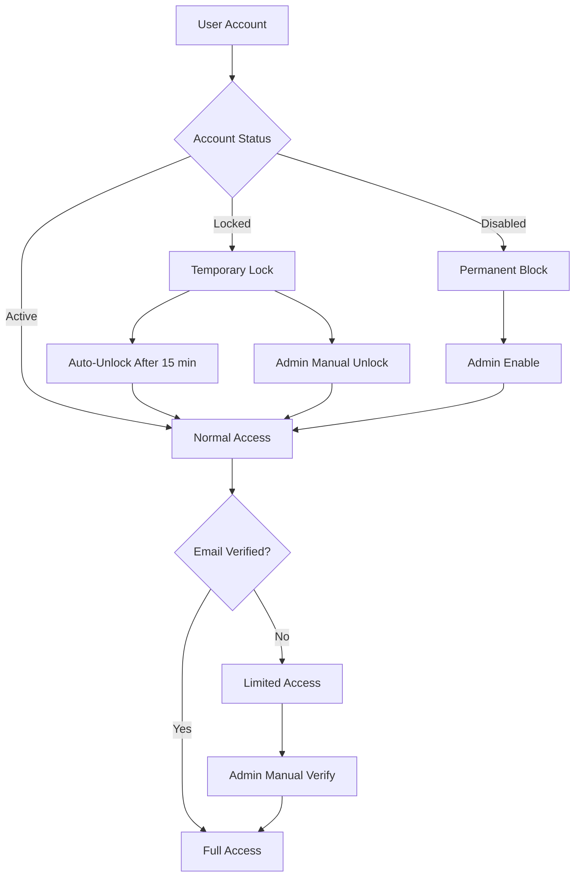
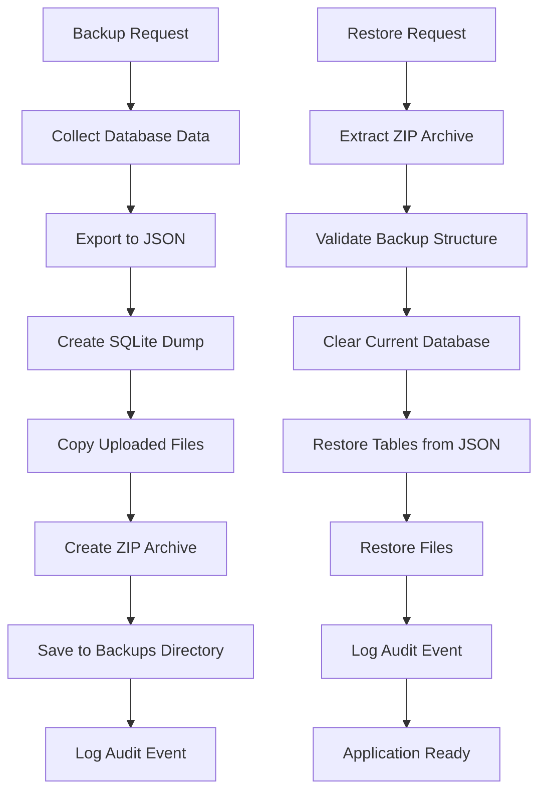

# ActaLog - Administrator Documentation

**Version:** 0.8.1-beta
**Last Updated:** 2025-01-22

This guide provides comprehensive instructions for ActaLog system administrators. It covers user management, system configuration, backup/restore operations, security best practices, and troubleshooting.

## Table of Contents

1. [Administrator Overview](#administrator-overview)
2. [User Account Management](#user-account-management)
3. [Database Backup and Restore](#database-backup-and-restore)
4. [Audit Log Monitoring](#audit-log-monitoring)
5. [System Configuration](#system-configuration)
6. [Security Best Practices](#security-best-practices)
7. [Database Management](#database-management)
8. [Troubleshooting](#troubleshooting)
9. [API Reference](#api-reference)
10. [Admin FAQ](#admin-faq)

---

## Administrator Overview

### What is an Administrator?

Administrators have elevated privileges in ActaLog, including:
- Full user account management (view, unlock, disable, delete, role changes)
- Database backup creation and restore capabilities
- Audit log access and cleanup
- Manual email verification overrides
- System data cleanup operations
- Access to admin-only API endpoints

### How to Become an Administrator

- The **first user** to register in a new ActaLog installation automatically becomes an administrator
- Additional administrators can be promoted by existing administrators via the Admin Users panel
- Admin status is controlled by the `role` field in the users table (`admin` vs `user`)

### Accessing Admin Features

Navigate to **Profile** → **Admin** to access:
- **Admin Users** - User account management
- **Backups** - Database backup and restore
- **Audit Logs** - System activity monitoring
- **Data Cleanup** - Maintenance operations

---

## User Account Management



### Accessing User Management

1. Navigate to **Profile** → **Admin** → **Admin Users**
2. View the complete user list with status indicators

### User List View

The Admin Users view displays:
- **Email:** User's email address
- **Role:** User or Admin badge
- **Email Verified:** Green checkmark or red X
- **Account Status:** Lock icon if locked
- **Account Enabled:** Green checkmark or red X if disabled
- **Actions:** Quick action buttons for each user

### Status Indicators

**Icons and Colors:**
- 🔒 **Lock (Red):** Account is temporarily locked due to failed login attempts
- ✅ **Verified (Green):** Email is verified
- ❌ **Not Verified (Red):** Email not verified
- 👤 **User (Blue):** Regular user role
- 🛡️ **Admin (Purple):** Administrator role
- ✅ **Enabled (Green):** Account is active
- ❌ **Disabled (Red):** Account is permanently disabled

### How Do I Unlock a Locked User Account?

**When Accounts Get Locked:**
- After 5 failed login attempts within 15 minutes
- Account locked until `locked_until` timestamp (15 minutes from last failed attempt)
- Can be manually unlocked by admin immediately

**To Unlock an Account:**
1. Navigate to **Admin Users** view
2. Find the user with a red lock icon
3. Click the **🔓 Unlock** button
4. Confirmation: "Account unlocked successfully"
5. User can now log in immediately

**Technical Details:**
- Sets `failed_login_attempts = 0`
- Clears `locked_at` and `locked_until` timestamps
- Audit log entry: `user_unlocked` event

### How Do I Disable/Enable User Accounts?

**Disabling an Account:**

Permanent account suspension (e.g., for policy violations, terminated employees, security concerns).

1. Navigate to **Admin Users** view
2. Find the user to disable
3. Click the **🚫 Disable** button
4. **Confirmation dialog appears:**
   - Enter a reason for disabling (required)
   - Example: "Violation of terms of service" or "Employee terminated"
5. Click **Confirm**
6. User account is disabled immediately

**What Happens When Disabled:**
- User cannot log in (all login attempts rejected)
- Existing sessions are revoked
- Data is preserved (workouts, PRs, profile)
- Account can be re-enabled by admin

**Enabling a Disabled Account:**

1. Navigate to **Admin Users** view
2. Find the user with red ❌ in Enabled column
3. Click the **✅ Enable** button
4. Confirmation: "Account enabled successfully"
5. User can now log in again

**Technical Details:**
- `account_disabled` boolean flag
- `disabled_at` timestamp
- `disabled_by_user_id` tracks which admin disabled the account
- `disable_reason` text field stores justification
- Audit log entries: `user_disabled` and `user_enabled` events

### How Do I Change User Roles (Admin/User)?

**Promoting a User to Admin:**

1. Navigate to **Admin Users** view
2. Find the regular user (blue 👤 icon)
3. Click the **🛡️ Make Admin** button
4. Confirmation dialog appears
5. Click **Confirm**
6. User is now an administrator

**Demoting an Admin to User:**

1. Navigate to **Admin Users** view
2. Find the admin user (purple 🛡️ icon)
3. Click the **👤 Make User** button
4. Confirmation dialog appears
5. Click **Confirm**
6. User is now a regular user (loses admin privileges)

**Important Notes:**
- You cannot change your own role (prevents accidental lockout)
- At least one admin should always exist in the system
- Role changes take effect immediately
- User may need to log out and back in to see updated permissions

**Technical Details:**
- `role` field in users table: `"admin"` or `"user"`
- Audit log entries: `user_role_changed` event

### How Do I Verify User Emails Manually?

**When Manual Verification is Needed:**
- User didn't receive verification email
- Email service is temporarily down
- Migrating users from another system
- Troubleshooting registration issues

**To Manually Verify an Email:**

1. Navigate to **Admin Users** view
2. Find the user with red ❌ in Email Verified column
3. Click the **✉️ Verify Email** button
4. Confirmation: "Email verified successfully"
5. User now has full access (no verification banner)

**Technical Details:**
- Sets `email_verified = true`
- Sets `email_verified_at = CURRENT_TIMESTAMP`
- Audit log entry: `user_email_verified` event

### How Do I Delete a User Account?

**⚠️ WARNING: This action is PERMANENT and CANNOT be undone!**

**What Gets Deleted:**
- User account and profile
- All workouts and performance history
- All personal records (PRs)
- Custom movements and WODs created by the user
- Profile pictures and uploaded files
- All user sessions

**To Delete a User:**

1. Navigate to **Admin Users** view
2. Find the user to delete
3. Click the **🗑️ Delete** button
4. **Confirmation dialog appears with warning:**
   - Shows what will be deleted
   - Requires explicit confirmation
5. Click **Delete User** to confirm
6. User and all associated data is permanently removed

**Important Notes:**
- You cannot delete your own account (prevents accidental lockout)
- Consider disabling instead of deleting if data preservation is important
- Database cascading deletes handle related data automatically
- Audit log entry: `user_deleted` event (logged before deletion)

**Technical Details:**
- Cascading deletes configured in database schema
- Deletes from tables: `users`, `user_workouts`, `workout_movements`, `workout_wods`, `refresh_tokens`, `password_resets`, `email_verification_tokens`, `sessions`
- Foreign key constraints ensure data integrity

---

## Database Backup and Restore



### Creating a Database Backup

**What's Included in a Backup:**
- All user accounts and profiles
- All workouts and performance data
- All movements (standard and custom)
- All WODs (standard and custom)
- All PRs and historical data
- Profile pictures and uploaded files
- Complete SQLite database dump (for quick restore)
- Backup metadata (version, timestamp, table row counts)

**To Create a Backup:**

1. Navigate to **Profile** → **Admin** → **Backups**
2. Click **Create Backup** button
3. Enter an optional description (recommended):
   - Example: "Pre-migration backup"
   - Example: "Weekly backup - 2025-01-15"
   - Example: "Before v0.9.0 upgrade"
4. Click **Create**
5. Wait for backup to complete (progress indicator shown)
6. Backup appears in the list with:
   - Filename (timestamped)
   - Description
   - Created date/time
   - File size
   - Row counts per table

**Downloading a Backup:**

1. Find the backup in the list
2. Click the **💾 Download** button
3. Save the ZIP file to a secure location
4. **Store backups in multiple locations** (local + cloud storage)

**Backup File Structure:**
```
backup_20250122_143000.zip
├── metadata.json          # Backup info, version, table counts
├── database.db            # Complete SQLite dump (quick restore)
├── users.json             # User accounts
├── user_workouts.json     # Workout sessions
├── workout_movements.json # Movement performances
├── workout_wods.json      # WOD performances
├── movements.json         # Movement library
├── wods.json              # WOD library
├── uploads/               # Uploaded files (profile pictures, etc.)
│   └── ...
```

**Technical Details:**
- Backups stored in `backups/` directory (excluded from git)
- Filename format: `backup_YYYYMMDD_HHMMSS.zip`
- Metadata includes ActaLog version for compatibility checking
- SQLite dump created using `.dump` command (for SQLite databases only)
- JSON exports work with all database drivers (SQLite, PostgreSQL, MySQL)

### Restoring from a Backup

**⚠️ WARNING: Restore REPLACES ALL CURRENT DATA!**

**Before Restoring:**
- Create a backup of current data (if any data worth preserving exists)
- Verify the backup file is valid and complete
- Ensure no users are actively using the system
- Test restore on a staging environment first (if possible)

**To Restore a Backup:**

1. Navigate to **Profile** → **Admin** → **Backups**
2. Find the backup to restore
3. Click the **🔄 Restore** button
4. **Confirmation dialog appears with strong warning:**
   - "This will REPLACE ALL current data"
   - "This action cannot be undone"
   - "Create a backup of current data first if needed"
5. Click **Restore** to confirm
6. Wait for restore to complete (progress indicator shown)
7. **Application reloads automatically**
8. Verify data is restored correctly

**What Happens During Restore:**
1. Existing database is cleared (all tables truncated)
2. Data is restored from JSON files in backup
3. Uploaded files are restored to uploads directory
4. Foreign key constraints are re-established
5. Audit log entry created: `backup_restored` event

**Post-Restore Verification:**
- Check user count matches backup metadata
- Verify workout count matches backup metadata
- Test login with a known user account
- Check a few workout entries for data accuracy
- Verify profile pictures and uploads are accessible

**Cross-Version Compatibility:**
- Backups from v0.6.0+ are compatible with v0.8.0
- Metadata includes version info for validation
- Restore handles missing tables gracefully (forward compatibility)
- Newer backups can be restored to older versions (with potential data loss for new features)

### Uploading Backups from Another System

If you're migrating from another ActaLog instance or restoring from external storage:

1. Navigate to **Profile** → **Admin** → **Backups**
2. Click **Upload Backup** button
3. Select the backup ZIP file from your device
4. Click **Upload**
5. Backup is validated and added to the backup list
6. You can now restore from this uploaded backup

**Validation Checks:**
- File must be a valid ZIP archive
- Must contain `metadata.json` file
- Filename is sanitized for security
- File size limits may apply (check system configuration)

### Deleting Old Backups

To free up disk space, you can delete old backups:

1. Navigate to **Profile** → **Admin** → **Backups**
2. Find the backup to delete
3. Click the **🗑️ Delete** button
4. Confirmation dialog appears
5. Click **Delete**
6. Backup file is permanently removed from server

**Important Notes:**
- Deleted backups cannot be recovered
- Download important backups before deleting
- Keep at least one recent backup at all times
- Consider automated backup rotation (future feature)

---

## Audit Log Monitoring

### What is the Audit Log?

The audit log tracks all significant system events for security and accountability:
- User authentication events (login, logout, failed attempts)
- Admin actions (user unlock, disable, delete, role changes)
- Backup operations (create, download, restore)
- Session management (token refresh, session revoke)
- Data modifications (user updates, email verification)

### Accessing the Audit Log

1. Navigate to **Profile** → **Admin** → **Audit Logs**
2. View chronological list of events

### Audit Log Event Types

**Authentication Events:**
- `user_login` - Successful login
- `user_logout` - User logout
- `failed_login` - Failed login attempt
- `account_locked` - Account locked due to failed attempts
- `token_refreshed` - JWT token refreshed

**Admin Actions:**
- `user_unlocked` - Admin unlocked user account
- `user_disabled` - Admin disabled user account
- `user_enabled` - Admin re-enabled user account
- `user_role_changed` - Admin changed user role
- `user_email_verified` - Admin manually verified email
- `user_deleted` - Admin deleted user account

**Backup Operations:**
- `backup_created` - Backup created
- `backup_downloaded` - Backup downloaded
- `backup_restored` - Backup restored
- `backup_uploaded` - External backup uploaded
- `backup_deleted` - Backup deleted

**Session Management:**
- `session_revoked` - Single session revoked
- `all_sessions_revoked` - All user sessions revoked

**User Events:**
- `user_registered` - New user registration
- `user_updated` - Profile updated
- `verification_email_sent` - Email verification sent
- `password_reset_requested` - Password reset requested
- `password_reset_completed` - Password successfully reset

### Audit Log Fields

Each audit log entry contains:
- **Event Type:** Category of event
- **User Email:** User who triggered the event (if applicable)
- **IP Address:** Source IP of the request
- **Timestamp:** When the event occurred
- **Details:** JSON object with event-specific data

### Filtering and Search

The audit log can be filtered by:
- **Event Type:** Select specific event categories
- **User:** Filter by user email
- **Date Range:** View events within a time period
- **IP Address:** Track activity from specific IPs

### Audit Log Cleanup

Over time, audit logs can grow large. To clean up old entries:

1. Navigate to **Profile** → **Admin** → **Audit Logs**
2. Click **Cleanup** button
3. Select retention period:
   - Last 30 days
   - Last 90 days
   - Last 365 days
   - All time (no cleanup)
4. Click **Confirm**
5. Older entries are permanently deleted

**Recommended Retention:**
- Production systems: 365 days minimum
- Compliance requirements: Check your industry regulations
- Security incidents: Preserve logs until investigation complete

---

## System Configuration

### Environment Variables

ActaLog is configured via environment variables in the `.env` file. Copy `.env.example` to `.env` and customize for your deployment.

#### Application Settings

```bash
# Application environment
APP_ENV=production              # development, staging, or production
APP_URL=https://your-domain.com # Used for email links
PORT=8080                       # Server port

# JWT Authentication
JWT_SECRET=your-secret-key-here-change-this  # MUST change in production
JWT_EXPIRATION=900              # Access token lifetime (seconds) - 15 minutes
REFRESH_TOKEN_EXPIRATION=2592000  # Refresh token lifetime (seconds) - 30 days

# Security
CORS_ORIGINS=https://your-frontend-domain.com  # Comma-separated allowed origins
```

**CRITICAL:**
- **JWT_SECRET:** MUST be changed from default! Use a long random string.
- **APP_URL:** Must match your actual frontend URL for email links to work
- **CORS_ORIGINS:** Whitelist only your frontend domain(s)

#### Database Configuration

**SQLite (Development/Small Deployments):**
```bash
DB_DRIVER=sqlite3
DB_NAME=actalog.db
```

**PostgreSQL (Production Recommended):**
```bash
DB_DRIVER=postgres
DB_HOST=localhost
DB_PORT=5432
DB_USER=actalog
DB_PASSWORD=your-db-password
DB_NAME=actalog
DB_SSLMODE=disable              # or require/verify-full for production
DB_SCHEMA=public                # Optional: schema isolation for multi-tenant
DB_MAX_OPEN_CONNS=25            # Connection pool: max open connections
DB_MAX_IDLE_CONNS=5             # Connection pool: max idle connections
DB_CONN_MAX_LIFETIME=5m         # Connection pool: max lifetime
```

**MySQL/MariaDB (Alternative):**
```bash
DB_DRIVER=mysql
DB_HOST=localhost
DB_PORT=3306
DB_USER=actalog
DB_PASSWORD=your-db-password
DB_NAME=actalog
DB_MAX_OPEN_CONNS=25            # Connection pool: max open connections
DB_MAX_IDLE_CONNS=5             # Connection pool: max idle connections
DB_CONN_MAX_LIFETIME=5m         # Connection pool: max lifetime
```

#### Email Configuration

```bash
# Email service (SMTP)
EMAIL_FROM=noreply@your-domain.com
SMTP_HOST=smtp.gmail.com        # Your SMTP server
SMTP_PORT=587                   # Usually 587 for TLS, 465 for SSL
SMTP_USER=your-email@gmail.com  # SMTP username
SMTP_PASS=your-app-password     # SMTP password or app-specific password
```

**Common SMTP Providers:**
- **Gmail:** `smtp.gmail.com:587` (requires app-specific password if 2FA enabled)
- **SendGrid:** `smtp.sendgrid.net:587`
- **AWS SES:** `email-smtp.us-east-1.amazonaws.com:587`
- **Mailgun:** `smtp.mailgun.org:587`

#### Frontend Configuration

The frontend uses environment variables prefixed with `VITE_`. Create `web/.env` for production deployments:

```bash
# API base URL (only needed if backend is on different domain/port)
VITE_API_BASE_URL=https://api.your-domain.com

# Or leave empty to use relative URLs (recommended when backend and frontend on same domain)
VITE_API_BASE_URL=
```

### Database Driver Selection

ActaLog supports three database drivers with automatic detection:

| Driver | Use Case | Connection Pooling | Schema Isolation |
|--------|----------|-------------------|------------------|
| **sqlite3** | Development, single-user, small deployments | ❌ No | ❌ No |
| **postgres** | Production, multi-user, high performance | ✅ Yes | ✅ Yes |
| **mysql** | Alternative production option, MariaDB compatible | ✅ Yes | ❌ No |

**PostgreSQL (Recommended for Production):**
- Uses **pgx/v5 driver** (actively maintained, 10-30% faster than lib/pq)
- Supports schema isolation via `DB_SCHEMA` parameter
- Advanced connection pooling with tunable parameters
- Best for multi-user production deployments

**Migration from SQLite to PostgreSQL:**
See `docs/POSTGRESQL_MIGRATION.md` for detailed migration guide.

### Connection Pooling Tuning

For PostgreSQL and MySQL, tune connection pooling for your workload:

**Conservative (Low Traffic):**
```bash
DB_MAX_OPEN_CONNS=10
DB_MAX_IDLE_CONNS=2
DB_CONN_MAX_LIFETIME=5m
```

**Moderate (Typical Production):**
```bash
DB_MAX_OPEN_CONNS=25
DB_MAX_IDLE_CONNS=5
DB_CONN_MAX_LIFETIME=5m
```

**Aggressive (High Traffic):**
```bash
DB_MAX_OPEN_CONNS=100
DB_MAX_IDLE_CONNS=25
DB_CONN_MAX_LIFETIME=1m
```

**Tuning Guidelines:**
- `MaxOpenConns`: Total concurrent database connections
- `MaxIdleConns`: Kept-alive connections (should be < MaxOpenConns)
- `ConnMaxLifetime`: How long a connection can be reused before recycling
- Monitor database connection count to avoid exceeding database limits
- PostgreSQL default max connections: 100 (adjust `max_connections` in postgresql.conf if needed)

---

## Security Best Practices

### Password Security

**Password Policy Recommendations:**
- Minimum 8 characters (enforced by application)
- Require mix of uppercase, lowercase, numbers, and symbols
- Implement password complexity checks (future enhancement)
- Educate users on password manager usage

**Password Storage:**
- All passwords hashed with bcrypt (cost factor 12)
- Never store plaintext passwords
- Password reset tokens expire after 1 hour
- Reset tokens are single-use only

### JWT Secret Key Management

**CRITICAL:** The `JWT_SECRET` must be:
- Changed from the default value before production deployment
- Long and random (minimum 32 characters, recommend 64+)
- Kept secure (never commit to version control)
- Rotated periodically (requires all users to re-login)

**Generating a Secure JWT Secret:**
```bash
# Linux/Mac
openssl rand -base64 64

# Or using Node.js
node -e "console.log(require('crypto').randomBytes(64).toString('base64'))"
```

### Account Lockout Protection

**Automatic Lockout:**
- Triggered after 5 failed login attempts within 15 minutes
- Account locked for 15 minutes
- Admin can manually unlock immediately

**Failed Login Tracking:**
- `failed_login_attempts` counter in users table
- `locked_at` and `locked_until` timestamps
- Audit log entry for each failed attempt
- Counter resets on successful login

### CORS Configuration

**Production CORS Setup:**
```bash
# Single origin
CORS_ORIGINS=https://app.your-domain.com

# Multiple origins (comma-separated)
CORS_ORIGINS=https://app.your-domain.com,https://www.your-domain.com
```

**Security Notes:**
- Never use `*` (allow all origins) in production
- Only whitelist your actual frontend domain(s)
- HTTPS required for production (HTTP only for local development)
- Verify CORS headers in browser dev tools

### Email Service Security

**SMTP Best Practices:**
- Use app-specific passwords (not main account password)
- Enable 2FA on email service account
- Use TLS/SSL for SMTP connections (port 587 or 465)
- Monitor email sending for unusual activity
- Set up SPF, DKIM, and DMARC DNS records for deliverability

### Database Backup Security

**Backup Protection:**
- Store backups in secure location (encrypted storage)
- Backups contain sensitive user data (email, hashed passwords, personal workouts)
- Restrict backup file access (chmod 600 or equivalent)
- Use encrypted backup archives (future enhancement)
- Off-site backup storage recommended

**Backup Rotation:**
- Keep multiple backup versions
- Implement automated backup schedule (daily/weekly)
- Test restore procedure regularly
- Document disaster recovery plan

### Session Management

**Refresh Token Security:**
- 30-day expiration (configurable via `REFRESH_TOKEN_EXPIRATION`)
- Revoke all sessions on password change (recommended)
- Allow users to view active sessions
- Admins can revoke user sessions if compromised

### User Access Monitoring

**Regular Security Audits:**
- Review audit logs for suspicious activity
- Monitor failed login patterns by IP
- Check for unusual admin actions
- Verify active sessions for all users
- Investigate account lockouts

---

## Database Management

### Running Database Migrations

Migrations are applied automatically on application startup. To manually run migrations:

```bash
# Run migrations
make migrate

# Or use the migrate tool directly
go run cmd/migrate/main.go
```

**Migration Files:**
- Located in `migrations/` directory
- Format: `YYYYMMDDHHMMSS_description.up.sql` (apply) and `.down.sql` (rollback)
- Applied in chronological order
- Migration status tracked in `schema_migrations` table

### Creating New Migrations

```bash
# Create new migration
make migrate-create name=add_new_feature

# Edit the generated files:
# migrations/YYYYMMDDHHMMSS_add_new_feature.up.sql
# migrations/YYYYMMDDHHMMSS_add_new_feature.down.sql
```

### Verifying Database Schema

To check if database schema is up-to-date:

```bash
# Check schema
make check-schema

# Or run the tool directly
go run cmd/check-schema/main.go
```

### Database Schema Isolation (PostgreSQL Only)

PostgreSQL supports schema isolation for multi-tenant deployments:

**Setup:**
```bash
# Set schema in environment
DB_SCHEMA=tenant1

# ActaLog will use search_path=tenant1 for all operations
```

**Benefits:**
- Multiple isolated ActaLog instances in one PostgreSQL database
- Each tenant's data in separate schema
- Easier database administration
- Cost-effective for SaaS deployments

**Limitations:**
- PostgreSQL only (not supported on SQLite or MySQL)
- All tables must be created in the schema (migrations handle this)
- Requires PostgreSQL user to have schema creation privileges

### Database Performance

**Monitoring:**
- Check connection pool utilization (log output)
- Monitor query execution time (enable SQL logging)
- Watch for slow queries in PostgreSQL logs
- Profile database load with `pg_stat_statements` (PostgreSQL)

**Optimization:**
- Add indexes on frequently queried columns
- Analyze query plans for slow queries
- Tune connection pool parameters
- Consider read replicas for high-traffic deployments
- Implement caching layer (future enhancement)

---

## Troubleshooting

### Database Connection Issues

**Problem:** `failed to connect to database`

**Solutions:**
- Verify database is running: `systemctl status postgresql` (or `mysql`)
- Check database credentials in `.env`
- Verify network connectivity to database host
- Check firewall rules allow connection on database port
- For PostgreSQL: verify `pg_hba.conf` allows connections from application host
- Check database logs for connection errors

**Problem:** `too many connections` (PostgreSQL/MySQL)

**Solutions:**
- Reduce `DB_MAX_OPEN_CONNS` in `.env`
- Increase database `max_connections` setting
- Check for connection leaks (connections not being closed)
- Monitor active connections: `SELECT count(*) FROM pg_stat_activity;` (PostgreSQL)

### Migration Failures

**Problem:** Migration fails mid-execution

**Solutions:**
- Check database logs for specific error
- Verify database user has sufficient privileges (CREATE TABLE, ALTER TABLE, etc.)
- Check if migration was partially applied (inspect database)
- Manually rollback partial migration if needed
- Fix migration SQL and retry

**Problem:** `migration version mismatch`

**Solutions:**
- Check `schema_migrations` table for current version
- Ensure all migration files are present in `migrations/` directory
- Run migrations: `make migrate`
- If corrupt, reset migrations (⚠️ data loss): drop `schema_migrations` table and run migrations

### Email Delivery Issues

**Problem:** Verification emails not being received

**Solutions:**
- Check SMTP configuration in `.env`
- Verify SMTP credentials are correct
- Test SMTP connection manually: `telnet smtp.gmail.com 587`
- Check email service logs for bounce/rejection messages
- Verify sender email (`EMAIL_FROM`) is authorized to send
- Check spam/junk folders
- Verify firewall allows outbound SMTP connections
- For Gmail: ensure "Less secure app access" is enabled OR use app-specific password

**Problem:** Email links point to wrong domain

**Solutions:**
- Set `APP_URL` in `.env` to your actual frontend URL
- Ensure HTTPS is used in production
- Restart application after changing `APP_URL`

### Backup and Restore Issues

**Problem:** Backup creation fails

**Solutions:**
- Check disk space: `df -h`
- Verify `backups/` directory exists and is writable
- Check database connectivity (backups query all tables)
- Review application logs for specific error
- Ensure no locks on database (e.g., long-running queries)

**Problem:** Restore fails with "table does not exist"

**Solutions:**
- Verify backup file is complete and not corrupted
- Check backup `metadata.json` for version compatibility
- Restore may be from newer version (forward compatibility issue)
- Manually inspect backup JSON files
- Contact support if backup is critical

### Performance Issues

**Problem:** Application is slow

**Solutions:**
- Check database connection pool settings
- Monitor database query performance (enable query logging)
- Review audit logs for unusual activity patterns
- Check system resources (CPU, memory, disk I/O)
- Optimize database indexes if needed
- Consider upgrading database instance or resources

**Problem:** High memory usage

**Solutions:**
- Check for memory leaks (restart application as temporary fix)
- Reduce connection pool size
- Monitor goroutine count (Go applications)
- Review large query result sets (pagination needed?)

### Authentication and Session Issues

**Problem:** Users getting logged out frequently

**Solutions:**
- Check `JWT_EXPIRATION` setting (default 15 minutes)
- Verify refresh token mechanism is working
- Check browser cookie settings (cookies must be enabled)
- Verify frontend is properly handling token refresh
- Check for clock skew between server and client

**Problem:** "Invalid token" errors

**Solutions:**
- Verify `JWT_SECRET` hasn't changed (changing secret invalidates all tokens)
- Check token expiration times
- Ensure frontend is sending token in `Authorization: Bearer <token>` header
- Verify token format is valid JWT
- Check for special characters in JWT_SECRET (use base64-encoded strings)

---

## API Reference

### Admin User Management Endpoints

All admin endpoints require authentication and admin role.

#### List All Users
```
GET /api/admin/users
Authorization: Bearer <admin-jwt-token>
```

**Response:**
```json
[
  {
    "id": 1,
    "email": "user@example.com",
    "role": "user",
    "email_verified": true,
    "email_verified_at": "2025-01-15T10:30:00Z",
    "failed_login_attempts": 0,
    "locked_at": null,
    "locked_until": null,
    "account_disabled": false,
    "disabled_at": null,
    "created_at": "2025-01-01T00:00:00Z"
  }
]
```

#### Unlock User Account
```
POST /api/admin/users/{id}/unlock
Authorization: Bearer <admin-jwt-token>
```

#### Disable User Account
```
POST /api/admin/users/{id}/disable
Authorization: Bearer <admin-jwt-token>
Content-Type: application/json

{
  "reason": "Violation of terms of service"
}
```

#### Enable User Account
```
POST /api/admin/users/{id}/enable
Authorization: Bearer <admin-jwt-token>
```

#### Change User Role
```
PUT /api/admin/users/{id}/role
Authorization: Bearer <admin-jwt-token>
Content-Type: application/json

{
  "role": "admin"  // or "user"
}
```

#### Toggle Email Verification
```
POST /api/admin/users/{id}/toggle-email-verification
Authorization: Bearer <admin-jwt-token>
```

#### Delete User
```
DELETE /api/admin/users/{id}
Authorization: Bearer <admin-jwt-token>
```

### Backup Management Endpoints

#### Create Backup
```
POST /api/admin/backups
Authorization: Bearer <admin-jwt-token>
Content-Type: application/json

{
  "description": "Weekly backup before upgrade"
}
```

#### List Backups
```
GET /api/admin/backups
Authorization: Bearer <admin-jwt-token>
```

#### Download Backup
```
GET /api/admin/backups/{filename}
Authorization: Bearer <admin-jwt-token>
```

#### Upload Backup
```
POST /api/admin/backups/upload
Authorization: Bearer <admin-jwt-token>
Content-Type: multipart/form-data

file: <backup.zip>
```

#### Restore Backup
```
POST /api/admin/backups/{filename}/restore
Authorization: Bearer <admin-jwt-token>
```

#### Delete Backup
```
DELETE /api/admin/backups/{filename}
Authorization: Bearer <admin-jwt-token>
```

### Audit Log Endpoints

#### Get Audit Logs
```
GET /api/admin/audit-logs?limit=100&offset=0&event_type=user_login
Authorization: Bearer <admin-jwt-token>
```

#### Clean Up Audit Logs
```
POST /api/admin/audit-logs/cleanup
Authorization: Bearer <admin-jwt-token>
Content-Type: application/json

{
  "older_than_days": 365
}
```

---

## Admin FAQ

**Q: How do I add another administrator?**
A: Navigate to Admin Users, find the user, click "Make Admin" button. The user must already have a registered account.

**Q: Can I demote myself from admin?**
A: No, you cannot change your own role to prevent accidental lockout. Another admin must demote you.

**Q: What happens if all admins are deleted or demoted?**
A: You would lose admin access. Always ensure at least one admin account exists. Recovery requires database-level changes.

**Q: How often should I create backups?**
A: Recommended schedule:
- Daily automated backups for active production systems
- Weekly backups for low-activity systems
- Before any major upgrade or migration
- Before bulk data operations

**Q: Can I restore a backup from an older version of ActaLog?**
A: Generally yes, backups from v0.6.0+ are forward compatible. The restore process handles missing tables gracefully. Test on staging first.

**Q: How do I migrate from SQLite to PostgreSQL?**
A: See `docs/POSTGRESQL_MIGRATION.md` for the complete migration guide. Overview: create backup, set up PostgreSQL, change `.env`, run migrations, restore data.

**Q: What's the difference between disabling and deleting a user?**
A: Disabling preserves all user data (can be re-enabled later). Deleting permanently removes the account and all data (cannot be undone).

**Q: How do I handle a security incident (compromised account)?**
A: Immediately disable the account, revoke all sessions, review audit logs for suspicious activity, reset password if re-enabling, investigate how compromise occurred.

**Q: Can I customize email templates?**
A: Currently, email templates are hardcoded in the application. Future versions may support customizable templates. Contact support for urgent customization needs.

**Q: How do I monitor application health?**
A: Check the health endpoint: `GET /health` (no authentication required). Returns status and version info. Set up monitoring/alerting on this endpoint.

**Q: What logs should I monitor?**
A: Monitor:
- Application logs (stdout/stderr)
- Audit logs (via Admin interface)
- Database logs (PostgreSQL/MySQL logs)
- Web server logs (nginx/apache if using reverse proxy)
- Failed login patterns
- Backup success/failure

---

**Document Version:** 0.8.0-beta
**Last Updated:** 2025-11-22
**Applicable Versions:** ActaLog 0.8.0-beta and later
