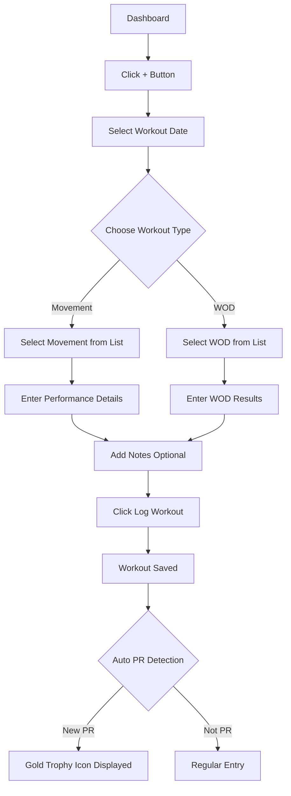
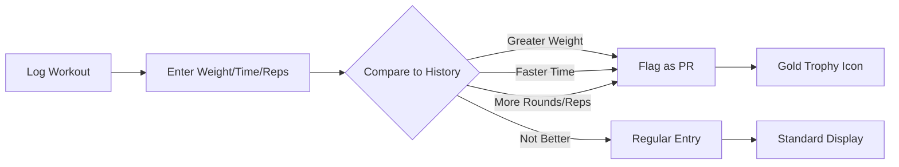
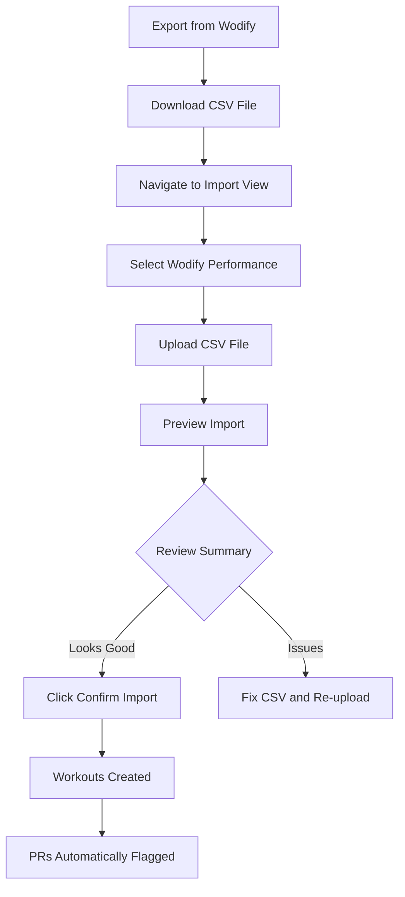

# ActaLog - User Help Documentation

**Version:** 0.8.1-beta
**Last Updated:** 2025-01-22

Welcome to ActaLog, your mobile-first CrossFit workout tracker! This guide will help you get the most out of the application.

## Table of Contents

1. [Getting Started](#getting-started)
2. [Logging Your First Workout](#logging-your-first-workout)
3. [Tracking Personal Records (PRs)](#tracking-personal-records-prs)
4. [Using Quick Log](#using-quick-log)
5. [Creating and Using Workout Templates](#creating-and-using-workout-templates)
6. [Viewing Performance Trends](#viewing-performance-trends)
7. [Importing Data from Wodify](#importing-data-from-wodify)
8. [Exporting and Backing Up Your Data](#exporting-and-backing-up-your-data)
9. [Installing the Progressive Web App (PWA)](#installing-the-progressive-web-app-pwa)
10. [FAQ](#frequently-asked-questions)
11. [Troubleshooting](#troubleshooting)
12. [Glossary](#glossary)

---

## Getting Started

### Creating Your Account

1. Navigate to the ActaLog application URL
2. Click **Register** on the login screen
3. Enter your email address and create a secure password
4. Click **Create Account**
5. Check your email for a verification link
6. Click the verification link to activate your account
7. Log in with your credentials

**Note:** The first user to register automatically becomes an administrator.

### Understanding the Dashboard

After logging in, you'll see the Dashboard which displays:
- **Total Workouts:** Your lifetime workout count
- **This Month:** Workouts completed in the current month
- **Recent Workouts:** Your 5 most recent workout sessions with dates and movements
- **Quick Log Button:** Floating action button (+ icon) to log a new workout

---

## Logging Your First Workout

### Step-by-Step Instructions

1. **Access the Log Workout Screen**
   - Click the **+ button** (floating action button) on any screen
   - OR navigate to **Workouts** tab and click **Log Workout**

2. **Select Workout Date**
   - The current date is pre-filled
   - Click the date field to select a different date (for logging past workouts)

3. **Add Movements**
   - Click **+ Add Movement**
   - Search for the movement using the autocomplete field
   - Standard movements include: Back Squat, Deadlift, Bench Press, Clean, Snatch, Pull-ups, etc.
   - Select the movement from the dropdown list

4. **Enter Performance Details**

   For **Strength/Weightlifting Movements:**
   - **Sets:** Number of sets performed (e.g., 3)
   - **Reps:** Number of repetitions per set (e.g., 10)
   - **Weight:** Weight used in pounds or kilograms (e.g., 185)

   For **Timed Movements:**
   - **Time:** Duration in MM:SS format (e.g., 5:30 for 5 minutes 30 seconds)

   For **Gymnastics/Bodyweight:**
   - **Reps:** Total repetitions completed
   - **Sets:** Optional, for structured workouts

5. **Add WODs (Workout of the Day)**
   - Click **+ Add WOD**
   - Search for standard WODs: Fran, Murph, Cindy, Grace, etc.
   - Select the WOD from the dropdown

   **Enter WOD Results Based on Type:**

   - **For Time WODs** (like Fran, Grace):
     - Enter completion time in MM:SS format
     - Example: "3:45" for 3 minutes 45 seconds

   - **AMRAP WODs** (As Many Rounds As Possible):
     - Enter rounds completed
     - Enter additional reps if applicable
     - Example: 7 rounds + 5 reps

   - **EMOM WODs** (Every Minute On the Minute):
     - Enter rounds completed
     - Note completion status in notes

6. **Add Notes (Optional)**
   - Add workout notes, feelings, or modifications in the Notes field
   - Example: "Felt strong today, moved up in weight" or "Scaled to 85% of 1RM"

7. **Save Workout**
   - Click **Log Workout** button
   - Your workout is saved and synced
   - Return to Dashboard to see your updated statistics

---

## Tracking Personal Records (PRs)

ActaLog automatically detects and flags personal records for you!

### How PR Detection Works

### Automatic PR Detection

When you log a workout, ActaLog compares your performance to your history:

- **Movement PRs:** Detected when you lift more weight than ever before for a movement
  - Example: Previous best Back Squat was 225 lbs → You log 230 lbs → Automatic PR!

- **WOD PRs (Time-based):** Detected when you complete a WOD faster than before
  - Example: Previous Fran time was 5:30 → You complete it in 4:45 → Automatic PR!

- **WOD PRs (AMRAP):** Detected when you complete more rounds + reps
  - Example: Previous Cindy score was 18 rounds → You complete 20 rounds → Automatic PR!

### Manual PR Flag Toggle

You can manually toggle the PR flag on any workout movement:

1. Navigate to **Workouts** view
2. Find the workout entry
3. Click the movement you want to toggle
4. Select **Toggle PR Flag**
5. The gold trophy icon will appear or disappear

### Viewing Your PR History

1. Navigate to **Performance** tab
2. Click **PR History** button
3. View all your personal records organized by movement
4. Each PR shows:
   - Movement name
   - Best weight/time/reps
   - Date achieved
   - Link to the workout

---

## Using Quick Log

Quick Log is the fastest way to record a workout!

### Accessing Quick Log

**From Dashboard:**
- Click the **⚡ Quick Log** button on any movement card in Recent Workouts

**From Library:**
- Navigate to **Library** tab
- Find a Movement or WOD card
- Click the **⚡ Quick Log** button

**From Detail Pages:**
- Open any Movement or WOD detail page
- Click the **⚡ Quick Log** button at the top

### Quick Log Features

- **Pre-filled Movement/WOD:** The selected movement or WOD is already entered
- **Current Date:** Defaults to today's date
- **Quick Entry:** Just enter your performance details and save
- **Immediate Feedback:** See your PR status instantly
- **Template Selection:** You can search for and select workout templates

### Using Templates in Quick Log

**Important:** When you select a workout template from Quick Log:
- ⚠️ **Only the workout date is preserved**
- Notes, workout name, and total time entered in Quick Log will NOT be carried over
- You'll be taken to the full Log Workout page with the template pre-loaded
- There you can enter all the detailed performance data for movements and WODs

**Workflow:**
1. Open Quick Log dialog
2. Search for a template in the "Add Performance Data" field
3. Select the template
4. Set the workout date
5. Click "Log Workout"
6. You'll be redirected to the full logging page with all template details ready to fill in

---

## Creating and Using Workout Templates

### What are Workout Templates?

Workout templates allow you to create custom WODs with specific movements, structures, and scoring types.

### Creating a Custom WOD

1. Navigate to **Library** tab
2. Click **WODs** category
3. Click **+ Create WOD** button
4. Fill in WOD details:
   - **Name:** Unique name for your WOD (e.g., "Tuesday Strength")
   - **Description:** What the WOD involves
   - **Type:** Choose from:
     - `for_time` - Complete as fast as possible
     - `amrap` - As many rounds/reps as possible
     - `emom` - Every minute on the minute
     - `tabata` - 20 seconds work, 10 seconds rest
     - `custom` - Any other structure
   - **Regime:** Classification (weightlifting, gymnastics, metcon, mixed)
   - **Score Type:** How it's scored (time, rounds_reps, weight, reps, custom)
5. Click **Create WOD**
6. Your custom WOD now appears in the WOD library

### Creating a Custom Movement

1. Navigate to **Library** tab
2. Click **Movements** category
3. Click **+ Create Movement** button
4. Fill in movement details:
   - **Name:** Movement name
   - **Type:** Select category (weightlifting, gymnastics, bodyweight, cardio, olympic_lift, strongman, accessory)
   - **Description:** Optional description or scaling options
5. Click **Create Movement**

### Using Templates in Workouts

Once created, your custom movements and WODs appear in the search lists when logging workouts, just like standard ones!

---

## Viewing Performance Trends

### Performance View

The Performance view helps you track progress over time.

**Accessing Performance:**
1. Navigate to **Performance** tab
2. Select a movement from the dropdown
3. View your performance chart

**Chart Features:**
- **Weight Progress:** Line chart showing weight progression over time
- **PR Markers:** Gold dots indicate personal records
- **Date Range:** Filter by date range
- **Stats Summary:** Max weight, total volume, average sets/reps

### Dashboard Statistics

Your Dashboard shows key metrics:
- **Total Workouts:** All-time workout count
- **This Month:** Current month's workout count
- **Recent PRs:** Latest personal records (max 5)
- **Workout Frequency:** Visual indication of consistency

---

## Importing Data from Wodify

ActaLog supports importing your workout history from Wodify Performance exports!

### Step-by-Step Import Guide

1. **Export from Wodify**
   - Log into your Wodify account
   - Navigate to Performance → Export
   - Download your performance history as CSV
   - Save the file to your device

2. **Access Import View**
   - In ActaLog, navigate to **Profile** tab
   - Click **Import Data**
   - Select **Wodify Performance** as import type

3. **Upload and Preview**
   - Click **Choose File** or drag-and-drop your CSV file
   - Click **Preview Import**
   - Review the import summary:
     - Total rows found
     - Valid workouts to be created
     - New movements and WODs that will be auto-created
     - Workout summary by date

4. **Confirm Import**
   - Review the preview carefully
   - Ensure dates, movements, and WODs look correct
   - Click **Confirm Import**
   - Wait for the import to complete (may take a minute for large files)

5. **Verify Import**
   - Check your Dashboard for updated workout count
   - Navigate to Workouts to see imported entries
   - Verify PRs were flagged correctly

### Import Results

After import, you'll see:
- **Workouts Created:** Total number of workout sessions
- **Performances Created:** Individual movement/WOD performances
- **Movements Created:** New movements auto-added to your library
- **WODs Created:** New WODs auto-added to your library
- **PRs Flagged:** Personal records automatically detected from Wodify data

### Supported Wodify Result Types

ActaLog parses the following Wodify performance result types:
- Weight (e.g., "3 x 10 @ 85 lbs")
- Time (e.g., "5:30" or "1:05:30")
- AMRAP - Rounds and Reps (e.g., "7 + 3")
- AMRAP - Reps (e.g., "50 Reps")
- AMRAP - Rounds (e.g., "5 Rounds")
- Max Reps (e.g., "3 x 8")
- Calories (e.g., "133 Calories")
- Distance (e.g., "500 m")
- Each Round (e.g., "175 Total Reps")

---

## Exporting and Backing Up Your Data

### Export Options

ActaLog provides multiple export formats for your data:

**1. User Workouts Export (JSON)**
- Navigate to **Profile** → **Export Data**
- Click **Export User Workouts**
- Downloads all your workouts with full details in JSON format
- Includes movements, WODs, notes, dates, and PR flags
- Optional: Filter by date range

**2. Movements Export (CSV)**
- Navigate to **Profile** → **Export Data**
- Click **Export Movements**
- Downloads all movements in CSV format
- Options to include/exclude standard vs. custom movements
- Use for spreadsheet analysis

**3. WODs Export (CSV)**
- Navigate to **Profile** → **Export Data**
- Click **Export WODs**
- Downloads all WODs in CSV format
- Options to include/exclude standard vs. custom WODs

### Backup Your Data (Admin Only)

If you're an administrator, you can create full database backups:

1. Navigate to **Profile** → **Admin** → **Backups**
2. Click **Create Backup**
3. Enter an optional description (e.g., "Pre-migration backup")
4. Click **Create**
5. Download the backup ZIP file for safekeeping

Backups include:
- All user accounts
- All workouts and performance data
- All movements and WODs (standard and custom)
- Profile pictures and uploaded files
- Complete database in SQLite format

---

## Installing the Progressive Web App (PWA)

ActaLog works as a Progressive Web App, meaning you can install it on your device like a native app!

### Benefits of Installing

- **Offline Access:** Log workouts even without internet
- **Home Screen Icon:** Quick access from your device
- **Full Screen Experience:** No browser UI cluttering your view
- **Background Sync:** Workouts sync when connection returns
- **Push Notifications:** Get reminders and updates (future feature)

### Installation Instructions

**On iOS (iPhone/iPad):**
1. Open ActaLog in Safari browser
2. Tap the **Share** button (square with arrow pointing up)
3. Scroll down and tap **Add to Home Screen**
4. Name it "ActaLog" or your preferred name
5. Tap **Add**
6. ActaLog icon appears on your home screen

**On Android:**
1. Open ActaLog in Chrome browser
2. Tap the menu (three dots) in the top right
3. Tap **Install App** or **Add to Home Screen**
4. Follow the prompts
5. ActaLog icon appears on your home screen

**On Desktop (Chrome, Edge, Brave):**
1. Open ActaLog in your browser
2. Look for the install icon in the address bar (+ or computer icon)
3. Click **Install**
4. ActaLog opens as a standalone app window

### Using Offline Mode

Once installed, ActaLog works offline:
- **Log workouts** without internet connection
- **View your history** and stats
- **Workouts sync automatically** when connection returns
- **Background sync queue** ensures no data is lost

---

## Frequently Asked Questions

### Account & Authentication

**Q: I didn't receive my verification email. What should I do?**
A: Check your spam/junk folder. If it's not there, go to Profile → Resend Verification Email. Verification links expire after 24 hours.

**Q: I forgot my password. How do I reset it?**
A: On the login screen, click "Forgot Password?" Enter your email address and you'll receive a password reset link. The link expires after 1 hour.

**Q: Can I change my email address?**
A: Currently, email changes must be done by an administrator. Contact your system admin.

**Q: How do I log out?**
A: Navigate to Profile → Logout button at the bottom.

### Workouts & Logging

**Q: Can I log workouts for past dates?**
A: Yes! When logging a workout, click the date field and select any past date.

**Q: Can I edit a workout after logging it?**
A: Yes, navigate to Workouts, find your workout, click it, and select Edit. You can modify movements, weights, times, and notes.

**Q: Can I delete a workout?**
A: Yes, open the workout and click Delete. This action cannot be undone.

**Q: Why wasn't my PR automatically flagged?**
A: PR detection only works if you've logged the same movement before. If it's your first time logging that movement, it won't be flagged as a PR (since there's no prior data to compare).

**Q: Can I log multiple WODs in one workout?**
A: Yes! You can add multiple WODs and multiple movements in a single workout session.

### Performance & PRs

**Q: How do I see all my PRs?**
A: Navigate to Performance → PR History to see all personal records organized by movement.

**Q: Can I manually mark something as a PR?**
A: Yes, click on any workout movement and select "Toggle PR Flag" to manually mark or unmark it as a PR.

**Q: Why is an old workout showing as a PR when I've done better since?**
A: You may need to run retroactive PR flagging. Contact your admin or use the API endpoint `POST /api/workouts/retroactive-flag-prs` (requires authentication).

### Import & Export

**Q: I imported from Wodify but some workouts are missing. What happened?**
A: Check the import preview summary. Invalid rows (missing data) are skipped. Ensure your Wodify CSV export is complete and properly formatted.

**Q: Can I import data from other platforms besides Wodify?**
A: Currently, ActaLog supports Wodify Performance CSV format. Generic CSV imports for movements and WODs are also supported. Custom import formats may be added in future versions.

**Q: How do I backup my data before switching devices?**
A: Navigate to Profile → Export Data and download all exports (User Workouts JSON, Movements CSV, WODs CSV). Keep these files safe. After switching devices, use the import feature to restore your data.

### PWA & Installation

**Q: Do I need to install the app?**
A: No, ActaLog works perfectly in your browser. Installation just provides a more app-like experience and offline functionality.

**Q: Can I use ActaLog on multiple devices?**
A: Yes! Your data syncs across all devices where you're logged in. Install the PWA on all your devices for the best experience.

**Q: Does ActaLog work offline?**
A: Yes, once installed as a PWA, you can log workouts offline. They'll automatically sync when you reconnect to the internet.

---

## Troubleshooting

### Login & Authentication Issues

**Problem:** "Invalid credentials" error when logging in
**Solution:**
- Verify your email and password are correct (check caps lock)
- Ensure your account email is verified (check email for verification link)
- If you've had multiple failed login attempts, your account may be temporarily locked (wait 15 minutes or contact admin)

**Problem:** Account locked after failed login attempts
**Solution:**
- Wait 15 minutes for the automatic unlock
- OR contact your system administrator to manually unlock your account
- Check that you're using the correct password

**Problem:** Verification email not received
**Solution:**
- Check spam/junk folder
- Wait a few minutes (email delivery can be delayed)
- Resend verification: Profile → Resend Verification Email
- Contact administrator if issue persists

### Workout Logging Issues

**Problem:** Can't find a movement in the search
**Solution:**
- Try searching with partial name (e.g., "squat" instead of "back squat")
- Check if movement exists in Library → Movements
- Create a custom movement if it doesn't exist

**Problem:** PR not automatically detected
**Solution:**
- Ensure you've logged this movement before (first-time entries can't be PRs)
- Check that weight is entered correctly (must be higher than previous max)
- Manually toggle PR flag if needed
- Contact admin to run retroactive PR detection

**Problem:** Workout won't save
**Solution:**
- Ensure all required fields are filled
- Check that date is valid (not in the future)
- Verify you have an active internet connection (or wait for offline sync)
- Try refreshing the page and re-entering data

### Performance & Data Issues

**Problem:** Dashboard shows 0 workouts but I've logged workouts
**Solution:**
- Refresh the page (pull down on mobile)
- Clear browser cache and reload
- Log out and log back in
- Contact administrator if issue persists

**Problem:** Charts not displaying
**Solution:**
- Ensure you've selected a movement from the dropdown
- Verify you have workout data for that movement
- Try a different movement
- Refresh the page

### Import/Export Issues

**Problem:** Wodify import fails with error
**Solution:**
- Verify CSV file is valid Wodify Performance export format
- Check file size (very large files may timeout - split into smaller chunks)
- Ensure CSV encoding is UTF-8
- Look for error message details in the import preview

**Problem:** Export download not starting
**Solution:**
- Check browser popup/download blockers
- Try a different browser
- Ensure you're logged in
- Contact administrator if issue persists

### PWA & Offline Issues

**Problem:** Can't install PWA
**Solution:**
- Ensure you're using a supported browser (Chrome, Safari, Edge, Brave)
- On iOS, must use Safari browser (not Chrome)
- Check that your browser version is up to date
- Ensure site is served over HTTPS

**Problem:** Offline sync not working
**Solution:**
- Verify PWA is installed (not just bookmarked)
- Check service worker is registered (in browser dev tools)
- Log out and log back in
- Reinstall the PWA

**Problem:** Old data showing after logging new workout
**Solution:**
- Pull to refresh (on mobile)
- Hard refresh browser (Ctrl+Shift+R or Cmd+Shift+R)
- Clear service worker cache and reload

---

## Glossary

### CrossFit Terms

- **AMRAP:** As Many Rounds (or Reps) As Possible - complete as much as you can in a given time
- **EMOM:** Every Minute On the Minute - perform a set amount of work at the start of each minute
- **For Time:** Complete the prescribed workout as fast as possible
- **Metcon:** Metabolic Conditioning - high-intensity cardio-focused workouts
- **PR:** Personal Record - your best performance for a given movement or WOD
- **Rx:** As Prescribed - completing the workout with the standard weight/reps (not scaled)
- **Scaled:** Modified version of a workout (lighter weight, fewer reps, or substitute movements)
- **WOD:** Workout of the Day - a specific workout routine

### ActaLog-Specific Terms

- **Movement:** An individual exercise (e.g., Back Squat, Pull-ups, Running)
- **Standard Movement:** Pre-loaded movements that come with ActaLog (31 total)
- **Custom Movement:** User-created movements specific to your training
- **Standard WOD:** Pre-loaded classic CrossFit WODs (e.g., Fran, Murph, Cindy)
- **Custom WOD:** User-created workout templates
- **Quick Log:** Fast workout logging from movement/WOD cards
- **PR Detection:** Automatic system that compares current performance to history
- **Retroactive PR Flagging:** Process that analyzes all historical workouts to properly flag PRs chronologically
- **Performance View:** Chart-based view of progress over time for a movement
- **User Workout:** A complete workout session (can include multiple movements and WODs)
- **Workout Movement:** An individual movement performance within a workout
- **Workout WOD:** A WOD performance within a workout

### Technical Terms

- **PWA:** Progressive Web App - a web application that works like a native mobile app
- **Service Worker:** Background script that enables offline functionality and caching
- **Background Sync:** Technology that syncs data when internet connection returns
- **JWT:** JSON Web Token - security token used for authentication
- **Refresh Token:** Long-lived token used to get new access tokens
- **Session:** An active login session on a device

---

## Need More Help?

If you need additional assistance:

- **User Issues:** Contact your system administrator
- **Bug Reports:** Report issues via GitHub Issues (if open source deployment)
- **Feature Requests:** Submit requests to your administrator
- **Technical Documentation:** See `docs/ARCHITECTURE.md` for technical details

---

**Document Version:** 0.8.0-beta
**Last Updated:** 2025-11-22
**Applicable Versions:** ActaLog 0.8.0-beta and later
