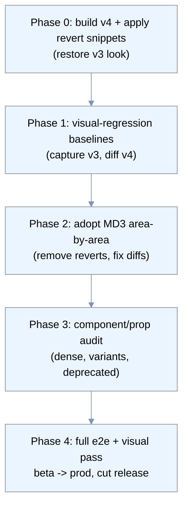

# Vuetify 3 -> 4 Migration - Scope & Plan

Status: EXECUTED (2026-07-19) - shipped in v1.3.5
Owner: John (jcz) - drafted with Claude Code

**Outcome:** the fast path was executed and then extended with an approved visual
refresh. `vuetify3-compat.css` + `vuetify3-spacing.css` restore the v3/MD2 rendering
on Vuetify 4 (verified to sub-pixel against v1.3.0), and the approved `redesign.css`
+ `redesign-plus.css` layers modernize surfaces, interaction states, and typography
(family-agnostic; the user font picker is untouched). The light theme's `background`
token moved to #f4f6f9; all seven themes verified via screenshot sweep. A bolder
"dock" variant was previewed and rejected (only its app-wide bolder icon stroke was
kept). e2e suite: 27/27 green on the final build.

## 1. Background & goal

The v1.3.3 dependency sweep bumped `vuetify ^3.12.1 -> ^4.0.6` (and `vite 7 -> 8`) without
migrating the app. The build still passed CI (there were no visual tests), but the
running UI broke app-wide: `solo` input fields lost their filled/elevated box, cards
lost containment, spacing collapsed. This shipped in 1.3.3 and 1.3.4.

As an interim measure, production and beta were pinned back to **v1.3.0** (the last
Vuetify-3 image; 1.3.2's image was never built). That is a working UI but leaves prod
one minor version behind and, notably, **without the v1.3.4 backend security hardening**
(govulncheck gate, Go stdlib CVE patch) which only ships in the Vuetify-4 images.

**Goal:** migrate the app to Vuetify 4 so the UI renders correctly again, unblocking
1.3.3+ (including the deferred backend security work), then resume normal releases.

## 2. Current state

| Package | Installed | Notes |
|---|---|---|
| vuetify | ^4.0.6 (4.1.2 resolved) | major upgrade already in `package.json` |
| vite | ^8.0.11 | major upgrade already in place |
| vite-plugin-vuetify | ^2.1.3 | **already v4-compatible** (v4 needs `^2.1.0`) |
| @mdi/font | ^7.4.47 | bundled locally + a redundant CSP-blocked CDN `<link>` to remove |
| sass | ^1.99.0 | present; no custom Vuetify SASS entry in use |

**Exposure inventory (`web/src`):**
- 94 `.vue` files, ~3,590 Vuetify component usages.
- Most-used: `v-icon` (669), `v-btn` (409), `v-card` (273), `v-chip` (207),
  `v-text-field` (199), `v-alert` (164), `v-col` (163), `v-list-item` (123),
  `v-card-text` (106), `v-card-title` (95), `v-row` (63), `v-dialog` (61), `v-select` (59).
- **No Vuetify SASS customization** (no `settings.scss`, no `@use 'vuetify/settings'`) - removes
  a large class of migration breakage.
- Global CSS footprint (interacts with v4's new CSS `@layer`): `src/assets/main.css` (277 lines),
  `App.vue <style>` (122 lines), plus `@font-face` files. ~63 `!important` declarations.
- Global component defaults in `src/plugins/vuetify.js`: inputs default to `variant: 'solo'`,
  `density: 'comfortable'`, `rounded: 'sm'`; `VCard` `elevation: 1`; `VBtn` `text-transform: none`.
- Custom themes: `actalogTheme` (light), `actalogDarkTheme`, `brutalistTheme`.

## 3. What Vuetify 4 changed (root cause of the breakage)

Vuetify 4 moves from Material Design 2 to Material Design 3 and reworks the style system.
The items that plausibly caused the observed breakage, and whether they apply here:

| v4 change | Applies here? | Impact |
|---|---|---|
| **Elevation system** reworked (0-24 -> 0-5, MD3 shadows) | Yes | `solo` fields & `VCard elevation:1` render different/flatter shadows - the visible "flat box" symptom |
| **CSS `@layer`** blocks for all Vuetify styles | Yes | app's unlayered global CSS + `!important` now cascade differently vs Vuetify; can override or be overridden unexpectedly |
| **Typography** MD2 -> MD3 type scale | Yes | font sizes/line-heights shift app-wide |
| **Breakpoints** reduced/retuned | Yes | app overrides thresholds in `vuetify.js`; grid/layout reflow needs re-check |
| **Grid overhaul** (`v-row`/`v-col`) | Yes (226 usages) | spacing/gutters may shift |
| **VField** layout reverted grid -> flex | Yes | input internal layout differs |
| default button `text-transform: uppercase` removed | No | app already sets `text-transform: none` |
| SASS var `$button-stacked-icon-margin -> $button-stacked-gap` | No | no SASS customization |
| `solo` variant removed | No | `solo` still supported in v4 |
| vite-plugin-vuetify needs new major | No | `2.1.3` already compatible |

**Conclusion:** this is primarily a **theme/CSS-cascade** migration (MD3 defaults + `@layer`),
not a components-API rewrite. Vuetify 4 also ships **official revert snippets** for CSS reset,
typography, elevation, and grid, which let us restore v3-equivalent behavior immediately and
adopt MD3 area-by-area. That makes an incremental, low-risk path viable.

## 4. Strategy

Incremental, verify-at-every-step, using the revert snippets to de-risk:

## 5. Phased plan

### Phase 0 - Un-break on v4 (fast win)
- Build the app on the current v4 deps in a local dev loop.
- Add the official v4 **revert snippets** (CSS reset, typography, elevation, grid) so the UI
  matches the v3 look. Remove the redundant jsdelivr `@mdi/font` `<link>` from `web/index.html`.
- Success = the app renders effectively identically to v1.3.0.

### Phase 1 - Visual-regression safety net
- Extend the existing `e2e/` suite with Playwright `toHaveScreenshot` baselines captured from
  the **known-good v1.3.0** build, for every screen (desktop + mobile).
- This turns "does it look right" into an automated per-screen pixel diff for the rest of the migration.

### Phase 2 - Adopt Material Design 3, area-by-area
- Remove revert snippets one area at a time (elevation, then typography, then grid, then reset),
  fixing the resulting visual diffs each time. Re-check the custom themes and elevation defaults.
- Reconcile the app's global CSS + `!important` with Vuetify's `@layer` cascade.

### Phase 3 - Component & prop audit
- Audit residual props: `dense` (v2 leftover -> `density`; found in a few views), `filled`/`outlined`
  variant usages, and any other deprecated props flagged by the build/console.
- Review breakpoint overrides against v4's retuned defaults.

### Phase 4 - Verify & ship
- Full `e2e/` run (auth + navigation + visual diffs) green locally, then against beta.
- Deploy to beta, manual review, then prod (DB dump first, per the deploy runbook).
- Cut the release (see open decision on versioning).

## 6. Effort & risk

| Phase | Rough effort | Risk | Notes |
|---|---|---|---|
| 0 | 0.5-1 day | Low | revert snippets are documented; fast feedback loop |
| 1 | 0.5 day | Low | mechanical; reuses existing suite |
| 2 | 2-4 days | Medium | the real work; `@layer` + global-CSS reconciliation is the wildcard |
| 3 | 1-2 days | Low-Med | bounded by inventory; mostly find-and-fix |
| 4 | 0.5 day | Low | established deploy runbook + gates |

Total: roughly **4.5-8 days**, front-loaded so the app is demoable on v4 (v3 look) after Phase 0.

## 7. Testing strategy

- The new `e2e/` Playwright suite is the backbone: `auth.spec.js` (render + elevation guard),
  `navigation.spec.js` (12 screens x desktop + mobile).
- Add **visual baselines** (`toHaveScreenshot`) from v1.3.0 so every migration step is diffed.
- Gate: no release unless the suite + visual diffs are green on beta.

## 8. Rollout

Follows the existing runbook: beta first -> manual review -> prod (dump `acta` DB first;
rollback = revert `~/actadocker/docker-compose.yml` image + restore dump).

## 9. Open decisions

1. **Design direction:** adopt the MD3 look (Phases 2-3) or permanently keep the v3 appearance via
   revert snippets? Keeping v3-look is cheaper and ends at Phase 1/2; adopting MD3 is the fuller effort.
2. **Versioning:** ship the fix as the next patch on the v4 line, or as a dedicated `2.0.0` given the
   visible UI change? Depends on decision 1.
3. **Backend security work:** the v1.3.4 govulncheck/Trivy gates currently fail on new Go stdlib CVEs
   (`GO-2026-5856`, `CVE-2026-39822`, fixed in go1.25.12) - the toolchain bump should ride along with
   this migration's release so CI is green end-to-end.

## 10. References

- Vuetify Upgrade guide: https://vuetifyjs.com/en/getting-started/upgrade-guide/
- Vuetify installation (v4): https://vuetifyjs.com/en/getting-started/installation/
- Variants (solo, etc.): https://vuetifyjs.com/en/concepts/variants/
- Global configuration / defaults: https://vuetifyjs.com/en/features/global-configuration/
- vite-plugin-vuetify: https://www.npmjs.com/package/vite-plugin-vuetify
