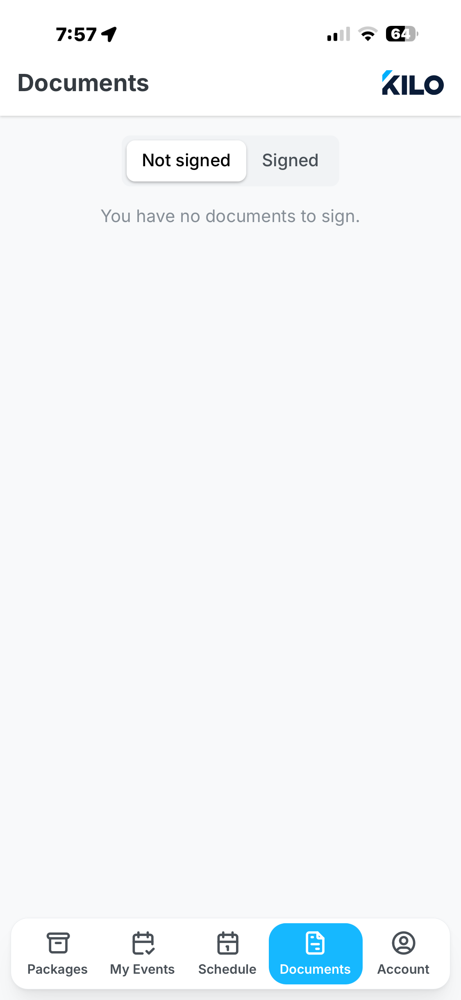
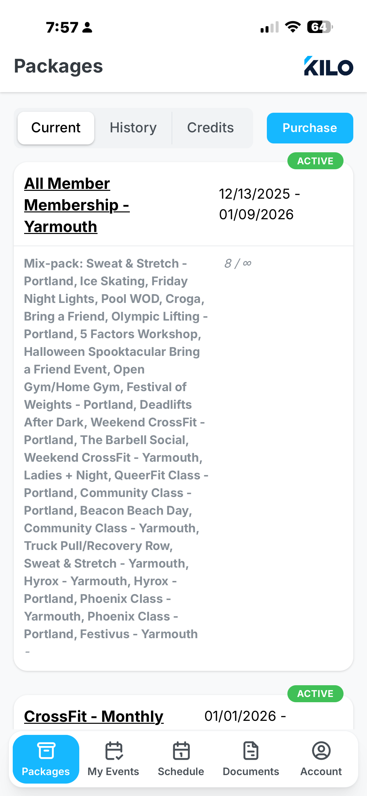
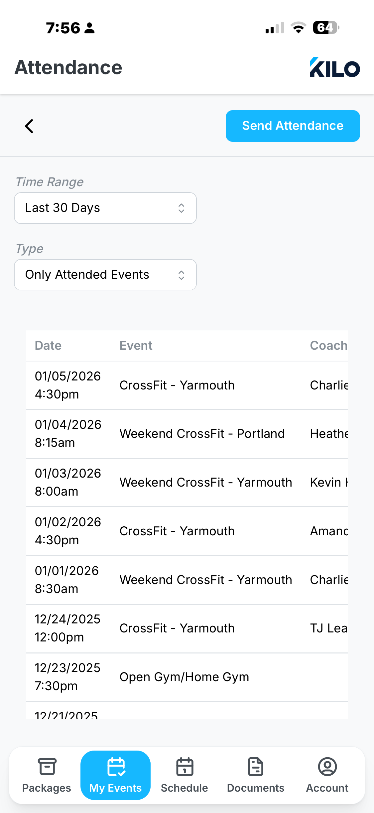
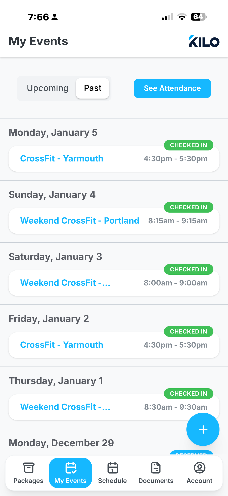

# Feature: Scheduling Classes

The system should now allow scheduling of classes, managing reservations, check-ins, and punch-card type memberships.

Add a first-class scheduling capability for gyms that lets administrators create recurring class templates and individual class sessions, let coaches manage attendance, and let athletes reserve and attend classes. The feature must be toggleable (disable/enable scheduling) by admins, respect gym boundaries, and integrate with existing workout templates and user workout records. Admins will see a warning when it is disabled.

In addition to user types of admin and athlete, we will introduce a new user role: coach.

Create a plan to implement this feature in phases, starting with the data model and basic flows, and expanding to cover all requirements. Begin with the core data structures and user stories and the easy ones first.

Documents are tied to the user through their profile, not to the class/session. 

### Startup

**Goals:**

- Provide a clear data model that separates a recurring class template from scheduled class sessions.
- Support reservations, waitlists, and capacity enforcement.
- Allow coaches to check-in/check-out attendees and record attendance and results (creating user workout records).
- Enable reporting: per-class participation, per-user attendance history, missed-class analysis and subscription/credit accounting.
- Make the feature administratively toggleable and safe to disable.

**Non-Goals:**

- Replace full calendar systems or enterprise resource scheduling — keep scope focused on classes and gym sessions.
- Manage complex multi-location resource bookings (beyond gym/location attribute and simple room/resource name).
- 

### Requirements

**High-level Requirements:**

1. Admins can enable/disable scheduling globally (or per-gym). When disabled, scheduling UIs disappear for all users except admins.
2. Gyms can have multiple class templates and sessions, each linked to existing workout templates.
3. A `ClassTemplate` holds recurring attributes: title, gym, location, default_workout_template_id, duration_minutes, day/time or recurrence_rule, max_capacity, subscription/package constraints (optional).
4. A `ClassSession` is a concrete occurrence with scheduled start/end, optional overrides (workout, coach assignment), and maintains reservations and attendance lists.
5. Roles: a user has a single primary role (athlete, coach, admin) for UI actions. Coaches may be assigned to sessions (not templates) and can check in/out attendees.
6. Reservations support states: `reserved` (holds seat), `canceled`, `attended`, `no_show`. Optional waitlist behavior when session is full.
7. When a `ClassSession` is marked `attended`, create a `UserWorkout` for attendees. Athletes, Coaches or Admins can enter results for that user. Of course, if an athlete was a no-show, no workout record is created
8. Athletes can only enter or edit results for workouts they attended and onlt their own workouts.
9. A classsession is a combination of class attributes plus a workout (template). When a user completes a class, it creates a user workout record whose results (overall elapsed time for the workout, as well as regime scores for any associated WODS and Movements) can be edited by the user without affecting others. All user entered attributes are optional.

**User Flows / UX:**

- Athlete: browse classes (filter by gym, class type, paged by day, ordered by time, then location), reserve or cancel a reservation, check-in at class (coach or athlete), view attendance history.
- Coach: view assigned upcoming sessions, view roster and reservation statuses, check users in/out, mark no-shows, add notes. Create class sessions from templates and apply workouts to sessions.
- A workout and other session details can be applied to more than one session at a time (bulk edit).
- Admin: manage templates and sessions, override capacity, manage subscriptions/credits, export attendance reports, enable/disable feature per gym/global.

**Recurrence & Scheduling Rules:**

- Support basic recurrence: weekly on day/time, daily on time, or custom RRULE (RFC 5545 subset). Store recurrence_rule on `ClassTemplate` and materialize `ClassSession` instances for an upcoming window (e.g., 90 days).
- Materialization strategy: run a background job to ensure sessions exist for the next N days. Admin edits to a template should support "apply to future sessions only" or "apply to all existing instances" choices.

**Reservation lifecycle & capacity handling:**

- Reservation request attempts to create a `Reservation` row and decrement available capacity.
- Enforce capacity with transactional checks and a unique constraint on (session_id, user_id) to avoid duplicates.
- For high concurrency, use DB transactions and an integer `reserved_count` on `ClassSession` updated with optimistic locking (version) or use SQL counter with WHERE reserved_count < capacity.
- Waitlist: when full, place reservation into `waitlist` state; when a spot opens (cancellation), notify next waitlist user and allow a TTL for confirmation.

**Check-in / Attendance:**

- Coaches or admins can mark `Attendance` rows; check-in sets `attended` state for reservation and may consume credits if not already consumed.
- Late/no-show rules: if a user fails to check-in and session passes, mark `no_show` and optionally record missed-class in user history.

**Subscription & Credit accounting:**

- Support two models: time-bound subscription (unlimited classes within time window) and credit-based punch cards.
- On check-in (state of `attended`) or no-show, decrement credits and record `UserSubscription` usage.

**APIs (examples):** - RESTful endpoints to manage classes, sessions, reservations, and attendance. Review design of api when more details are confirmed.

- GET /gyms/{gym_id}/classes?from=2026-01-01&to=2026-03-31 — list sessions
- POST /gyms/{gym_id}/templates — create template
- POST /sessions — create or materialize session
- POST /sessions/{id}/reserve — { user_id } → creates `Reservation`
- POST /sessions/{id}/cancel_reservation — { user_id, reason }
- POST /sessions/{id}/checkin — { user_id, recorded_by }
- GET /users/{id}/attendance — attendance history and credits used

Return patterns: include reservation state and whether user has required documents and sufficient subscription/credits.

**Notifications & Webhooks:**

- Events to emit: `reservation_created`, `reservation_canceled`, `waitlist_promoted`, `session_canceled`, `session_rescheduled`, `attendance_recorded`.
- Support email/SMS push notifications for reservation confirmations and waitlist promotions.

**Reporting / Admin dashboards:**

- Class participation by template/session (count, attendance rate, average capacity used) and also by day of week and time to allow gyms to optimize class offerings.
- User attendance history and missed-class counts
- Subscription revenue / credit usage tied to sessions
- Athletes, Coaches, and Admins can view their own attendance history and credits used from their profile page.
- Admins can export attendance reports filtered by date range, class template, and user.
- Admins can see a dashboard of upcoming classes with reservation counts and waitlist sizes
- Admins can see dashboards of users and attendance statistics such as milestones like 50, 100, 200, etc. classes attended; number of weeks in a row with attendance; and other engagement metrics.

**Concurrency & Data Integrity:**

- Use DB constraints to prevent duplicate reservations (unique(session_id, user_id)).
- Use transactional counters or SELECT ... FOR UPDATE patterns when reserving seats.
- Consider background reconciliation job to resolve transient inconsistencies (e.g., overbooked sessions).

**Testing:**

- Unit tests: reservation logic, capacity enforcement, waitlist promotion, credit accounting.
- Integration tests: materialization job creates sessions for templates, API flows for reservations and check-ins.
- Manual QA: simulate heavy concurrent reservation load to validate locking strategy.

**Migration Plan:**

1. Add new tables if not present.
2. Backfill minimal sessions for existing important templates if needed.
3. Deploy materialization job and set conservative horizon (e.g., 30 days) initially.

**Security & Privacy:**

- Respect gym-level boundaries for all queries; verify `gym_id` in writes.
- Protect personal data (attendance records and documents) per privacy rules; only allow exports to authorized roles.
- However, athlete attendance can be viewed by coaches and admins as needed across gyms.
- Each gym may have multiple locations; classes are tied to a specific location within the gym.

**Monitoring & Metrics:**

- Track metrics: reservations_created, reservations_confirmed, sessions_completed, average_capacity_utilization, waitlist_promotions, checkins_per_session.

**Open Questions / Decisions Needed:**

- When should credits be charged: on reservation confirmed or on check-in? (Configurable per gym). Answer: on check-in.
- Waitlist promotion TTL: how long does a promoted user have to confirm? (e.g., 10 minutes). Answer: configurable, default 15 minutes.
- Recurrence complexity: support full RRULE or only simple weekly schedules? Answer: I need to see examples.

### Screenshots for attributes and ideas

Ignore the navigation bars in the example screenshots — focus on attributes and flows.

Figure 1 — Document checklist: users must sign required documents before confirming reservations. Documents are tied to the user profile, not to the class/session.

Figure 2 — Subscription/package UI: subscriptions may be time-bound or credit-based (punch card). Credits decrement on confirmed attendance.

Figure 3 — Attendance tracking with filters.

Figure 4 — Classes taken by user.

Figure 5 — Class details and attributes.

Figure 6 — (example layout/origin image)

### User Stories

#### 1. As an athlete I should be able to:

1.1 see a list of classes that I can reserve in the future.
1.1.1 the listing will show the information shown in image_007.png
1.1.2 click a card from the list shows the details of the class shown in image_006.png
1.2 see list of classes I have completed
1.3 reserve classes for me to take in the future
1.4 cancel classes in the future that they have reserved
1.5 if canceled, and athlete has a "punch card" membership, the credit should be returned to the athlete's membership
1.6 An athlete is a user who is not a coach (new user role) or an admin
1.7 athletes may not cancel a reservation from the past and the class will reduce the credits if the membership is a punch card type. 

#### 2. As a coach I should be able to

2.1 Create standard workouts
2.2 Check atheletes into workouts - even if they have not previously reserved
2.3 See a list of classes I am coaching and have coached in the past
2.4 Mark athletes as no-shows
2.5 Coaches can only check in athletes for classes they are assigned to coach
2.6 Coaches can only see classes for gyms they belong to
2.7 Coaches can only see athletes who have reserved or attended classes they are coaching

#### 10. Memberships

10.1 Athlete punch card memberships have an expiration date that defaults to one year from when they are created
10.2 Admins can change membership expiration dates
10.3 Admins can add or remove credits from punch card memberships
10.4 All actions against memberships is capture in the audit log
10.5 When an athlete reserves a class, a credit is deducted from their punch card membership
10.6 When an athlete cancels a class reservation, a credit is returned to their punch card membership
10.7 If an athlete does not show up for a class they reserved, the credit is not returned to their punch card membership
10.7 Athletes with active punch card memberships may only reserve classes if they have at least one credit remaining
10.8 Athletes can track their remaining credits and expiration date from their profile page
10.9 When an athlete's punch card membership expires, they may no longer reserve classes until they renew their membership
10.10 Admins can view a list of athletes with expiring memberships and send them reminders
10.11 Athletes can reserve as many classes as they want, as long as they have enough credits on their punch card membership, or have a different type of membership that allows unlimited reservations.

#### 11. Roles

1.6 An athlete is a user who is not a coach (new user role) or an admin

### Data Model

**Data model (suggested entities):**

- `Gym` (existing)
- `User` (existing, with role)
- `WorkoutTemplate` (existing)
- `ClassTemplate` (id, gym_id, title, description, default_workout_template_id, location, recurrence_rule, duration_minutes, max_capacity, visibility)
- `ClassSession` (id, template_id nullable, gym_id, start_time, end_time, location, coach_user_id nullable, capacity_override nullable, status [scheduled|completed|cancelled])
- `Reservation` (id, session_id, user_id, state [reserved|canceled|attended|no_show], reserved_at, confirmed_at, canceled_at, note)
- `Attendance` (id, session_id, user_id, check_in_time, check_out_time, recorded_by_user_id) -- design not sure this is needed if Reservation with state attended/no_show suffices to calculate attendance.
- `CoachAssignment` (session_id, coach_user_id) - there can be multiple coaches per session if needed.
- `Document` / `UserDocument` (document requirements and signed state)
- `Subscription` / `UserSubscription` (credit/punch tracking and constraints)

ClassTemplate vs ClassSession: templates represent recurrence and default attributes; sessions are concrete instances created by a scheduler job or admin action and can override template data (notably coach assignments and capacity overrides).

**Notes:**

Architect: the dual concept of ClassTemplate and ClassSession allows for flexible scheduling of recurring classes while still permitting individual session customization. The Reservation entity tracks user sign-ups and their attendance status, enabling robust management of class participation.

 ## Scenario-Based Clarification Questions

  ### Scenario 1: Feature Toggle Scope

  Situation: Admin wants to test scheduling at one gym before rolling out to others.

  Question 1: Should the feature toggle be. Answer: B Per-gym
  - A) Global only - One switch enables/disables for all gyms
  - B) Per-gym - Each gym can independently enable/disable
  - C) Both - Global master switch + per-gym overrides

  ---
 ### Scenario 2: Recurrence Complexity

  Situation: A gym wants "CrossFit WOD" at 6am, 9am, noon, and 5pm every weekday, but only 9am on Saturday.

  Question 2: What recurrence patterns must be supported at launch? . Answer: The full rule should be supported, though we need to keep the UI as simple as possible.
  - A) Simple weekly - Single day/time per template (create 6 templates for the above)
  - B) Multi-slot weekly - Multiple days and times per template
  - C) Full RRULE - RFC 5545 subset including exceptions and complex patterns

  ---
  ### Scenario 3: Credit Charging Timing

  Situation: User reserves a spot Monday for Wednesday's class. They cancel Tuesday evening.

  Question 3: When should credits be charged? . Answer:  A On reservation. but can be refunded on cancel, until 24 hours before class. Configurable per gym.
  - A) On reservation - Credit consumed immediately; refund on cancel
  - B) On check-in - Credit consumed only when they show up
  - C) Configurable per gym - Admin chooses the policy

  If (A) or (C), what's the cancellation refund policy?. Answer: Full refund if cancelled 24+ hours before. Configurable per gym.
  - Full refund if canceled 24+ hours before? 
  - Partial refund within 24 hours?
  - No refund?

  ---
  ### Scenario 4: Waitlist Promotion

  Situation: Class is full with 3 people waitlisted. Someone cancels at 5pm for a 6am class.

  Question 4a: How long does the promoted user have to confirm?. Answer: D Configurable per gym
  - A) 10 minutes
  - B) 30 minutes
  - C) Until class starts
  - D) Configurable per gym

  Question 4b: If the promoted user doesn't confirm in time: . Answer: A Auto-promote next waitlisted user.
  - **A) Auto-promote next waitlisted user
  - **B) Spot becomes open for anyone (first-come)
  - **C) Spot stays empty until original user confirms or next cancellation

  Question 4c: How is the promoted user notified?. Answer: C Both email and push
  - **A) Email only
  - **B) Push notification only
  - **C) Both email and push
  - **D) SMS (requires additional integration)

  ---
  ### Scenario 5: Walk-ins

  Situation: Someone shows up to class without a reservation. There's one open spot.

  Question 5: Should walk-ins be supported? . Answer: B Yes, coach can add
  - A) No - Must have reservation to attend
  - B) Yes, coach can add - Coach creates reservation + attendance on the spot
  - C) Yes, attendance only - Coach records attendance without reservation (affects reporting)

  ---
  ### Scenario 6: No-Show Handling

  Situation: User reserved and confirmed but didn't show up to class.

  Question 6a: When is no-show status applied? answer: C Automatically X minutes after class starts if not checked in. Can be configurable per gym. no-show can be removed by coach or admin if needed.

  - **A) Automatically when session marked completed
  - **B) Coach manually marks no-show
  - **C) Automatically X minutes after class starts if not checked in

  Question 6b: What happens to credits for no-shows? answer: A Credit is consumed (no refund). Can be configurable per gym. 
  - **A) Credit is consumed (no refund)
  - **B) Credit is restored
  - **C) Configurable per gym

  Question 6c: Should there be consequences for repeat no-shows? Answer: A just track in reports.
  - A) No - Just track in reports
  - **B) Warning after N no-shows
  - **C) Auto-restrict booking after N no-shows in X days
  - **D) Configurable policy per gym

  ---
  ### Scenario 7: Coach Assignments

  Situation: Gym has 3 coaches. "Morning CrossFit" needs coverage Mon-Fri but coaches rotate.

  Question 7a: Can a session have multiple coaches?  Answer: B Yes - Multiple coaches, no need to mark primary.
  - A) No - One coach per session
  - B) Yes - Multiple coaches, one marked primary

  Question 7b: When sessions are materialized from template, how are coaches assigned? Answer C Coach schedule - Separate coach availability system (more complex). Admins then assign coaches to sessions based on their availability.
  - A) No coach - Admin assigns after materialization
  - B) Default coach from template - Can be overridden per session
  - C) Coach schedule - Separate coach availability system (more complex)

  ---
  ### Scenario 8: Athlete Self-Check-in

  Situation: Small gym, coach is busy warming up, athletes arrive.

  Question 8: Can athletes check themselves in? Answer: C Configurable - Gym setting to allow/disallow self-check-in, including QR code option.
  - A) No - Only coach/admin can check in
  - B) Yes, always - Athletes can self-check-in
  - C) Configurable - Gym setting to allow/disallow self-check-in
  - D) QR code - Athlete scans code at gym to check in

  ---
  ### Scenario 9: Document Requirements

  Situation: User hasn't signed the updated waiver (new version uploaded last week).

  Question 9a: When are document requirements checked? answer: A On reservation - Can't reserve without signed docs
  - A) On reservation - Can't reserve without signed docs
  - B) On confirmation - Can reserve, must sign before confirming
  - C) On check-in - Can reserve/confirm, must sign at door

  Question 9b: When a document is updated (new version): answer: C Admin chooses per document update
  - **A) Existing signatures remain valid
  - **B) Users must re-sign new version
  - **C) Admin chooses per document update

  ---
  ### Scenario 10: Class Cancellation

  Situation: Coach is sick, 6am class needs to be cancelled. 15 people are confirmed.

  Question 10a: What happens to reservations when a session is cancelled? answer: A All automatically cancelled, credits restored
  - **A) All automatically cancelled, credits restored
  - **B) All automatically cancelled, no credit restore
  - **C) Admin chooses credit restore at cancellation time

  Question 10b: Should the system support rescheduling (move to different time)? answer A No - Cancel and manually create new session if needed.
  - A) No - Cancel and create new session
  - B) Yes - Reschedule option that keeps reservations, notifies users

  ---
  ### Scenario 11: Subscription Constraints

  Situation: Gym offers "Morning Only" subscription (classes before noon) and "Unlimited" subscription.

  Question 11: Should class templates restrict which subscriptions can book? answer A: A No - Any active subscription can book any class
  - A) No - Any active subscription can book any class
  - B) Yes - Templates can specify allowed subscription types
  - C) Yes, with time rules - Subscription defines allowed time windows

  ---
  ### Scenario 12: Credit Expiration

  Situation: User bought 10-credit punch card 6 months ago, used 3 credits, subscription is "indefinite."

  Question 12: Can credits expire independently of subscription? answer B: yes - Credits expire after X days from purchase. Each purchase has its own terms
  - A) No - Credits valid as long as subscription is active
  - B) Yes - Credits expire after X days from purchase
  - **C) Configurable per subscription type

  ---
    ### Scenario 13: Reporting Needs
    Situation: Gym admin wants to analyze class attendance trends.
    Question 13: What reporting features are essential at launch? answer: A None - Reporting can be added later. But add these feature requests to the backlog to be fleshed out later.
    - A) None - Reporting can be added later
      - B) Basic reports - Attendance per class/session, user attendance history
      - C) Advanced analytics - Peak times, no-show patterns, subscription usage trends
      - D) Custom report builder - Admins create their own reports with filters and aggregations
      - E) Export capabilities - CSV/Excel exports of attendance and reservation data
      - F) Dashboard views - Visual summaries of key metrics for quick insights
      - G) Scheduled reports - Automated email reports sent to admins on a regular basis
      - H) Integration with BI tools - Connect to external business intelligence platforms for deeper analysis
      - I) User engagement metrics - Track user activity, class participation rates, and retention statistics
      - J) Feedback collection - Allow users to provide feedback on classes and coaches for quality improvement
      - K) Historical data access - Ability to view and analyze past attendance and reservation data over time
      - L) Role-based access - Control who can view and generate reports based on user roles (admin, coach, etc.)
      - M) Real-time reporting - Live updates on class attendance and reservations for immediate insights
      - N) Customizable dashboards - Allow admins to personalize their dashboard views with preferred metrics and visualizations
      - O) Data visualization tools - Built-in charts and graphs to help interpret attendance and reservation data easily
      - P) API access - Provide APIs for external systems to pull reporting data for integration purposes
      - Q) User segmentation - Analyze attendance and reservation patterns based on user demographics and behavior
      - R) Class performance metrics - Evaluate the success of classes based on attendance, feedback, and user retention
      - S) Coach performance reports - Track coach effectiveness based on class attendance and user feedback
      - T) Automated insights - System-generated recommendations based on attendance trends and user behavior
      - U) Multi-gym reporting - Consolidated reports for admins managing multiple gym locations
      - V) Data export scheduling - Set up automated exports of reporting data at specified intervals for offline analysis
      - W) User activity tracking - Monitor user interactions with the scheduling system for usage analysis and improvements
      - X) Attendance forecasting - Predict future class attendance based on historical data and trends
      - Y) Custom alerting - Notify admins of significant changes in attendance patterns or reservation trends
      - Z) Data retention policies - Define how long attendance and reservation data is stored for reporting purposes
      - AA) Integration with CRM systems - Sync attendance and reservation data with customer relationship management platforms for enhanced user management
      - AB) Mobile reporting - Access reporting features and dashboards on mobile devices for on-the-go insights
      - AC) User feedback analysis - Aggregate and analyze user feedback to identify areas for improvement in classes and coaching
      - AD) Class popularity metrics - Identify the most and least popular classes based on attendance data
      - AE) Seasonal trend analysis - Examine attendance patterns across different seasons or time periods for strategic planning
      - AF) User retention reports - Track how often users return to classes and their long-term engagement with the gym
      - AG) Data visualization customization - Allow admins to customize the appearance and layout of data visualizations for better clarity
      - AH) Integration with scheduling tools - Sync reporting data with external scheduling platforms for comprehensive analysis
      - AI) User journey mapping - Visualize the user journey from reservation to attendance for better understanding of user behavior
      - AJ) Class cancellation impact analysis - Assess the effects of class cancellations on attendance and user satisfaction
      - AK) Real-time alerts - Notify admins of significant changes in attendance patterns or reservation trends
      - AL) Data retention policies - Define how long attendance and reservation data is stored for reporting purposes
      - AM) Integration with CRM systems - Sync attendance and reservation data with customer relationship management platforms for enhanced user management
      - AN) Mobile reporting - Access reporting features and dashboards on mobile devices for on-the-go insights
      - AO) User feedback analysis - Aggregate and analyze user feedback to identify areas for improvement in classes and coaching
      - 
